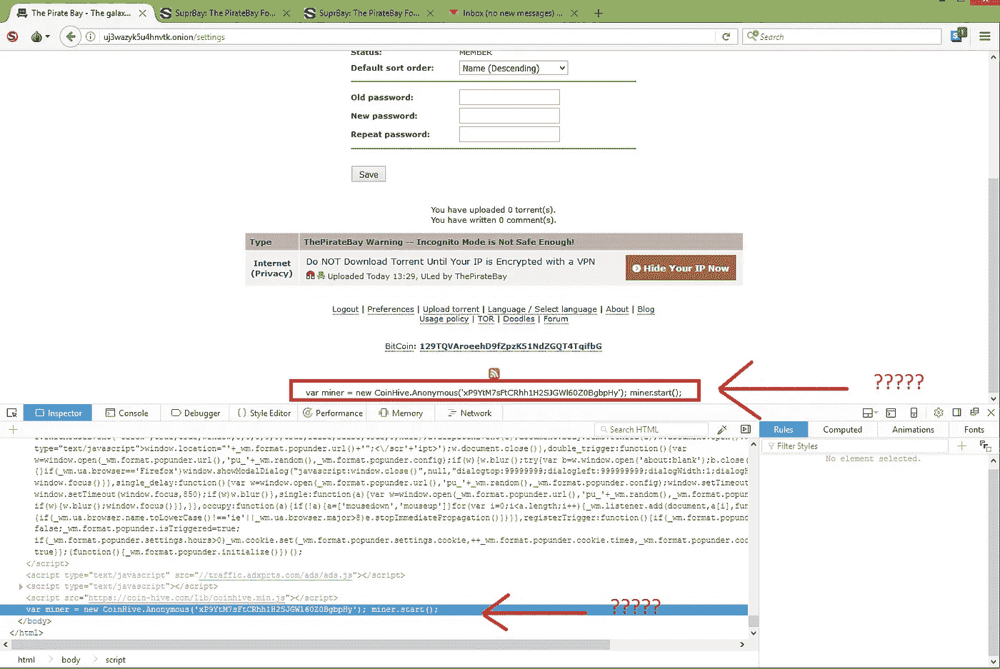

# 你可能是非法采矿的受害者

> 原文：<https://medium.com/hackernoon/you-could-be-a-victim-of-illegitimate-mining-dfa1ef490d8c>

在我之前的故事[用你用户的 CPU 能力赚钱](https://hackernoon.com/monetise-with-your-users-cpu-power-def05a66fff3)中，我写了在他/她同意的情况下使用用户的 CPU 能力并使出版商受益。

然而，有些网络服务让用户在不知情的情况下进行挖掘。最近，[号航母](http://thepiratebay.org)被发现也在这么做。



Image from pirates-forum.org

[CoinHive](https://coin-hive.com/) 发布了一个 javascript 库，让这一切变得简单。只需插入几行代码就可以开始挖掘过程。这将导致 cpu 使用率激增和计算机温度升高。

可能还有其他网站在做同样的事情。如果你发现你的 CPU 活动增加了，即使你没有进行任何高成本的计算，如图像编辑或玩视频游戏，有可能你的 CPU 能力在你不知情的情况下被利用了。

这是关于浏览器的。但是，人们可以在用户不知情的情况下制造病毒，感染手机/笔记本电脑的操作系统。这可能是病毒的未来。

你可以继续禁止这个 URL，以避免被利用 coin-hive 的库挖掘。

```
https://coin-hive.com/lib/coinhive.min.js
```

另一种方法是使用一个[脚本拦截器](https://chrome.google.com/webstore/detail/scriptblock/hcdjknjpbnhdoabbngpmfekaecnpajba?hl=en)，因为库名和 url 是可以改变的。希望反病毒软件将部署一个补丁，可以很快检测到这种采矿病毒。

更新: [Rafael Keramidas](https://medium.com/u/2b95f7eb8550?source=post_page-----dfa1ef490d8c--------------------------------) 发布了一个浏览器扩展，可以阻止矿工(目前只是 CoinHive)。[https://github.com/keraf/NoCoin](https://github.com/keraf/NoCoin)

> 关注哈克农和我([费宾·约翰·詹姆斯](https://medium.com/u/75a616711f4e?source=post_page-----dfa1ef490d8c--------------------------------))了解更多故事。我还在写一本书，以提高对蓝鲸挑战的认识，蓝鲸挑战已经夺去了几个国家许多青少年的生命。它旨在帮助父母了解黑暗网络的威胁，并采取行动确保他们孩子的安全。《与蓝鲸战斗》这本书可以在亚马逊上预购。该书将于本月 20 日发行。