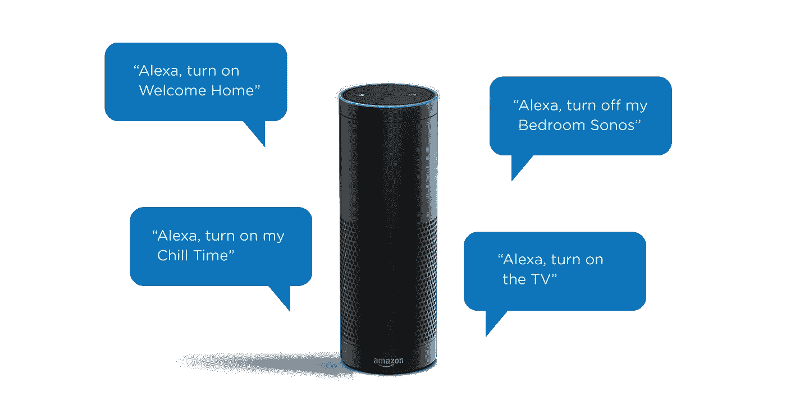
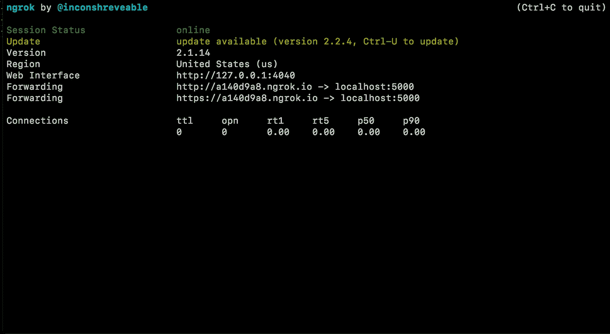
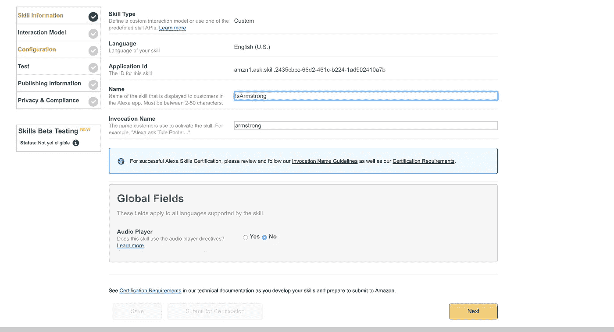
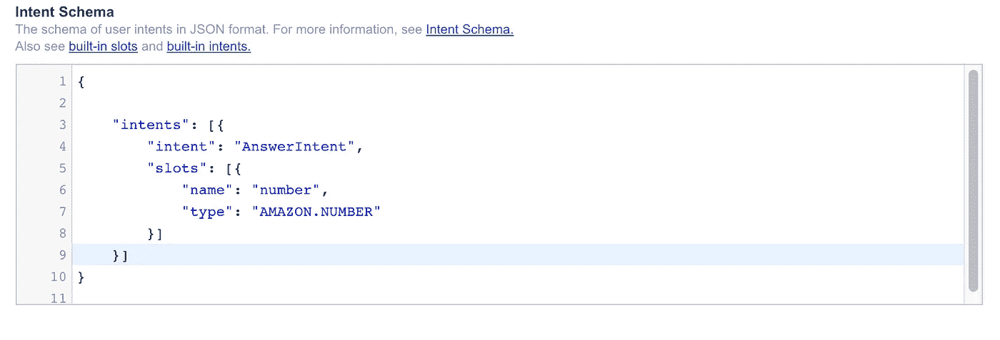
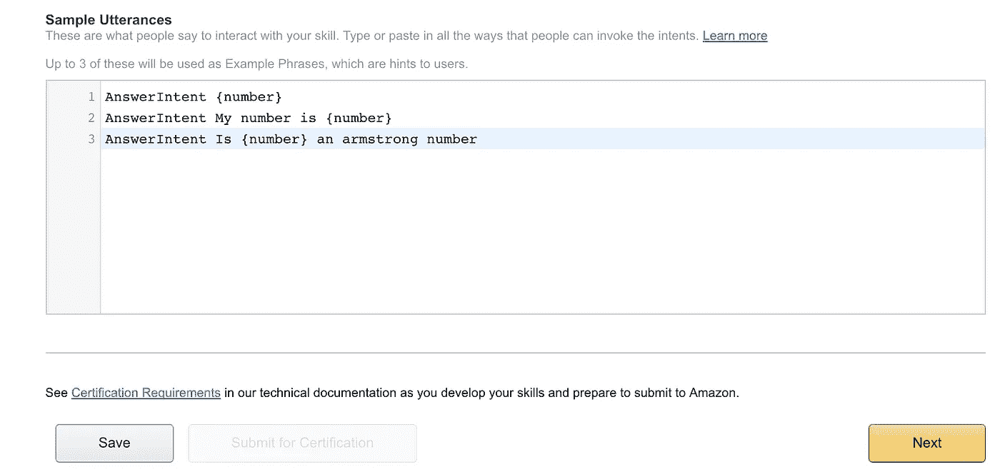
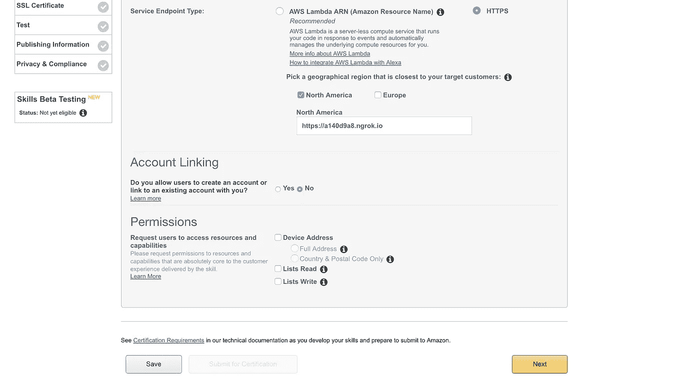
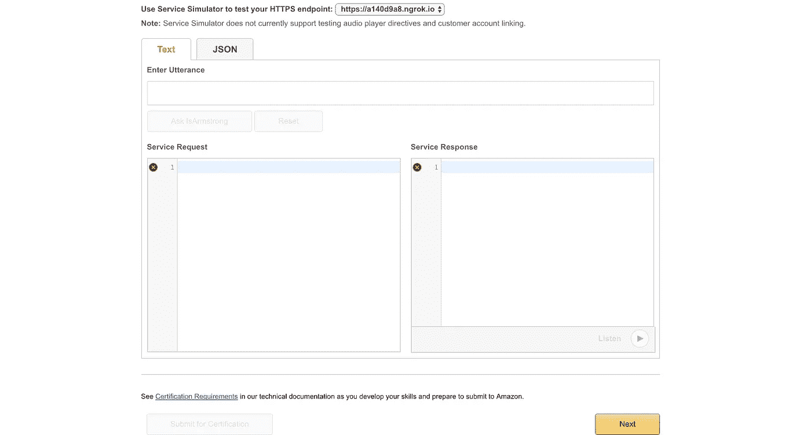
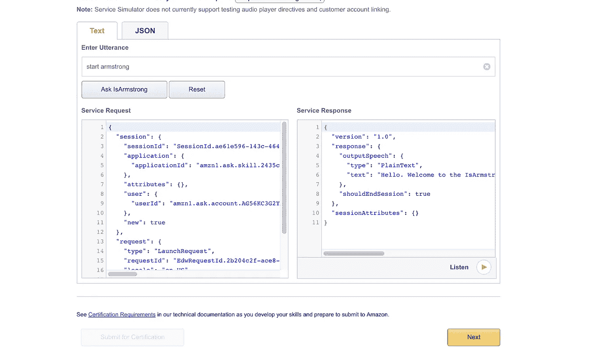
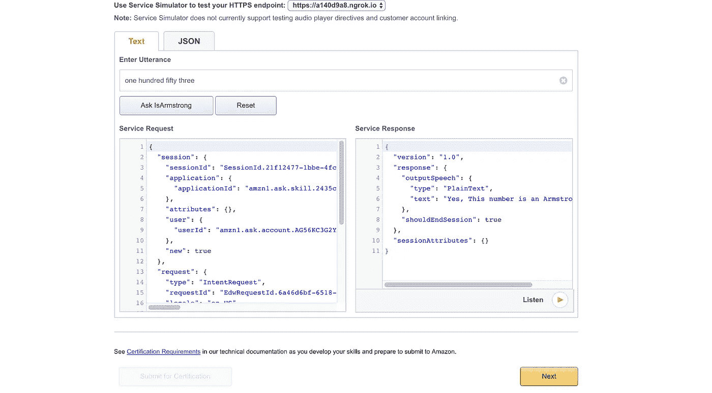
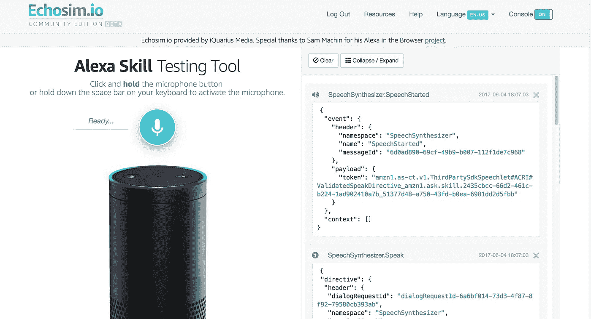

# 用 Echoism 建立很酷的 Alexa 技能

> 原文：<https://medium.com/hackernoon/you-dont-need-an-alexa-to-build-alexa-skills-7227460cd738>

亚马逊在 2014 年 11 月发布了 Alexa。现在是大家最喜欢的私人助理。有很多关于如何开始在 Alexa 上开发的教程(亚马逊自己有 2-3 个)。现在，你可以遵循每一步，使完美的 Alexa 技能，但唉，你需要一个 Alexa 来测试它。我将向你展示如何建立几乎任何你想要的 Alexa 技能(当然还要测试它！)而没有拥有一台 Alexa。



# **入门**

我们将要建立的技能非常简单。我们将让 Alexa 有能力告诉我们一个给定的数字是否是一个[阿姆斯壮数字](http://www.cs.mtu.edu/~shene/COURSES/cs201/NOTES/chap04/arms.html)。我们将用 Python 2.7 编写所有的代码。下面是 Python 的安装链接，如果你没有的话: [OS X](https://www.python.org/downloads/mac-osx/) 和 [Windows](http://docs.python-guide.org/en/latest/starting/install/win/) 。接下来，我们将安装 pip，一个 Python 的包管理工具，在这里下载。通过打开终端并键入以下命令，安装 python 微框架 Flask。

```
pip install Flask
```

# 烧瓶询问

通常当你用 Alexa 建立技能时，你需要设置一个 AWS Lambda 函数。但是如果你在，努力做 lambda 函数并不是最好的方法。进入:Flask-Ask，一个 Flask 扩展工具，可以轻松建立 Alexa 技能。你可以在这里了解更多

[](https://github.com/johnwheeler/flask-ask) [## 约翰·惠勒/烧瓶-询问

### Python 的 flask-ask - Alexa 技能包

github.com](https://github.com/johnwheeler/flask-ask) 

像我们之前对 Flask 所做的一样，在终端中使用相同的行来安装 flask-ask

```
pip install flask-ask
```

安装了 flask-ask 后，我们创建了一个名为 *flask_app.py* 的文件，它将保存 flask 服务器的代码。在同一个文件夹中创建一个文件， *templates.yaml* ，它将保存我们的语音模板。

现在我们的 python 后端已经准备好了，我们可以通过输入。

```
python flask_app.py
```

这将在本地端口 5000 上启动我们的服务器。我们还需要 Alexa 来访问我们的服务器，为此有一个方便的工具叫做 [ngrok](https://ngrok.com/) 。如果您已经下载了它，请打开一个新的终端窗口并键入:

```
ngrok http 5000
```

您的终端屏幕应该看起来像这样。



# Alexa 技能包

前往 https://developer.amazon.com/[创建你的开发者账户，如果你还没有的话。如果你已经做了，只需登录。转到 Alexa 标签，选择 Alexa 技能包，然后点击添加新技能。](https://developer.amazon.com/)



我们填写的第一个选项卡是技能信息。选择技能类型为*自定义交互技能，*名称为 IsArmstrong ，调用名称为 Armstrong。这里的名称是我们的技能名称和调用名称，当我们必须启动技能时，例如:' Alexa，启动阿姆斯特朗'。

第二个选项卡是我们的交互模型。这主要描述了我们将如何与我们的技能互动。第一个文本框，意图模式，告诉 Alexa 我们的技能将拥有的各种语音意图。用以下 JSON 填充它:

```
{"intents": [{ "intent": "AnswerIntent", "slots": [{ "name": "number", "type": "AMAZON.NUMBER" }] }]}
```

暂时忽略自定义插槽类型。在示例话语下，输入以下内容:

```
AnswerIntent {number}
AnswerIntent My number is {number} 
AnswerIntent Is {number} an armstrong number
```



现在点击下一步，让我们继续。

在构建交互模型的同时，让我们完成其余的选项卡。

对于“配置”选项卡，单击“HTTPS”单选按钮和“北美”复选框。在文本框中，输入 ngrok HTTPS 网址，然后点击下一步。它应该看起来像这样。



在 SSL Certificate 选项卡中，选择选项“我的开发端点是拥有来自证书颁发机构的通配符证书的域的子域”。点击下一步。

# 测试你的技能

现在是我们的测试阶段。您应该会看到这样的屏幕。



在显示*的框中，输入话语*，让我们开始输入我们的调用短语，在本例中是“开始阿姆斯特朗”。Alexa 的回应应该是这样的。



你可以点击听，听到你的反应读出我的 Alexa。

继续输入 153。这是回应。



现在，如果你有一个 Alexa，你可以去那里启用技能，但这不是本教程的重点。前往 [Echoism.io](https://echosim.io/) ，用你的亚马逊 id 登录。

现在按住麦克风，测试你的技能。让控制台开着，这样你就能看到发生了什么。



我的对话是这样的:

**我**:“Alexa，启动阿姆斯特朗”

**Alexa** :“你好。欢迎学习 IsArmstrong 技能。给我一个号码，我会告诉你这是不是阿姆斯特朗的号码。”

**我**:“问阿姆斯特朗 153 是不是阿姆斯特朗的号码”

**Alexa:** “对，这个号码是阿姆斯特朗号！”

# 结论

我们建立的技能非常简单。Alexa 技能，好的至少需要更多的代码和更多的测试。如果你想继续探索其他技能，请前往 [Alexa 商店](http://alexa.amazon.co.uk/spa/index.html),或者如果你有一个想法并想部署自己的想法，这里有另一个很棒的教程:[http://modus create . com/build-an-Alexa-skill-with-python-and-AWS-lambda/](http://moduscreate.com/build-an-alexa-skill-with-python-and-aws-lambda/)

快乐发展🎉