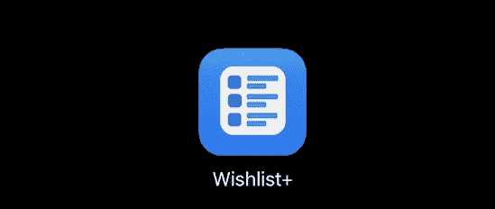
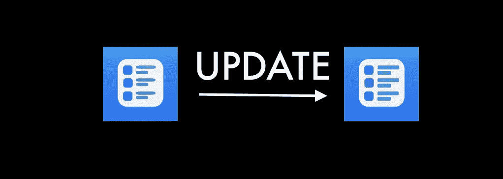
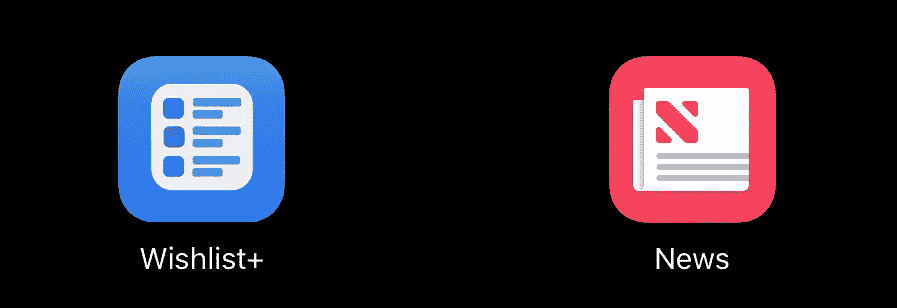
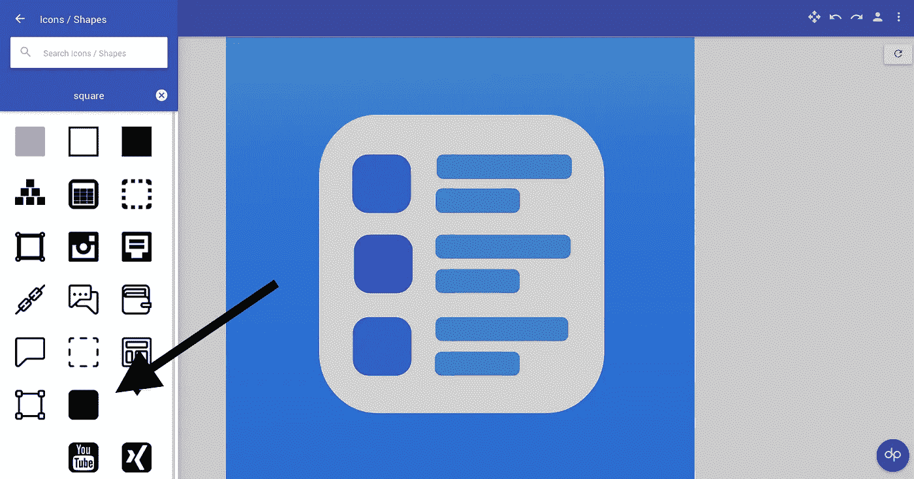

# 你不需要图标设计师，甚至不需要 Photoshop

> 原文：<https://medium.com/hackernoon/you-dont-need-an-icon-designer-or-even-photoshop-afdc55fb3c51>

## 免费获得优质图标的独立创作者指南。

Wishlist+ current app icon

这是我为自己的应用 Wishlist+做的 logo。是我做的，免费的，没有使用任何付费的[工具](https://hackernoon.com/tagged/tools)比如 Photoshop 或者 Sketch。它可能不会赢得任何图标[设计](https://hackernoon.com/tagged/design)奖项，但它在主屏幕上看起来绝对不会格格不入。为自己制作这样一个图标有几个关键因素:

# 时间

我在**花了一个半小时完成了这个图标的初稿。**正如你在这张图片中看到的，一个月后，最终的图标只增加了几分钟的调整。

Small refinements made in minutes

与普遍的看法相反，我并不觉得这个过程很耗时。只要你把所有正确的元素结合起来，这个过程就简单而短暂。

# 抑制

在你为你的想法寻找灵感之前，你需要为自己设定规则。我把自己限制在基本的形状和配色方案上。这是设计时间如此之短的最大关键之一。当你只是在一个颜色渐变上处理一堆圆形方块时，你不仅可以快速创建你的图标，还可以快速做出改变。设计一个形状简单的平面图标只需要几分钟，而不是几天。

# 灵感

起初，你可能会努力为你的应用找到一个想法。当我陷入困境时，我从苹果的系统应用程序中寻找灵感。我特别受到苹果新闻图标的启发。

Wishlist+ and the icon that inspired it

如果你还在为你的应用程序寻找一个想法，想想你可以用什么样的物理隐喻来代表你的应用程序。例如，我的应用程序是一个愿望列表，所以我的图标是一个列表。苹果新闻应用程序包含新闻，所以图标是一份报纸。

# 工具

整个创作过程发生在两个网络应用程序中，[http://designapp.io/](http://designapp.io/)和[https://makeappicon.com](https://makeappicon.com)所有的设计都是在 Designapp 中免费完成的，该文件被上传到 MakeAppIcon，它为 iOS 或 Android 生成所有必要的图标文件。**这两个工具都是 100%免费使用的。**

Designapp 可能不是最好的设计客户端，如果你有 Photoshop 的话可以随意使用，但是它可以让你按照我们有限的规则制作应用图标。你可以有许多几何形状和颜色渐变，但我用了一个形状，圆角正方形。

designapp.io and the rounded square

# 关于图标设计者的一个注释

我绝不是说图标设计师所做的事情是没有价值的或者是容易被取代的。在 web 应用中制作一个免费的图标并不能取代那些有足够资金的人的专业工作。然而，如果你想自己制作你的图标，免费的，这是可能的。它可能更适合小公司/独立创意人员。

总之，如果你正在制作你的第一个应用程序或者需要为一个网站做品牌推广，你不需要花 100 美元让一个设计师为你做。如果你愿意花几个小时，你可以免费得到你想要的设计。

*感谢您阅读我的文章，讨论的应用程序名为 Wishlist+,可在此处的应用程序商店获得:*https://itunes.apple.com/app/wishlist/id1229495537