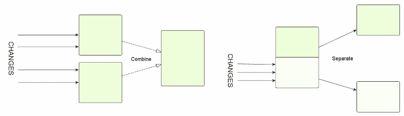

# 你明白单一责任原则吗？

> 原文：<https://medium.com/hackernoon/you-dont-understand-the-single-responsibility-principle-abfdd005b137>

单一责任原则是关键的软件工程原则，它决定了我们应该如何在面向对象编程中模块化代码。由 Robert Martin 制定，并在多年中被他坚持不懈地反复强调，该原则的力量以及他在将其作为一组坚实的原则加以传播时所做的努力，已经导致任何声称了解软件工程的人都会对它很熟悉。

为了避免你在维基百科上查找，它的定义是一个类应该只有一个责任，这被马丁进一步定义为“一个改变的理由”

很多人在很多场合都谈到过这个问题，但我想谈谈我所看到的对这个原则越来越普遍的误用和误解。我看到一些人对他们的代码进行了在我看来很糟糕的构建，然后证明这是符合 SRP 的。这促使我进一步研究，试图找出到底发生了什么，这篇文章就是结果。

## 症状

举个例子，如果你看 Mark Seeman 关于重构服务的文章，他建议将一个有两个方法的类重构为两个各有一个方法的类，以减少注入到构造函数中的服务数量。他暗示这是一个简化的操作，与 SRP 一致，当它增加要管理的类的数量以及添加一个接口时，在这个过程中他添加了 7 行样板代码。很多作者都有很多这样的例子。

在[这个 StackExchange 问题](https://softwareengineering.stackexchange.com/questions/150760/single-responsibility-principle-how-can-i-avoid-code-fragmentation)中描述了一个很好的例子。作者描述了他正在工作的代码库是如何变得更加难以理解和调试的，封装是如何被为了使类片段能够通信而使一切都公开的需要所破坏的，以及使用依赖注入是如何由于为了完成任何工作而不得不注入如此多的微观服务而变得不切实际的。

回答这个问题的人认为他没有真正理解 SRP 的真正含义，他应该使用“常识”，或者绕过他的实际问题告诉他，他没有正确使用 SRP，因为他有太多的服务要注入(忽略这个原因，服务是如此之少)。

直觉上，我们的组织和封装单元应该被用来封装单个方法，或者甚至一两个非常短的方法，这似乎是错误的。在这种情况下，为什么还要为类费心，为什么不回到过程化编码呢？我认为将这样一个单薄的类描述为代码气味是公平的。在特定情况下，这可能是合理的，但你需要确定你为什么要这样做。

公平地说，Mark Seeman 可能并没有在实践中建议一个只有单一方法的类是一个好主意，他可能只是用一个非常简单的例子来表达他的观点。然而，提醒人们这一点是明智的，因为在现实世界中，StackExchange 示例显示了当得到错误的想法时会发生什么。

但是，如果你看看维基百科描述的 SRP，以及经常被引用的 SRP，归结到一个责任或一个改变的理由只会意味着减少你的班级规模。因此，当我们有一个占主导地位的软件工程原则告诉我们要划分类，而没有相反方向的平衡原则时，代码基础会变得支离破碎就不足为奇了。但这真的是 SRP 所说的吗？

## SRP 不是一条单行道

所以我们现在的情况是，在软件工程的世界里，遵守既定规则的人会想，你不能把班级搞得太小。这就是你所说的单行道。现在软件工程中有许多这样的趋势，我发现它们都令人担忧。关于这些单行道，我注意到的一点是，当你回头看这个原则的创始人实际上说了什么时，他们比他们的信徒更加细致入微和平衡。所以我回去仔细研究了罗伯特·马丁到底说了什么。

在他的许多文章和 YouTube 讲座录音中，他将举例说明他所说的“改变的理由”是什么意思，比如一个为员工提供计算和报告工资方法的类，或者一个提供数据操作和数据持久化操作的类。他还谈到了与软件所服务的业务中的功能相关的改变的原因:在这些情况下，应该将类分开，因为需要报告的业务功能和定义如何计算工资的业务功能是不同的。

从表面上看，他似乎在说，SRP 只是关于一个类具有属于两个不同层或模块的功能，它应该被分离。但是，当那些声称遵循 SRP 的人展示他们用它做了什么时，他们正在做一些更普遍的事情，忘记了马丁的解释，并用它来分割任何做“不止一件事”的类，如马克·西曼。

当我阅读这篇文章时，事情变得更清楚了，在这篇文章中，马丁比平时更深入地思考他在想什么。在这篇文章中，他给出了“SRP 的另一种措辞”:

> 把因为同样的原因而改变的事情集合起来。把那些因为不同原因而改变的事情分开。

这种“将因同样原因而改变的事物集合在一起”的损失有多大，怎么强调都不为过。我只能假设它已经丢失了，因为马丁和像他这样的新程序员的老师们一直想纠正把所有的东西都集中到一个大类中的幼稚倾向，但是还没有看到有这样的需要去教导避免原子化。

更令人着迷的是，马丁的文章中提到了 1972 年的一篇学术文章《T2》，这是一篇令人惊叹的作品，尽管自写作以来技术水平已经有了长足的进步。我强烈建议阅读它。当我这样做的时候，很清楚在 SRP 的最初表述中，Martin 是从哪里来的。

## SRP 是关于限制变化的影响

本文讨论两种独立的方法来模块化文本处理系统。第一个是根据流程图，按程序或如其所言进行模块化。在这种结构中，模块的构建使得第一个模块将其结果传递给第二个模块，依此类推。第二个是根据可能的变化来源对系统进行模块化。

对代码系统的任何改变自然都需要在不同的地方对代码主体进行改变。如果系统的结构遵循“将那些因为同样的原因而改变的东西集合在一起”的原则，你将会减少需要改变的模块(类)的数量。这允许您尽可能将更改隐藏在封装边界之后，从而阻止更改级联到系统的其余部分，并减少需要重新测试的内容，因为它可能会被破坏。

本文详细讨论了模块化结构的第二种方法的优点。

马丁描述了“分离那些因不同原因而改变的事物”的好处。由于不同原因而改变的两段代码保存在同一个封装模块中，没有任何东西可以阻止它们紧密耦合，因此在一个类立足于用户界面和业务逻辑的例子中，对用户界面的改变可能会破坏业务逻辑。

除此之外，这些结构规则给变更带来的简单但重要的好处是，它们最大限度地减少了代码中需要搜索的位置和不同文件的数量，以便进行变更。

对这两个互补规则的考虑为我们提供了将代码分成类(或模块)的平衡标准，我们需要这些标准来避免代码变得原子化。

## 一些不同的例子

关于 SRP，要记住的困难是，它是基于可能的变更模式，而不是代码中的依赖或功能关系。代码的内部结构或外部功能和需求都不是关键，而是代码正在经历变化的业务环境的性质。Martin 在举使用 SRP 的例子时经常提到这些因素，而其他评论者几乎从不这样做。如果他们没有，他们正在做一些没有使用 SRP 的事情。

Martin 和其他人使用的一个经典例子是活动记录模式。在这种模式中，一个类包含数据库记录中字段的属性以及与持久性相关的操作，如 GetFromId、Save 等。这总是被认为是违反 SRP 的。然而，这取决于具体情况。无论出于什么原因，如果您没有使用对象关系映射，并且相同的开发人员控制着代码和数据库，那么活动记录模式在 SRP 下具有优势。这是因为一种非常常见的更改形式是添加、更改或删除数据库中存储的字段。活动记录封装了与它所保存的数据的存储相关的所有问题。它很容易对程序的其他部分隐藏外部公开的数据和内部数据库结构之间的关系。如果您使用一些替代方法，例如某种也必须知道记录字段的 Mapper 类，这将导致像添加字段这样的更改的影响扩散。

另一个从天真的角度来看似乎违背 SRP 的例子是在一个类中使用依赖注入的应用程序的所有服务构造和初始化的位置。一个类的服务注入需求的任何变化都意味着这里的变化。这当然是一个用天真的解释做不止一件事的类。然而，它遵循 SRP，因为配置更改通常聚集在一起。例如，更改网站上的身份管理系统需要对 IoC 容器中注册的服务进行一组相关的更改。

## 结论

SRP 是一个被广泛引用的重构理由。这通常是在没有完全理解 SRP 的要点及其上下文的情况下完成的，导致代码基础的碎片化，带来一系列负面后果。SRP 不是一条通向最小规模班级的单行道，它实际上是在聚集和划分之间提出了一个平衡点。

关于开放/封闭原则系列的下一篇文章在[https://hacker noon . com/why-the-Open-Closed-Principle-is-the-one-you-need-to-know-but-don-176 f7e 4416d](https://hackernoon.com/why-the-open-closed-principle-is-the-one-you-need-to-know-but-dont-176f7e4416d)。