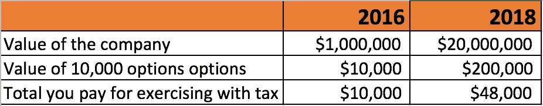

# 一家初创公司给了你一份工作。现在怎么办？

> 原文：<https://medium.com/hackernoon/you-got-an-offer-at-a-startup-now-what-4de80a6935f4>

在一家初创公司获得一份工作机会既令人兴奋又让人放松，尤其是如果你已经找了一段时间的话。然而，正是在这个时候，许多人放松了警惕，犯下了一些职业生涯中的重大错误。以下是我见过人们反复陷入的三个陷阱:

## 1)未经协商签署要约

谈到薪水，有些人可以接受较低的薪水或不要求更高的薪水，他们认为自己会努力工作，以后会加薪和升职。然而，根据 [ADP](https://www.adp.com) 在[对 33 万家美国公司和 2400 万美国私营部门员工进行的一项研究](http://workforcereport.adp.com/2016/4/wvi.aspx)，当你换全职工作时，比当你寻求加薪时，你更有可能获得更大的工资增长。

> 因此，你应该在报价阶段进行谈判，以获得最大价值。

## 2)在不了解股权部分的情况下签署要约

许多人选择创业，而不是在大公司工作，希望在收购或首次公开募股时通过股票期权发财。但问题是，围绕股权部分的规则相当复杂，大多数人并没有真正理解它。

**这种缺乏理解让很多人焦头烂额(** [自我报告工资清单](https://medium.com/u/f8025419d9c8#gid=1023506792)，但我对这份清单持保留态度。

# **报价阶段**

*报价条款和您应该询问的澄清问题*

**当你口头得到报价时，千万不要当场接受，即使报价很惊人。相反，你应该感谢他们给了你这个机会，并要求他们给你一份书面工作。然后你应该告诉他们你想花一天时间和你的朋友和家人讨论一下，因为这对你来说是一个重大的决定。**

如果你不当场接受，有些公司会质疑你对这个职位的兴奋程度或认真程度。你可以推后说，因为这是一个改变职业的机会，你需要花些时间认真考虑。

你需要时间思考有两个原因:

1.  这样你就可以仔细查看报价，然后问清楚问题。这些问题的答案将对谈判进程变得重要
2.  给你一个机会思考你的谈判策略

一旦你收到书面报价，确保你仔细阅读条款，尤其是股权部分。**这篇** [**文章**](https://maxschireson.com/2011/08/23/startup-stock-options-explained/) **确实很好地解释了股权部分，所以如果你想彻底理解它，我强烈推荐你阅读一下**。 [Buffer](https://open.buffer.com/explaining-equity/) 也就此写了一篇很棒的文章，你可以去看看。

如果公司没有给你书面的录用通知怎么办？有一些公司是这样做的，特别是对于那些公司，你要问下面的问题来真正了解他们提供给你什么。

现在轮到你提出澄清性问题了。下面你会看到我经常问的问题列表。除非你主动要求，否则公司一般不会告诉你股票期权何时到期，或者公司在银行有多少存款。找出答案是极其重要的，因为如果没有答案，你将无法完全理解你的报价范围。

> 我的[YOUR_SHARE_AMOUNT]期权代表公司的百分之几？即有多少完全稀释的流通股，包括普通股、优先股、限制性股票、未发行股票、认股权证等。

无论你是拥有 1，000，000 股(1%)中的 1 万股，还是拥有 1，000，000 股(0.1%)中的 1 万股，都有着天壤之别。检查投资者是否得到了优先股(这意味着他们比其他任何人都先得到支付)也是很好的。

> 我收到了什么类型的股票期权？

初创公司通常会发放股票期权(ISOs)，但如果是其他东西，比如限制性股票单位(rsu)，你会提前发现。

> [COMPANY_NAME]最近一次 409a 评估是什么时候完成的？股票的估价是多少？

鉴于创业公司的投机性质，美国国税局会迫使你的公司与第三方公司合作，以确定该公司发放的股票期权的公平市场价值。这被称为 409a 估值，期权的执行价格通常以估值定价，例如每个期权 0.50 美元。

> 这些选项是否带有提前行使选项？

如果你的公司提供这种服务，那将是一项巨大的福利。按照 ISOs 的工作方式，当你行使期权时，你不用缴税。取而代之的是，你要为你的期权的出售价格和行使价格之间的差额支付资本利得税。然而，这里有一个主要的问题。

假设你的公司决定给你 10，000 股，每股 1 美元。有 1，000，000 股，所以你实际上以 10，000 美元拥有公司的 1%。

假设这家价值 100 万美元的公司经营得非常好，几年后价值 2000 万美元。如果您在这里行使您的期权，并支付 10，000 美元购买 200，000 美元的股票，则 190，000 美元被视为替代最低税的收入。**如果你的税率是 20%，当你行使时，你欠 38000 美元的税。**

为了避免这种情况，一些公司提供提前行使期权，你可以在期权授予之前行使你的期权。假设你在公司价值 100 万美元时行使了你的期权。你在这里不用缴税，因为你没有任何收入，当公司估值达到 20，000，000 美元时，你也不用缴税。

> **再说一遍，这是一项巨大的福利，所以一定要看看你的公司是否提供这项服务。**

关于这一点的更深入的阅读，请查看 Alex Flint 在 Quora 中的回答。

> 如果我离开[COMPANY_NAME]，期权会终止吗？如果是，几天后？

大多数期权的棘手之处在于，它们会在你退出后 30 或 90 天到期。如果你在你的公司工作了四年，所有的期权都被授予了，这并不重要。如果你离开了，而你的公司仍然没有流动性事件，你可能会失去所有的期权，除非你在期权到期前行使它们

正如我们在前面的回答中看到的，行使你的期权，尤其是在这么晚的时候，可能会带来巨额的税单，所以这会让你处于不利的境地。

这一条款对员工非常不利，因此公司开始将行权期延长至 10 年。因此，如果你在公司工作了两年，然后辞职，你将有 10 年的时间来行使你的既得期权。

> **这是一个非常非常好的好处，因为在行使你的期权之前，你可以等着看公司是否会出现流动性事件，这大大降低了你的风险。**

[Quora](https://dangelo.quora.com/10-Year-Exercise-Periods-Make-Sense) 是首批提供这种服务的公司之一，像 Pinterest 和一些 Y Combinator [公司](https://triplebyte.com/ycombinator-startups/extended-options#cT0mZEZbMF09YmF0Y2gmZEZbMV09ZmllbGRzJmRGWzEwXT1leHRlbmRlZF9zdG9ja19wbGFuJmRGWzJdPXRlY2hfdXNlZCZkRlszXT1mdW5kaW5nJmRGWzRdPWVtcGxveWVlX2NvdW50JmRGWzVdPWNvdW50cnkmZEZbNl09Y2l0eSZkRls3XT12Y3MmZEZbOF09cmVtb3RlX3dvcmtfb2smZEZbOV09c3BvbnNvcl92aXNhcyZoUFA9NTAmaWR4PXB1YmxpY19jb21wYW5pZXMmbVZQRj01MCZwPTAmdEY9JnRUPWZhbHNlJmRGUltleHRlbmRlZF9zdG9ja19wbGFuXVswXT10cnVlJnRzPTE0ODc4MzIyNTM=)这样的大公司已经跳上了这趟列车。

> [COMPANY_NAME]在银行中还有多少存款，您目前的月烧钱率是多少？

你想问这个问题，以确保公司的财务状况良好。如果他们拒绝回答这个问题，你可以问他们公司还有几个月的时间。

# **谈判阶段**

*如何从您的报价中获得更多价值*

现在你已经有了所有你需要的关于报价的信息，是时候谈判了。那么，如何成功地询问呢？我发现的最有效的方法是利用你拥有的任何额外信息作为杠杆。这可能是另一份工作、全国平均工资或你在上面找到的信息。

例如，假设你的期权在你离开后 30 天到期，而不是标准的 90 天。你可以这样措辞你的邮件:

> 你好[招聘经理]
> 
> 谢谢你寄来的书面报价。我对这个职位感到兴奋，我相信我能为公司增加很多价值。
> 
> 不过，在我接受之前，我想和你讨论一下报酬问题。虽然 90，000 美元的年薪很优厚，但我要求的年薪是 105，000 美元。我的薪资要求考虑到期权在终止后 30 天到期，而不是标准的 90 天，以及缺乏 401k 雇主匹配计划。请注意，我的权益不必根据新的数字增加。
> 
> 这是一个极好的机会，我相信我能执行营销策略，所以我希望我们能就可接受的薪水达成一致。
> 
> 最好的，
> 
> 约翰

在这个提议中，他们给你的东西低于标准，所以你可以要求他们给你更多的薪水作为补偿。同样，你可以使用任何其他相关信息，比如他们是否付给你低于平均水平的工资，或者你手头是否有另一份工作。

刘易斯·林(Lewis Lin)写了一份针对所有不同情况的[电子邮件脚本](https://www.lewis-lin.com/blog/2015/5/6/31-killer-salary-negotiation-scripts)的详细清单，你可以查看一下。

当他们回来说他们不能在薪水上让步时，你怎么办？那有时会发生。也许你已经得到了最大数量。在这种情况下，你可以要求他们在其他事情上让步，比如向你提供签约奖金或额外的在家工作时间。

我的建议是，如果他们在两次请求后没有让步，就不要再推了。他们给你的可能是你能得到的最好的提议。现在剩下要做的就是决定这个提议是否足够好让你接受。

希望这份指南能让你的报价更加清晰，并帮助你从中获得更多价值。你还见过其他陷阱吗？或者你用过什么有趣的策略来提高你的报价？

> [黑客中午](http://bit.ly/Hackernoon)是黑客如何开始他们的下午。我们是 [@AMI](http://bit.ly/atAMIatAMI) 家庭的一员。我们现在[接受投稿](http://bit.ly/hackernoonsubmission)并乐意[讨论广告&赞助](mailto:partners@amipublications.com)机会。
> 
> 如果你喜欢这个故事，我们推荐你阅读我们的[最新科技故事](http://bit.ly/hackernoonlatestt)和[趋势科技故事](https://hackernoon.com/trending)。直到下一次，不要把世界的现实想当然！

