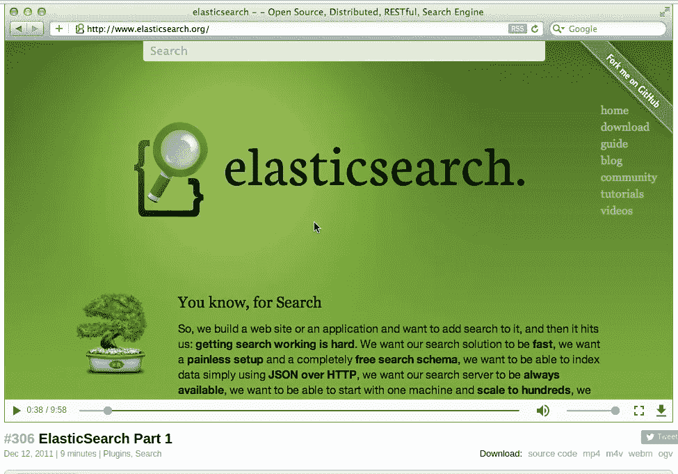
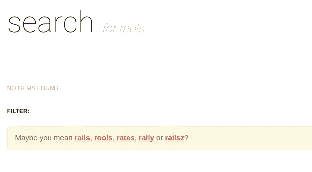

# 你知道，为了搜索..

> 原文：<https://medium.com/hackernoon/you-know-for-search-de62b6126a86>

## rubygems.org 现在使用弹性搜索

随着它在 2010 年 2 月 8 日的首次发布，elasticsearch 是如此的古老以至于让人感觉有点怀旧。如今，数千家公司使用 elasticsearch 进行全文搜索、自动补全、[日志处理](https://www.elastic.co/products/logstash)和[分析](https://www.elastic.co/products/kibana)。

Railscast - [#306 ElasticSearch Part 1](http://railscasts.com/episodes/306-elasticsearch-part-1)

Rubygems.org 的搜索功能没有达到标准。无论如何，在使用像操作符一样的[时，不要抱太大希望。它又慢又笨拙，你只能搜索 rubygem 的名字。至少，新的搜索方式要快得多。](https://www.postgresql.org/docs/8.3/static/functions-matching.html)

我认为这是 elasticsearch 的一项成就，一旦我浏览了他们的文档并观看了几个视频，我就能够对现有的实现做出有意义的改变。此外，有用法示例的文档是最好的❤文档

# 搜索多个字段

默认情况下，查询将与 gem 的名称、描述和摘要相匹配。每个匹配的结果都有一个相关性分数，它由以下三个因素决定:

**术语频率** -查询术语在名称、描述或摘要中出现得越频繁，相关性得分越高。

**逆文档频率** -出现在许多文档中的术语(如 the、a、gems 等)比更不常用的术语得分低。

**字段长度标准** -在更长的字段中匹配，如摘要和描述，得分低于名称。([阅读更多](https://www.elastic.co/guide/en/elasticsearch/guide/current/scoring-theory.html))

[Geek And Poke](http://geekandpoke.typepad.com/geekandpoke/2011/01/nosql.html)

它变得更好；)我们使用 gem 下载来提高搜索结果的分数。这确保了受欢迎的和社区认可的宝石在搜索页面上排名更高。

亚马逊 elasticsearch 服务的 Elasticsearch 5 支持及时地让我们在使用它之前更新了实例。Elasticsearch 5 在相关性评分方面做了一些[漂亮的改进](https://www.elastic.co/guide/en/elasticsearch/reference/current/breaking_50_search_changes.html#_scoring_changes)。

# 过滤器和高级搜索页面

在 elasticsearch 中，查询字符串支持自己的迷你语言，可用于定制您的查询。搜索页面上显示的过滤选项已经提供了有用的默认值，可以限制您的搜索，只匹配名称、描述、摘要、最近一周或最近一个月更新的内容。

[Search active](https://rubygems.org/search?utf8=%E2%9C%93&query=active) on rubygems.org

您可以使用[和](https://rubygems.org/search?utf8=%E2%9C%93&query=ruby+AND+rails)和[或](https://rubygems.org/search?utf8=%E2%9C%93&query=ruby+OR+rails)运算符来组合您的查询词。查询字符串还支持[通配符](https://rubygems.org/search?utf8=%E2%9C%93&query=active*)、[模糊性](https://rubygems.org/search?utf8=%E2%9C%93&query=activo~)、[范围](https://rubygems.org/search?utf8=%E2%9C%93&query=active+AND+downloads%3A%5B20000+TO+100000%5D)、[增强](https://rubygems.org/search?utf8=%E2%9C%93&query=rails%5E3+db)和[更多](https://www.elastic.co/guide/en/elasticsearch/reference/5.1/query-dsl-query-string-query.html#query-string-syntax)。当你想做一点实验时，请查看我们的[高级搜索页面](https://rubygems.org/search/advanced)。

# 建议和分析者

你有没有因为太懒而无法正确输入查询中的所有字符？不要害怕！弹性搜索建议支持你。当没有找到匹配的结果时，搜索页面会建议您可能想要输入的查询。

[Search raols](https://rubygems.org/search?utf8=%E2%9C%93&query=raols) on rubygems.org

Elasticsearch 的[预打包分析器](https://www.elastic.co/guide/en/elasticsearch/reference/current/analysis-analyzers.html)有可感知的默认值，可以直接使用。分析器确保当你搜索 [rails async、async rails 或 async-rail](https://github.com/rubygems/rubygems.org/issues/1412) 时，你得到相同的结果。我们用*模式*解析器解析名称，用*英文*解析器解析摘要和描述。

# 后面的路

我对我们最终得到的代码并不感到骄傲。我写了一个方法，它返回两个值ಠ_ಠ

有时候，我要么自己摸索出正确的解决方案，要么在陷入困境后得到了关键的帮助。自主学习新事物伴随着机遇和挑战。

elastic search[explain API](https://www.elastic.co/guide/en/elasticsearch/reference/current/search-explain.html)在跟踪得分问题时派上了用场。elasticsearch-rails 上的 [rails 应用程序模板](https://github.com/elastic/elasticsearch-rails/blob/master/elasticsearch-rails/README.md#rails-application-templates)是一个很好的参考资源。弹性搜索模型 gem 也有一些很好的例子。

# 前方道路

大量的工作尚待完成。我们还没有将 rubygem.org 搜索 api 切换到 elasticsearch。我们已经有了为搜索字段添加自动完成功能的 PR[,但是我对使用 typehead.js](https://github.com/rubygems/rubygems.org/pull/1315) 有点怀疑。我不确定我们是否需要一个*建议引擎*，当*一些有用的东西*可以用更少的代码来编写的时候。

如果您遇到任何问题或有改进建议，请随时访问我们的问题板。

> [黑客中午](http://bit.ly/Hackernoon)是黑客如何开始他们的下午。我们是 [@AMI](http://bit.ly/atAMIatAMI) 家庭的一员。我们现在[接受投稿](http://bit.ly/hackernoonsubmission)并乐意[讨论广告&赞助](mailto:partners@amipublications.com)机会。
> 
> 如果你喜欢这个故事，我们推荐你阅读我们的[最新科技故事](http://bit.ly/hackernoonlatestt)和[趋势科技故事](https://hackernoon.com/trending)。直到下一次，不要把世界的现实想当然！

