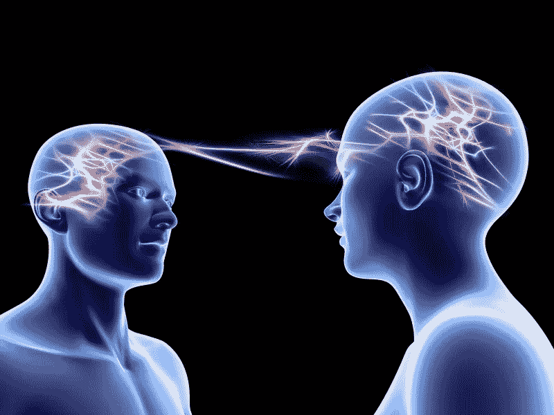
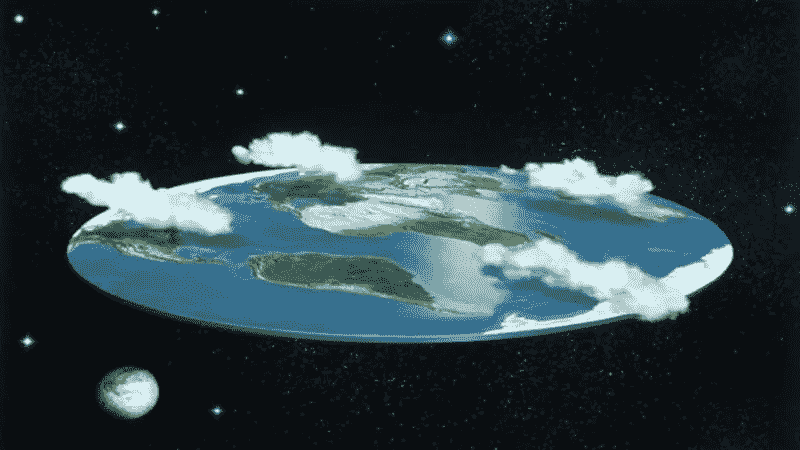
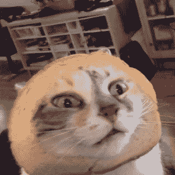
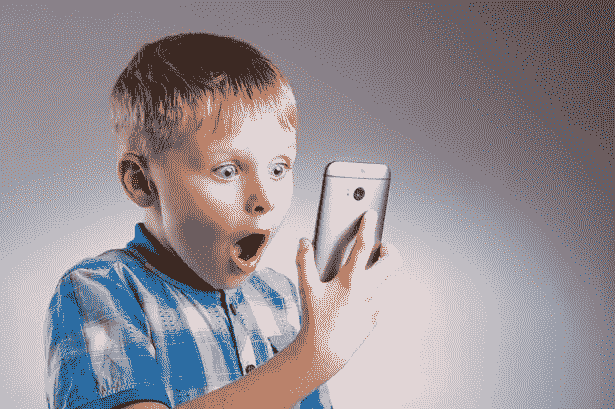

# 你猜怎么着也许上网应该被束缚。

> 原文：<https://medium.com/hackernoon/you-know-what-maybe-internet-access-should-be-fettered-adef42fb8c33>

我知道，我知道。解开你的内裤，跟我来一会儿。

问问你自己:互联网有多少是好的？我不是指“善与恶的力量”类型的善。实际上很好。有益或真正有趣的内容。7%?5%?少？

如果通过废除网络中立来增加互联网接入的成本可以改善内容，T2 会怎样？也许不是内容本身，但也许是你懒得看的内容，因为它的其余部分不值得花费。

也许，只是也许，你会收回一些时间。也许你不会暴饮暴食。我要求你们思考以下问题，哪怕只有一分钟。

# **心灵感应烂透了**

是的，我在看你，推特。二十年前，我会和一群朋友坐在一起玩“你会选择什么样的超级大国”的游戏通常人们会选择读心术(声明，他们错了，最好的超能力是心灵运输)。20 年后的今天，我们都有能力读懂每个人的每一个糟糕的想法。 和**简直烂透了**。大部分人的大脑都有炒鸡蛋的实质和清晰。他们的突触牢牢地系在团队误传的侮辱上。还记得我们无法组建这些团队的时候吗？当机器人没有告诉我们他们的机器人思想的时候？当我们在桃子镇的指挥官不能每天用他的垃圾感情激怒群众的时候？我不是说我们需要摆脱它。如果你热爱你的超能力，那就努力吧。但是，我敢打赌，如果你不得不为此付出更多，你只会说不，谢谢。

# **购物**

我保证。你不需要那些垃圾。如果有服务费，你会去购物中心吗？没有。所以，如果访问亚马逊的费用更高，你可能就不会这么做了。想象一下。在这个世界里，你不得不花超过一次点击的时间来重新考虑你的购买。也许你不会有魔鬼鸡蛋沙拉旋转器。也许你不会去买二手的鲁布托。也许这只是我。

# **平地球学会**

没人会为那破事付钱。再见。

# **CATS**

也许我们都会记得猫其实很差劲。或者我们可以看看家里已经有的。嘿，也许我们真的应该摸摸它们，而不是把它们推开，因为我们看不到屏幕。也许我们不会强迫他们戴面包头盔，因为我们有打破互联网的梦想。

# **频闪/大腿缝隙/腹部裂缝/轮廓/大腿眉毛**

我可以非常肯定地告诉你，我不会为了进一步摧毁我的自尊而额外付钱。我的意思是，我会在周五晚上免费做几个小时，但如果我不得不付钱呢？绝对不会。如果我找不到能让我保持自我憎恨的材料，我该怎么办？如果我不能看着 Instagram，意识到我的生活是一场由不匹配的床单和不整洁的眉毛组成的未策划的狗屎风暴？也许我会去治疗。

# 也许 11 岁的孩子不会谷歌“亚洲肛门袜子木偶奶油派”

也许*你*也不会，40 岁先生。我知道，你的蛋蛋在恐惧中爬回了你的身体。你在说什么，女士？我不会有自由进入步骤摩洛伊斯兰解放阵线吮吸青少年公鸡在淋浴？没有更多的勉强合法的高中荡妇干爷爷？我知道这很可怕。我不是建议我们禁止色情，但是，嘿，如果你必须为内容额外付费，也许你会更有眼光。也许十来岁的孩子没有机会接触到。我们已经在与在免费色情中长大的整整一代人打交道，如果你问我的任何一个 30 岁的单身朋友，他们都被*耍了。*或者，完全没有搞砸，因为色情已经把性变成了一种脱节和高期望值的奇怪组合。但那是另一回事了。