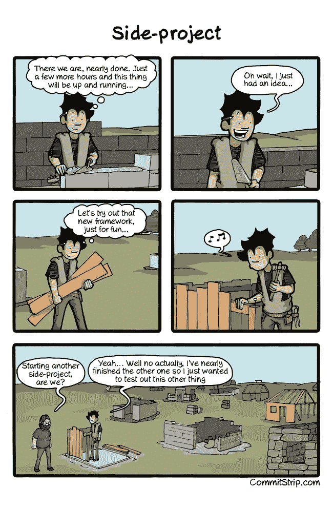

# 你可能不需要反应

> 原文：<https://medium.com/hackernoon/you-might-not-need-react-e5fd54611111>

**产品驱动开发的故事**

When someone says that you need to switch to React

“如果你是一名前端开发人员，但你仍然不在你的项目中使用 *React* ，你可能是一名糟糕的前端开发人员。你也不用 *ES6* 吧？那对你来说太糟糕了。也许 *Webpack* ？没有吗？你怎么还没被开除？”

我敢打赌，你们以前都听过这样的观点。周围的人希望我们使用最新的技术，就在它们被创造出来之后。我们停止了那些没有用 *React / ES6 / Webpack* (或者另一种新技术)编写的项目，仅仅是因为它们不是用它编写的不酷。因为有人说我们应用的技术已经死了，没人再用了。我们花费大量的时间来改变一切，尽管事实上我们最终会得到相同的工作产品。

我们真的应该一直这么盲目地做下去吗？不，不是真的。别做了。新技术并不总是一件好事。原因如下。

# **产品高于一切**

首先，我们是软件开发者，我们的职业意味着我们必须开发应用程序。让我们的生活变得简单并帮助人们的应用程序。能够正常工作的应用程序。这是我们的主要目标，如果我们达到了，我们会很高兴。

我们可能没有想到这一点，但当我们想要在新的轰动技术的道路上迈出一步时，我们已经有了一个有效的产品。或者可能现在还不行，但是在项目目前的环境下我们有很多经验。通过使用这些知识，我们可以使产品工作得更快，因为我们已经知道所有可能出现的问题的解决方案。

此外，您的用户并不介意您使用哪个框架来开发您的应用程序。他们只想用它来解决他们的问题。有太多伟大的产品是用一些人不想使用的技术开发出来的，因为他们认为这些技术已经“死了”。

*jQuery，Backbone，LESS，Ember* 等。你还认为这些东西死了吗？所以也许你需要看看使用*的[公司名单，比如。或者使用 *jQuery*](https://github.com/jashkenas/backbone/wiki/projects-and-companies-using-backbone) *的[公司。](http://royal.pingdom.com/2012/06/20/jquery-numbers/)* [或*余烬*](http://emberjs.com/ember-users/) 。Pinterest、WordPress、Yandex、StackOverflow、Amazon、Square、TED 等项目都使用这些框架。这些项目做得很好，有很多满意的用户。*

*因此，如果你在开发产品时使用你选择的任何工具，它们使产品工作，并且你的用户满意，你就已经走在正确的道路上了，不是吗？*

# ***过度炒作***

*我并不是说我们不必继续前进，在产品开发中引入新技术。*

*前端正在高速发展，也许比现在软件开发的任何其他领域都要快。开发人员从其他编程语言中带来了新的范例和新的设计模式，并创建了新的框架和新的库。似乎每个开发人员都必须编写自己的 JavaScript 框架，否则他就不够好。*

*这些东西中的一些确实可以使开发更快更容易。但并不是所有的*。*或者他们可以，但不适合你和你的项目。大部分都只是炒作，不值得任何关注。*

*我们常见的错误是喜欢这些新技术。当我们听到一个以“JS”结尾的美丽的新词，并读到它的小营销描述时，我们准备开始用这个“辉煌”的东西编写新的项目。但事实是，营销废话和美丽的名字是这一新事物的唯一优势，它可能会在未来两个月内被遗忘。我们花了这么多时间学习新东西，只是为了忘记它们，毁掉我们所有的知识，当有人在互联网上再次说它不再酷了，有一个最新的东西真的很棒。*

*有时候新技术真的可以是开创性的。但仍然不是马上开始用的理由。即使是革命性的技术也需要一些时间来“站稳脚跟”，获得所有需要的功能，并从最初的错误中得到修补。 *Node.js* 起初看起来是个很棒的东西，但是如果你决定用它来写你的项目，你会遇到比使用老式 PHP*更多的麻烦。在那个时候，Node.js 甚至没有足够的包来完成发送电子邮件这样的任务。 *React***

*你需要非常有耐心和选择性。你需要更好地选择技术。给他们一些时间让社区中的其他人利用。等到用的机会多的人说真的值得和他们合作。与你使用的技术相比，他们有真正的优势。等到人们编写了所有的部分，创建了所有的库，没有这些库你就不能使用这些技术，并且修复了所有的关键错误。*

*还要看看你的产品是否真的需要新框架的优势。很明显，例如， *React* 将提供更快的应用程序渲染。或者一个用于绘制图表的新库会比你当前的库绘制出更漂亮的图表。但是如果你的产品仍然没有提供一些基本的功能，这些特性可能就不那么重要了。用户宁愿在他们的图表上看到不那么漂亮但正确和最新的数据，即使这些数据是在 2 秒钟后呈现的，也不愿看到包含错误信息的快速而漂亮的图表。*

*如果一段时间后人们仍然喜欢这个新事物，如果你仍然清楚它的优点，那么就该开始计划变革了。*

# ***天时地利人和***

*所以你决定在你的产品开发中引入一些新的东西。但你还是不能在此时此地做。当你转换到一项新技术时，你将获得优势，但这只有在做出这种改变时才会发生。开始这种改变并不等同于完成它。*

*要实现这一改变，你需要两件重要的事情。第一个是你的团队，第二个是时间。两者相互影响。如果你有一个技术更好的团队，那么你需要更少的时间来开发一些东西，反之亦然。这两者也受贵公司预算的影响。*

*通常一个公司的财政资源非常有限。因此，你有一个有限的开发团队，他们的技能和有限的工作时间。在此期间，你需要向市场推出一些东西。一些能让你的公司赚更多钱并保持活力的东西。如果公司活着，那么你开发的产品也活着。这就是它的工作原理。当然，在这种情况下，我们谈论的是真实的世界和专业的软件开发，而不是那些可能永远发展下去并且根本没有用户的琐碎项目。*

*正如我们之前所说，作为开发人员，您需要让人们的生活变得更轻松。换句话说，给他们带来新的客户价值。它可能是一个新产品的发布，或者是一个已经存在的产品的新的便利特性。你需要尽快完成。如你所见，在如此有限的条件下，这可能是一个棘手的问题。一直都是这样。*

*你总是需要确保你的公司有足够的资源来执行技术的改变。*

*当你的公司没有很多资源的时候，你真的想开始吗？你真的想失去所有的时间，并在几个月的工作后，没有其他的相同的产品吗？或者，你可能需要等待一段时间，在使用当前框架的同时带来新的有意义的功能，获得更多的用户，获得新的投资者和更多的资金，找到更多拥有所需技能的开发人员，然后进行这一步？这个决定甚至可以值公司的命。*

*综上所述，您不仅需要选择一种迁移技术，还需要选择您的产品能够切换到该技术的时间。*

**

# *结论*

*新技术对软件开发者来说总是好的。然而，向他们的即时迁移通常不会成功结束。这个问题不仅仅是前端的问题，它与前端有很大的关系，因为现在是我们每天都有太多新事物出现的时候。*

*我们必须明白为什么我们拒绝使用一些旧技术，为什么我们不能再使用它。我们需要过滤新技术，找到钻石，远离垃圾。我们必须小心选择迁徙的时机。有时我们甚至不需要它，尽管这个想法很吸引人。有时我们需要等待很长时间才能进行下去。只是有时候我们能当场做到。*

******

> *[黑客中午](http://bit.ly/Hackernoon)是黑客如何开始他们的下午。我们是 [@AMI](http://bit.ly/atAMIatAMI) 家庭的一员。我们现在[接受投稿](http://bit.ly/hackernoonsubmission)，并乐意[讨论广告&赞助](mailto:partners@amipublications.com)机会。*
> 
> *如果你喜欢这个故事，我们推荐你阅读我们的[最新科技故事](http://bit.ly/hackernoonlatestt)和[趋势科技故事](https://hackernoon.com/trending)。直到下一次，不要把世界的现实想当然！*

**