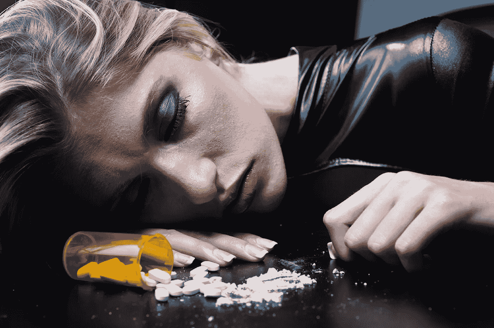

# 你需要进行信息节食

> 原文：<https://medium.com/hackernoon/you-need-to-go-on-an-information-diet-def2f5a3fd5b>

我们生活在一个吸毒者的社会里。你最好的朋友可能就是其中之一。你的家人也是。很有可能，你也是。然而，你的药物不是通常的嫌疑人之一，它更微妙，更安静，没有任何社会耻辱，并且可能，因为这些原因，更危险。

药物就是信息。

作为一个 15 岁的孩子，我成长的过程中，信息渗透到了我生活的方方面面。我需要知道我的朋友们每周 7 天每天 24 小时都在做什么——首先是在脸书，见鬼，如果我检查了脸书，为什么不在 Instagram 上，如果完成了，还有 Snapchat。

我不能忘记 Youtube 等平台上源源不断的内容，比如看你最喜欢的 vlogger 告诉你在你看的时候活得最精彩，在你的房间里，或者 Buzzfeed，因为看“闺蜜第一次乘坐加勒比海游轮”是对我时间的宝贵利用。

因此，在过去的几个月里，我意识到**我们在网上消费的大部分内容是完全无用的。**

Jake Paul- A rapidly growing Youtuber whose content is questionable at best

这是人类有史以来第一次接触到如此多的信息。[互联网](https://hackernoon.com/tagged/internet)被采用的速度意味着我们完全没有准备好处理它的数量，以及这些信息对我们的影响。

> 这是人类有史以来第一次接触到如此多的信息。互联网被采用的速度意味着我们完全没有准备好应对它的庞大数量。

我们中有多少人能说，他们从来没有掉进过链接的兔子洞，从一个链接跳到另一个链接，从一个谷歌搜索跳到另一个，没有明确的目的，也许甚至意识到这种行为是徒劳的，但仍然继续下去？

我们社会中最大和最有影响力的公司——谷歌、脸书和苹果，都依赖于你对信息的需求。也许正是因为我们对它的渴望，这些公司才达到了今天的影响力水平。

## 为什么我们如此沉迷于信息？

如果我们想放松对了解自己的需求的控制，我们必须首先理解我们为什么首先渴望如此多的信息。

作为原始人，我们天生就喜欢寻找能提高我们生存几率的东西。比如含糖食物、更高的社会地位和信息。为什么是信息？根据《科学美国人》的这篇文章，这是因为:

> 获得更多相关信息——比如知道食物在哪里——可以让动物做出更好的决定。此外，获得这些信息可能会让我们更好地控制我们的环境，从而增加我们的生存机会。

这些东西激活我们大脑中的奖励系统，释放一种叫做多巴胺的化学物质，这种化学物质在吃油炸食品或社交等愉快的情况下释放。

所以，互联网可以像食物一样令人上瘾，但它也有其他不利的副作用。根据《连线》杂志上的这篇文章，它通过提供太多的信息过度刺激大脑，并产生“削弱我们的深度处理能力，这种能力是正念知识获取、归纳分析、批判性思维、想象力和反思的基础。”这也让我们[的注意力持续时间缩短，可能的副作用是人际关系中的摩擦](http://www.nytimes.com/2010/06/07/technology/07brain.html?ref=matt_richtel&pagewanted=all&mtrref=en.wikipedia.org)。

## 我们该怎么办？

当然，互联网也不是那么糟糕。通过维基百科(Wikipedia)和 Youtube 这样的网站，可以获取信息和学习知识的人数量大幅增加。为了娱乐而上网并不是坏事，这是娱乐和放松的合法方式。问题在于我们使用它的方式和数量

经过思考，我意识到信息类似于食物。快速的网络文章和列表就像垃圾食品——快速、有趣、不健康，而合适的书籍是健康食品——没有那么有趣或快速，但对我们更好。

**如果我们想放松互联网对我们的控制，我们需要开始像思考我们吃的食物一样思考我们消费的信息。**

> 我们需要进行信息节食，就像我们进行食物节食一样，摆脱我们每天消耗的大量垃圾信息。

所以下次你在网上发现自己的时候，问问自己这些问题

我在这里是有原因的吗？

我正在阅读的东西真的对我有价值吗？

除了阅读眼前的东西，还有比这更有价值的用途吗？

过一段时间，你会从本质上理解你在网上做的是不是有用的事情。

> 互联网没有好坏之分，它是一种工具，而使用工具的方式决定了它们的好坏。互联网可以用来学习如何编码，或者与世界各地的人交流，也可以用来浪费时间浏览几个小时的无用内容。

**我们对信息的需求，就像我们对食物的需求一样，需要被控制。沉迷于信息和沉迷于其他任何东西一样糟糕。**

在信息控制我们之前，我们应该强迫自己控制我们消费的信息。

**感谢阅读**

萨尔瓦什

**想聊天？在**[**Twitter**](https://twitter.com/SarvasvKulpati)**，**[**Linkedin**](https://www.linkedin.com/in/sarvasvkulpati/)**，以及** [**Quora**](https://www.quora.com/profile/Sarvasv-Kulpati) 上找到我

这里是我写的其他一些帖子

 [## 你需要进行信息节食

### 我们生活在一个吸毒者的社会里。你最好的朋友可能就是其中之一。你的家人也是。很有可能，你也是…

hackernoon.com](https://hackernoon.com/you-need-to-go-on-an-information-diet-def2f5a3fd5b)  [## 苹果的专长不是硬件或软件

### 每个人在批评苹果时都忽略了一个明显的点

medium.com](/swlh/apples-speciality-isn-t-hardware-or-software-af1e6337d5f2)  [## 如果你是为年轻人创业，不要关注产品

### Snapchat 赢得我们所有千禧一代的特殊方式

hackernoon.com](https://hackernoon.com/if-you-are-making-a-startup-for-young-people-dont-pay-attention-to-the-product-fbeebb9059ce)