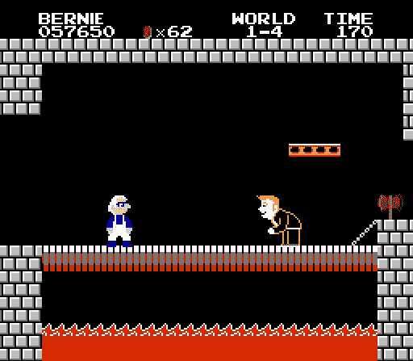

# 你看到这个周末发生了什么吗？CodeCampNYC！

> 原文：<https://medium.com/hackernoon/you-see-what-happened-this-weekend-free-training-833b4ef2e684>

我在时代广场的微软商店参加了 2016 年的 CodeCampNYC。我现在知道如何破解 NES 或者微软的 HoloLens 了。我有更好的反应-Fu 和 AspNet-Core-Do /*是的，这个双关语有点夸张*/。

(它不是免费的，它是 10 美元的注册费外加火车费…所以实际上是免费的…不要怀疑我，兄弟。；)

Attending CodeCamps could lead you on a path to programming something like [this](http://www.usnews.com/photos/2016/05/17/photos-donald-trump-video-game-villain)

> 代码营在微软的办公室并不意味着只有微软技术。我穿着我的“AWS Lambda/I survive the zombie 启示录”t 恤，没有发生任何建筑安全事故。

在 CodeCampNYC 上，主题由志愿者演讲嘉宾提出，与会者投票选出他们最感兴趣的主题。**活动当天可参加 5 场** [**65 场独特的 75 分钟工作坊**](http://codecampnyc.org/schedule/) **。**这不是一个赞助的演示“培训”活动:**这些研讨会的范围从 React 前端开发到高级云架构再到 NES 开发**。演讲者没有金钱补偿，只有进入瓦尔哈拉殿堂的保证。

每年 Picard 队长(又名 [Steve Bohlen](https://twitter.com/@sbohlen) )和[其他](https://twitter.com/boulosdib)出色的志愿者都会组织这种**几乎免费的年度全天软件工程师**培训活动。几乎免费意味着花 10 美元你就可以得到免费的水、咖啡、苏打水、甜甜圈和比萨饼。(无论赞助商的餐桌上会有什么好吃的。)

另外，*这是非常重要的*，**最后是免费奖品的抽奖**。是的，我说免费。哦耶！奖品从饥饿游戏的收割仪式(又名免费书籍)一直到免费的涅槃之旅(又名免费的**Xbox One S with Gears of War 4**)。

这些代码营发生在世界各地。 [CodeCampNYC](http://codecampnyc.org/) 是一个无价的培训资源。[费城的比纽约的](http://phillydotnet.org/)还要大。[波士顿有一个](https://www.bostoncodecamp.com)。对于注重数据的人来说，还有 SQL 周六活动。谷歌[it。买一张票。跳上飞机、火车或汽车，享受学习的乐趣。](https://hackernoon.com/tagged/google)

Me headed on the train to CodeCampNYC. Now if only they had a workshop on how to do selfies.

# 我参加了这五个很棒的工作坊！

## 安迪·雷塔诺[使用 NESpectre 开发 NES](https://twitter.com/@batslyadams)

他集成了 Node.js 网站之间的开发，该网站使用 socket.io 与 NES 上的 RAM 进行实时通信。我开始玩魂斗罗，而房间里的其他参与者将在他们的手机上选择我将拥有的武器。

在田径跳远比赛中，我们都用手机来模拟控制器上的按钮，这导致我们的选手从屏幕上跳下，然后从屏幕的左侧再次进入。这真的很搞笑。

我总是试着去上一堂与我的工作无关的随机课。这是我的选择。我运气好。谢谢安迪！[嵌入图 1](https://www.instagram.com/p/BLTaKpLBKjN/) 和[嵌入图 2](https://www.instagram.com/p/BLTf2BpBM2x)

Andy Reitano or @batslyadams

People add random objects and change the environment using their phones over socket.io, you see it switch to B&W

## 《反应》中的速成班由[埃迪·赞斯基](https://twitter.com/@eddiezane)

来自 Eddie 的一条有价值的建议是，如果你试图学习 React，如果你试图找到关于如何实现所有东西的完美示例代码，你可能会超载和困惑自己。他说你最好看看 FB 的文章，尤其是他们关于如何反应的文章。

Eddie 介绍了三个简单的 React 入门示例。我在 Instagram 评论中保存了前两个 jsbin 链接。

[嵌入图 1](https://www.instagram.com/p/BLTjl7BhnpY) 和[嵌入图 2](https://www.instagram.com/p/BLTupHDh79q)

He used jsbin.com for his tutorials, check the comments for links to code

a screenshot of his second example to fetch a list of tacos from giphy API

## 一个顾问遇到的棘手问题的日记。NET 4.5 到 ASPNET 核心:作者[约翰·布朗](https://twitter.com/@softcraftsman)

这真的是一个很实用的建议，一点也不复杂。这是你刚刚吃完两片比萨饼和早餐剩下的甜甜圈后应该寻找的东西。

我在评论中加入了他的一些观点。他在 Visual Studio 15 Preview 2 中从一个空的 MVC ASPNET 核心网站开始。他说这比浏览模板附带的臃肿代码要容易得多。

[嵌入图 1](https://www.instagram.com/p/BLT0phUh2yy) 和[嵌入图 2](https://www.instagram.com/p/BLT2vsih2ya)

Again, check the comments, that’s where the notes are

More notes via Instagram comments

## 第一次发言人[李·布兰特](https://twitter.com/@leebrandt)谈论在 ASP.NET 核心区做 OpenID 连接

我已经完成了一些 OAuth2 和 SAML 集成和联合项目，所以我想保持对其他新东西的更新，以方便 IDP 和 Auth 集成。李第一次做得很好。

他在研讨会上多次重申，“OpenID 连接”(OIDC)与“OpenID”不同。OIDC 有一个标准化的基本索赔清单和认证程序。成功的 OIDC 身份验证还会返回一个端点，用于检索用户的身份声明列表。

[嵌入图 1](https://www.instagram.com/p/BLT_YYjB0F0) 和[嵌入图 2](https://www.instagram.com/p/BLUBPO_BUKV)

check the comments for notes, he used aspnetcore yo generator

sample config for OpenID Connect in ASP.NET Core

## [Rob Zelt](https://twitter.com/@robzelt) 使用 C#和 Unity 在微软 Hololens 上展示 Hello World 课程

这很有趣。照片说明了一切。(我知道你在想什么，为什么我总是从 1 开始数而不是从 0？)

[嵌入图片 1](https://www.instagram.com/p/BLUJVo7hk0f) 和[嵌入图片 2](https://www.instagram.com/p/BLUKjlrB_Ae) 和[嵌入视频 3](https://www.instagram.com/p/BLUPBByBMUv)

walking through the hardware specs and common dev feedback he receives, check the comments

Hey, Ma! Look! I’m on TV, Ma! (Also sitting next to my awesome Slalom coworker and friend Kevin Mulder)

video demonstration of a hand coded bowling app. later he showed how the ball would bounce off of the podium.

午餐时间还有一场由赞助商主导的研讨会，但我没有去，而是去参加社交活动，与一位前客户同事聊天。总的来说，从新泽西坐十美元的火车非常值得。:)

**查找在您附近举行的代码夏令营或 SQL 星期六活动。这样的投资。很有趣。很有学问。**

# 如果你喜欢这个故事，请按下推荐键。

## ——就像 CodeCampNYC 的主持人一样，我活着就是为了你们的赞美。；)

如果你喜欢我的冷笑话，那么**跟着我**，如果你喜欢与编程相关的一切，那么**跟着出版物**。

我在 [Instagram](https://instagram.com/codingjoe) 和 [Twitter](https://twitter.com/@codingjoe)

> [黑客中午](http://bit.ly/Hackernoon)是黑客如何开始他们的下午。我们是 [@AMI](http://bit.ly/atAMIatAMI) 家庭的一员。我们现在[接受投稿](http://bit.ly/hackernoonsubmission)并乐意[讨论广告&赞助](mailto:partners@amipublications.com)机会。
> 
> 如果你喜欢这个故事，我们推荐你阅读我们的[最新科技故事](http://bit.ly/hackernoonlatestt)和[趋势科技故事](https://hackernoon.com/trending)。直到下一次，不要把世界的现实想当然！

