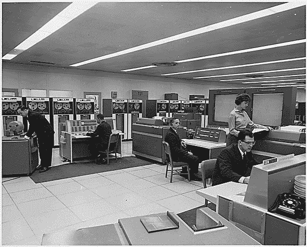

# 2017 年要学函数式编程

> 原文：<https://medium.com/hackernoon/you-should-learn-functional-programming-in-2017-91177148ec00>

函数式编程已经存在很长一段时间了，从 50 年代开始，引入了 **Lisp** 编程语言；如果你在过去的两年里一直在关注的话，像 **Clojure** 、 **Scala** 、 **Erlang** 、 **Haskell** 和**elixin**这样的语言已经引起了很大的反响，得到了大量的关注。

但是什么是**函数式编程**，为什么每个人都为之疯狂，为什么没有更多人使用它？在这篇文章中，我将尝试回答所有这些问题，并希望激起你对函数式编程的兴趣。

## 函数式编程简史

正如我们之前说过的，函数式编程始于 50 年代，当时创建了 Lisp 来运行在 IBM700/7000 系列科学计算机上。Lisp 引入了许多我们现在与函数式编程联系在一起的范例和特性，虽然我们可以称 **Lisp** 为函数式编程的鼻祖，但我们甚至可以进一步追溯到所有函数式编程语言的共同根源 **Lambda Calculus** 。



这是函数式编程最有趣的方面；所有函数式编程语言都基于同一个简单的数学基础，**λ演算**。

> Lambda 演算是图灵完备的，也就是说，它是一个通用的计算模型，可以用来模拟任何单带图灵机。[1]与其同名的希腊字母 lambda (λ)用于 lambda 表达式和 lambda 术语中，表示在函数中绑定变量。— [维基百科](https://en.wikipedia.org/wiki/Lambda_calculus#Explanation_and_applications)

Lambda 演算是一个令人惊讶的简单而强大的概念。lambda 演算的核心有两个概念:

*   **函数抽象**，用于通过名字(变量)的引入来泛化表达式。
*   **函数应用**，用于通过给特定值命名来评估通用表达式。

让我们来看一个例子，一个单自变量函数 *f* 将自变量增加 1:

```
f = λ x. x+1
```

假设我们想将函数应用于数字 5；那么该函数可以读作如下:

```
f(5) => 5 + 1
```

## 函数式编程基础

数学已经讲得够多了，现在让我们来看看使函数式编程成为一个强大概念的特性:

## 一流的功能

在函数式语言中，函数是一等公民，这意味着**函数可以存储在变量**中，例如在如下所示的 elixir 中:

```
double = fn(x) -> x * 2 end
```

因此，我们可以轻松地调用如下函数:

```
double.(2)
```

## 高阶函数

高阶函数被定义为以一个或多个函数作为自变量和/或返回新函数的函数。让我们再次使用我们的双重功能来举例说明这个概念:

```
double = fn(x) -> x * 2 end 
Enum.map(1..10, double)
```

在这个例子中 **Enum.map** 将一个可枚举的列表作为第一个参数，将我们刚刚定义的函数作为第二个参数；并且**将函数**应用于可枚举的每个元素，结果是:

```
[2,4,6,8,10,12,14,16,18,20]
```

## 不可变状态

在函数式编程语言中，状态是不可变的，这意味着一旦一个变量被绑定到**一个值，它们就不能被重新定义**，这有一个很好的优势**防止副作用和竞争条件**；使得并发编程变得更加容易。

像以前一样让我们用长生不老药来说明这个概念:

```
iex> tuple = {:ok, "hello"}
{:ok, "hello"}
iex> put_elem(tuple, 1, "world")
{:ok, "world"}
iex> tuple
{:ok, "hello"}
```

在这个例子中，我们的元组永远不会改变值，在第三行中，put_elem 返回一个全新的元组，而不修改原始元组的值。

我不会深入讨论细节，因为这篇文章不是对 lambda 微积分、计算理论甚至函数式编程的介绍；如果你想让我更深入地研究这两个话题，请在评论区给我留言。现在，我们从这一部分中得出以下结论:

*   函数式编程已经存在很长时间了(50 年代早期)
*   函数式编程基于数学概念，特别是 Lambda 演算
*   与命令式语言相比，函数式编程被认为太慢了
*   函数式编程正在卷土重来。

## 函数式编程应用

作为软件开发人员，我们生活在一个激动人心的时代，云的承诺终于到来了，有了它，我们每个人都可以获得前所未有的计算机能力。不幸的是，随之而来的还有对可伸缩性、性能和并发性的需求。

**面向对象编程**已经不再适用了，特别是当涉及到**并发**和**并行**的时候；试图给这种语言添加并发性和并行性会增加很多复杂性，并且通常会导致过度工程化和低性能。

另一方面，函数式编程已经非常适合这些挑战，**不可变状态、闭包和高阶函数**，这些概念非常适合编写高度并发和分布式的应用程序。

但不要相信我的话，你可以通过查看 WhatsApp 和 Discord 等初创公司的技术反馈找到足够的证据:

*   [WhatsApp](https://www.wired.com/2015/09/whatsapp-serves-900-million-users-50-engineers/) 通过使用**二郎**，在团队只有 **50 名工程师**的情况下，能够支持 9 亿用户。
*   [Discord](https://blog.discordapp.com/how-discord-handles-push-request-bursts-of-over-a-million-per-minute-with-elixirs-genstage-8f899f0221b4) 以类似的方式使用**药剂**每分钟处理超过**百万个请求**。

由于函数式编程的优势，这些公司和团队有能力处理这种大规模增长，并且随着函数式编程获得越来越多的牵引力；我坚信像 WhatsApp 和 Discord 这样的故事会越来越普遍。

由于这个原因，函数式编程需要成为每个开发人员的必备知识，你需要准备好构建下一代应用程序，为下一个十亿用户服务。如果这还不够的话，相信我，函数式编程真的很有趣，看看**灵丹妙药**:

*   [仙丹入门](http://elixir-lang.org/getting-started/introduction.html)
*   [学习仙丹的有趣方式](http://rob.conery.io/2016/01/04/learn-elixir-while-having-fun/)
*   [我们享受编写灵丹妙药的 4 个理由](https://teamgaslight.com/blog/4-reasons-were-having-fun-programming-elixir)

最后，如果你有任何意见，纠正或你想知道更多关于这个主题，不要犹豫，留下评论就在下面。

*本文原帖* [*在我自己的网站*](http://coderoncode.com/functional-programming/2017/04/23/you-should-learn-functional-programming-in-2017.html) *。*

[](http://bit.ly/HackernoonFB)[](https://goo.gl/k7XYbx)[](https://goo.gl/4ofytp)

> [黑客中午](http://bit.ly/Hackernoon)是黑客如何开始他们的下午。我们是 [@AMI](http://bit.ly/atAMIatAMI) 家庭的一员。我们现在[接受投稿](http://bit.ly/hackernoonsubmission)并乐意[讨论广告&赞助](mailto:partners@amipublications.com)机会。
> 
> 如果你喜欢这个故事，我们推荐你阅读我们的[最新科技故事](http://bit.ly/hackernoonlatestt)和[趋势科技故事](https://hackernoon.com/trending)。直到下一次，不要把世界的现实想当然！

