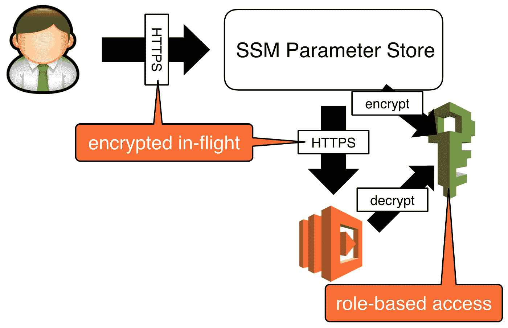
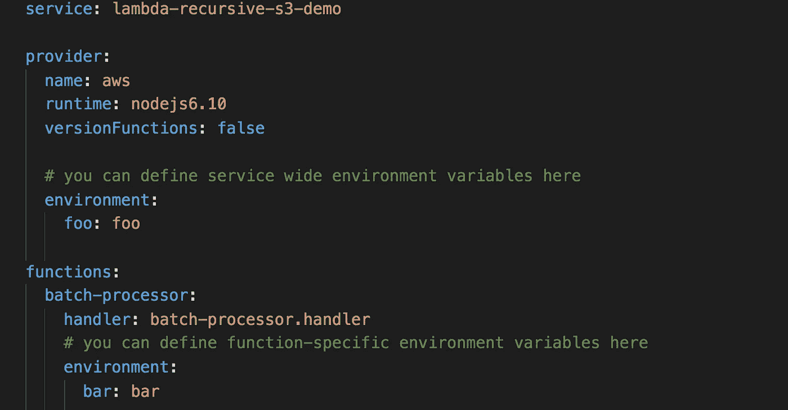
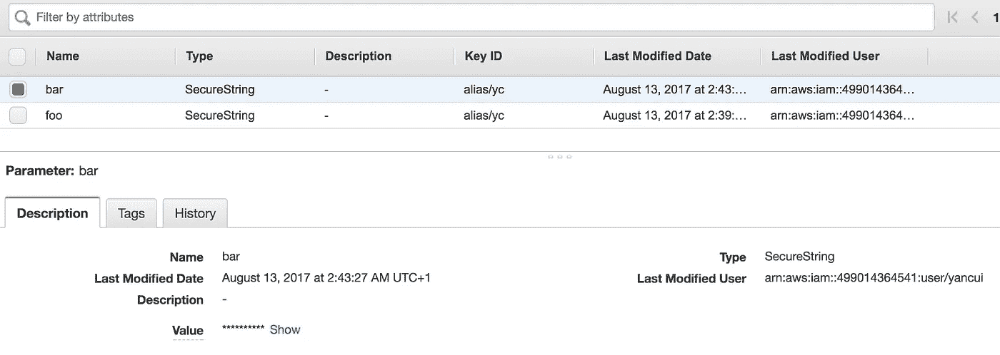
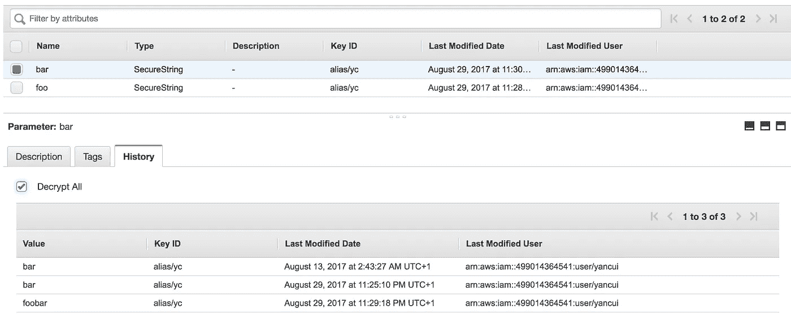
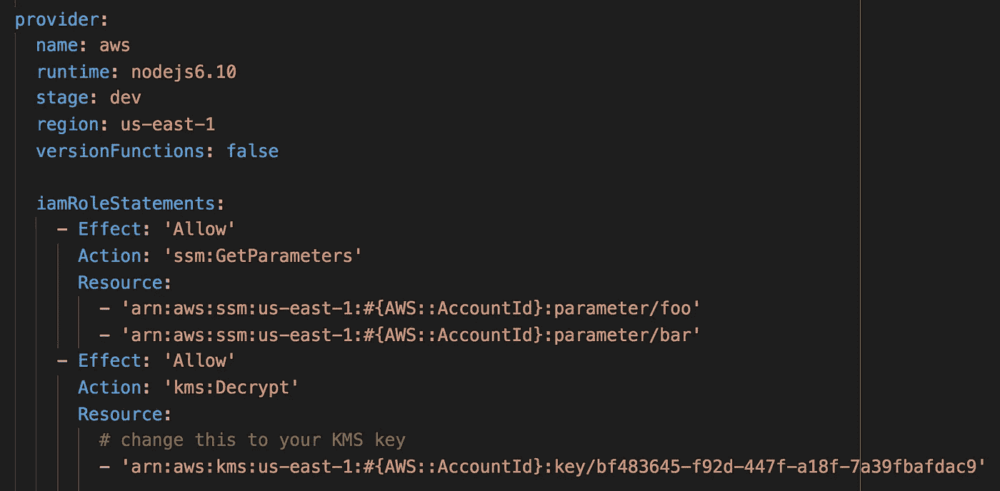
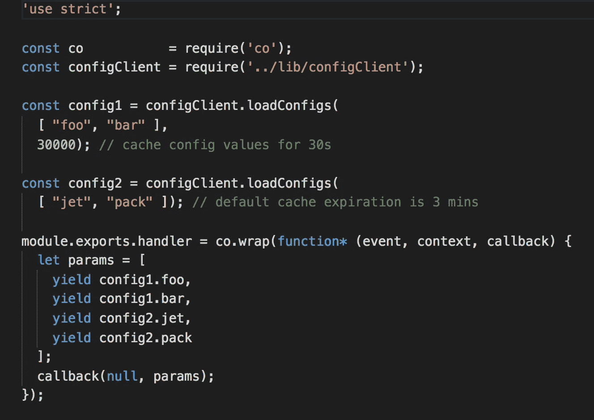
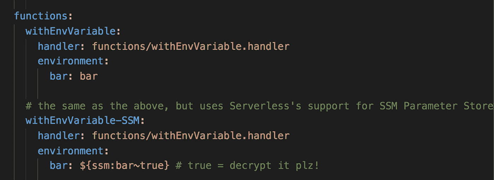

# 你应该在 Lambda 环境变量上使用 SSM 参数存储

> 原文：<https://medium.com/hackernoon/you-should-use-ssm-parameter-store-over-lambda-env-variables-5197fc6ea45b>

## AWS Lambda 引入了对环境变量的本机支持(带有 KMS 加密支持)。但是，使用 AWS Lambda 环境变量很难跨函数共享配置值，也很难实现对敏感数据(如凭证、API 密钥等)的细粒度访问。)

***更新*** *:这篇文章在无服务器框架 1.22.0 发布后于 2017 年 9 月 15 日更新，该框架引入了对 SSM 参数存储的开箱即用支持。请到文章末尾查看它与其他方法的比较。*

AWS Lambda [在 2016 年底宣布对环境变量的原生支持](https://aws.amazon.com/blogs/aws/new-for-aws-lambda-environment-variables-and-serverless-application-model/)。但即使在那之前，[无服务器](https://serverless.com/)框架已经支持环境变量，当我和我的团队在[将我们的 monolithic Node.js 后端迁移到无服务器](https://theburningmonk.com/2016/12/yubls-road-to-serverless-architecture-part-1/)时，我正在愉快地使用它们。

然而，随着我们架构的扩展，我们发现用环境变量管理配置有几个缺点。

# 难以跨项目共享配置

对我们来说，最大的问题是无法跨项目共享配置，因为环境变量在运行时是特定于功能的。

无服务器框架有[服务](https://serverless.com/framework/docs/providers/aws/guide/services/)的概念，这只是将相关功能组合在一起的一种方式。您可以指定服务范围的环境变量以及特定于函数的环境变量。

A sample serverless.yml that specifies both service-wide as well as function-specific environment variables.

然而，我们经常发现配置需要跨多个服务共享。当这些配置发生变化时，我们不得不*更新并重新部署依赖它们的所有功能*——这本身就成为了一个挑战，以跟踪由团队不同成员维护的许多 Github repos 之间的依赖关系。

例如，当我们在交付新特性的同时从一个单一的系统一点一点地迁移时，我们不能一次性地从单一的 MongoDB 数据库中迁移出来。这意味着许多函数共享 MongoDB 连接字符串。当这些连接字符串中的一个发生变化时——它确实发生了几次——痛苦和苦难就接踵而至。

我们经常共享的另一个可配置值是中间服务的根 URL。作为一个社交网络，我们很多用户发起的操作都依赖于关系数据，所以我们很多微服务都依赖于关系 API。与其将 URL 硬编码到每个服务中的关系 API(致命的[微服务反模式](http://theburningmonk.com/2015/05/craftconf15-takeaways-from-microservice-antipatterns/)之一)，不如将其存储在中央配置服务中。

# 难以实现细粒度的访问控制

当您需要配置敏感数据(如凭据、API 密钥或数据库连接字符串)时，经验法则是:

1.  静态数据应该加密(包括不以明文形式将数据签入源代码管理)
2.  数据在传输过程中应该加密
3.  将最小特权的**原则应用于功能和人员对数据的访问**

如果你在一个监管严格的环境中运营，那么第 3 点。可能不仅仅是一个好的实践，而是一个法规要求。我知道许多金融科技公司和金融巨头对生产证书的访问受到严格控制，只有公司中的少数人才能获得。

而像[无服务器秘密插件](https://github.com/serverless/serverless-secrets-plugin)这样的努力实现了第一点。它将一个人部署 Lambda 功能的能力与一个人对敏感数据(即部署该功能的人也必须能够访问敏感数据。这对于许多初创公司来说可能是可以的，因为每个人都可以访问任何东西，理想情况下，你管理数据访问的流程可以随着公司的发展而发展。

# SSM 参数存储

我的团队无法满足环境变量的需求，我开始寻找这个领域其他流行的解决方案——etcd、consul 等。但是我真的不喜欢这些解决方案，因为:

*   运行它们的成本很高:您需要在多 AZ 环境中为 HA 运行几个 EC2 实例
*   你必须管理这些服务器
*   他们都有一个关于配置服务和 CLI 工具的学习曲线
*   我们需要他们提供的一小部分功能

这是亚马逊在 re:invent 2016 上宣布 SSM 参数商店之前的 5 个月，所以当时我们用 API Gateway 和 Lambda 构建了自己的配置 API。

现在，您应该只使用 SSM 参数存储，因为:

*   这是一项全面管理的服务
*   共享配置很容易，因为这是一项集中服务
*   它与 KMS 集成，开箱即用
*   它通过 IAM 提供细粒度的控制
*   它记录了变化的历史
*   你可以通过控制台 [AWS CLI](http://docs.aws.amazon.com/cli/latest/reference/ssm/index.html#cli-aws-ssm) 以及它的 HTTPS API 来使用它

简而言之，它符合我们所有的条件。

You can create secure strings that are encrypted by KMS.

You can see a history of all the changes to these parameters.

You have fine-grained control over what parameters a function is allowed to access.

有几个[服务限制](http://docs.aws.amazon.com/general/latest/gr/aws_service_limits.html)需要注意:

*   每个帐户最多 10，000 个参数
*   参数值的最大长度为 4096 个字符
*   一个参数的最大 100 个过去值

# 客户端库

拥有一个集中存储参数的地方只是事情的一个方面。您仍然应该努力创建一个易于使用的健壮的客户端库，并支持:

*   缓存和缓存过期
*   源配置值更改时的热插拔配置

这是我为演示而创建的一个客户端库:

要使用它，您可以用`loadConfigs`函数创建配置对象。这些对象将公开返回配置值为`Promise`的属性(因此有了`yield`，这是我们从 [co](https://github.com/tj/co) 中获得的神奇力量)。

不同的缓存过期时间也可以有不同的配置值。

如果您想尝试使用 Lambda 中的 SSM 参数存储(或者查看这个缓存客户端的运行情况)，那么请检查这个 [repo](https://github.com/theburningmonk/lambda-config-demo) 并将其部署到您的 AWS 环境中。我没有包含任何 HTTP 事件，所以您必须从控制台调用这些函数。

**2017 年 9 月 15 日更新:**无服务器框架版本 1.22.0 引入了对 SSM 参数的开箱即用支持。

有了这个最新版本的无服务器框架，您可以直接从 SSM 参数存储中指定环境变量的值。

与许多现有方法相比，它有一些优点:

*   避免在源代码管理中以纯文本形式签入敏感数据
*   避免在多个服务中复制相同的配置值

然而，它在许多方面仍然存在不足(根据我自己的要求):

*   因为它在部署时获取 SSM 参数值，所以它仍然**将您部署功能的能力与对敏感配置数据的访问**
*   配置值以 Lambda 环境变量的形式存储在**纯文本中，这意味着您不需要 KMS 权限就可以访问它们，您可以在 Lambda 控制台中清楚地看到它们**
*   除此之外，如果该函数被攻击者破坏(攻击者随后可以访问`process.env`，那么他们将能够在初始探测期间轻松找到解密的值(转到此[视频](https://www.youtube.com/watch?v=jUhiPj6h_L8)中的 13:05 标记，我在那里演示了这是如何轻松完成的)
*   因为这些值是在部署时生成的，**它不允许您轻易地传播配置值更改**。要更改配置值，您需要 a) *识别所有相关功能*；以及 b) *重新部署所有这些功能*

当然，您的需求可能与我的非常不同，我当然认为这是对我见过的许多方法的改进。但是，我个人仍然认为你应该:

1.  运行时获取 SSM 参数值
2.  缓存这些值，并在源值改变时进行热交换

嗨，我的名字是**崔琰**。我是一个 [**AWS 无服务器英雄**](https://aws.amazon.com/developer/community/heroes/yan-cui/) 和 [**量产无服务器**](https://bit.ly/production-ready-serverless) 的作者。我已经在 AWS 中运行了近 10 年的大规模生产工作负载，我是一名架构师或首席工程师，涉足从银行、电子商务、体育流媒体到移动游戏等多个行业。我目前是一名专注于 AWS 和无服务器的独立顾问。

你可以通过[邮箱](mailto:theburningmonk.com)、[推特](https://twitter.com/theburningmonk)和 [LinkedIn](https://www.linkedin.com/in/theburningmonk/) 联系我。

查看我的新课程，[**AWS 步骤功能完整指南**](https://theburningmonk.thinkific.com/courses/complete-guide-to-aws-step-functions) 。

在本课程中，我们将介绍有效使用 AWS Step Functions 服务所需了解的一切。包括基本概念、HTTP 和事件触发器、活动、设计模式和最佳实践。

点击获取您的副本[。](https://theburningmonk.thinkific.com/courses/complete-guide-to-aws-step-functions)

来了解 AWS Lambda: CI/CD 的操作性**最佳实践**，本地测试&调试功能、日志记录、监控、分布式跟踪、canary 部署、配置管理、认证&授权、VPC、安全性、错误处理等等。

还可以用代码 **ytcui** 获得**票面价格 4 折**。

点击获取您的副本[。](https://bit.ly/production-ready-serverless)