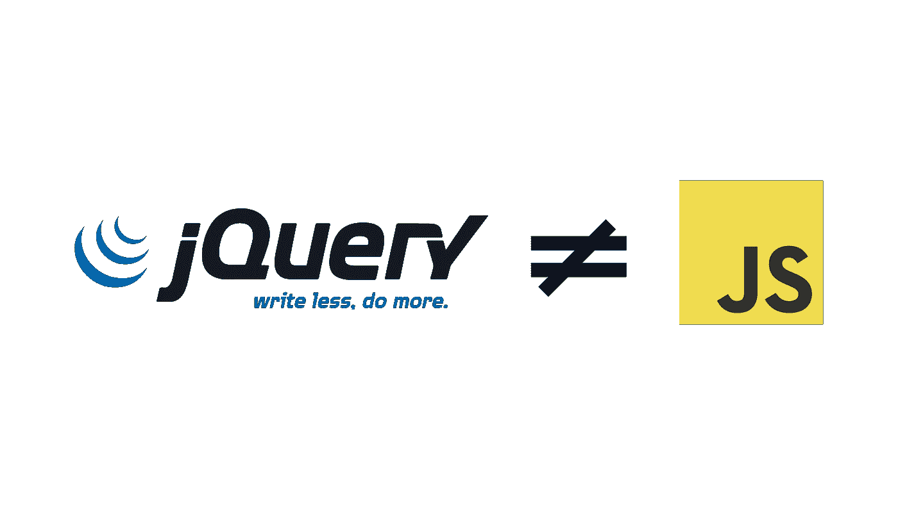

# 你真的不需要 jQuery

> 原文：<https://medium.com/hackernoon/you-truly-dont-need-jquery-5f2132b32dd1>



…如果不是绝对需要，你真的不应该使用它。

免责声明:这不是一篇反 jQuery 的文章。所有这些都可以应用于任何 JavaScript 库或框架。jQuery 似乎只是开发人员在开始之前添加的一个库。

我不时会看到一篇文章，提到学习 JavaScript，也提到立即学习 jQuery。我认为这不是最好的建议。应该像对待任何其他库一样对待 jQuery，并且应该只在需要的时候添加它。

现在有很多关于完全不使用 jQuery 的争论。JavaScript 提供的大多数原生 DOM API 都受所有现代浏览器(IE9+)支持，并且比 jQuery 更快。如果它们在目标浏览器中不可用，那么不用 jQuery 也很容易实现。

下面是一些常用的 jQuery 方法，以及它们在原生 JavaScript 中的对应方法。

## 文档就绪

```
// jQuery
$(document).ready(readyCb);
or
$(readyCb);// VanillaJs
function docReady(cb) {
  if (document.readyState != 'loading'){
    cb(); 
  } else {
    document.addEventListener('DOMContentLoaded', cb);
  }
}docReady(readyCb);
```

## 选择器

这里列出了各自的性能: [JSPERF](https://jsperf.com/dm-jquery-vs-vanilla-selectors) 。

剧透一下 VanillaJS 选择器每次都比 jQuery 计数器部分快。

**类选择器(IE 9+)**

```
// jQuery
const items = $('.item');// VanillaJS
const items = document.getElementsByClassName('item');
```

**ID 选择器(IE 6+)**

```
// jQuery
const item = $('#item');// VanillaJS
const item = document.getElementById('item');
```

**查询选择器(IE 9+)**

```
// jQuery
const items = $('.list .item');
const lastItem = $('.item:last-item');// VanillaJS
const items = document.querySelectorAll('.list .item');
const lastItem = document.querySelector('.item:last-item');
```

## 添加/删除类别(IE 10+)

要用 VanillaJS 添加和删除类，可以使用`classList`。对这一个的支持几乎是 IE 10+加上一些警告。有关支持的更多信息，请参见[can use](http://caniuse.com/#feat=classlist)。

```
// jQuery
const item = $('#item')
item.addClass('new-class');
item.removeClass('new-class');// VanillaJS
const item = document.getElementById('item');
item.classList.add('new-class');
item.classList.remove('new-class');
```

## 显示/隐藏元素

```
// jQuery
const item = $('#item');
item.hide();
item.show();// VanillaJS
const item = document.getElementById('item');
item.style.display = 'none';
item.style.display = '';
```

## 创建交互式、快速动态网页应用的网页开发技术

用于替换美元。ajax 你有几个选择

**XMLHttpRequest (XHR)**

这有最好的浏览器支持，但是 API 真的不是最直观的。

```
const xhr = new XMLHttpRequest();
xhr.addEventListener("load", function() {
  // response can be used here
});
xhr.open('GET', 'url');
xhr.send();
```

**获取**

大多数主流浏览器都支持 Fetch，但是 IE 和 Safari 还不太支持(Safari 即将支持 Mac)。有一些很好的小[多孔填料](https://github.com/github/fetch)用于在需要时固定支架。查看[可使用](http://caniuse.com/#feat=fetch)获取更多支持信息。

```
fetch(’url’)
  .then(function (response) {})
  .catch(function (error) {});
```

**另一个请求图书馆。**

我个人最喜欢的是 Axios，但是还有很多其他的。

```
axios.get(’url’)
  .then(function(response) {})
  .catch(function(failedResponse) {});
```

如果你想要更多的例子，可以去看看 youmightnotneedjquery.com。

## 你可能还想用它

jQuery 是那些在浏览器不标准的时候几乎是必需品的工具之一，但是浏览器在很大程度上已经标准化了大多数 API，并且比过去更快地增加了支持。这并不是说 jQuery 仍然没有用武之地，但是你不应该仅仅因为它是 jQuery 就默认在每个项目中都使用它。

[](http://bit.ly/HackernoonFB)[](https://goo.gl/k7XYbx)[](https://goo.gl/4ofytp)

> [黑客中午](http://bit.ly/Hackernoon)是黑客如何开始他们的下午。我们是 [@AMI](http://bit.ly/atAMIatAMI) 家庭的一员。我们现在[接受投稿](http://bit.ly/hackernoonsubmission)并乐意[讨论广告&赞助](mailto:partners@amipublications.com)机会。
> 
> 如果你喜欢这个故事，我们推荐你阅读我们的[最新科技故事](http://bit.ly/hackernoonlatestt)和[趋势科技故事](https://hackernoon.com/trending)。直到下一次，不要把世界的现实想当然！

