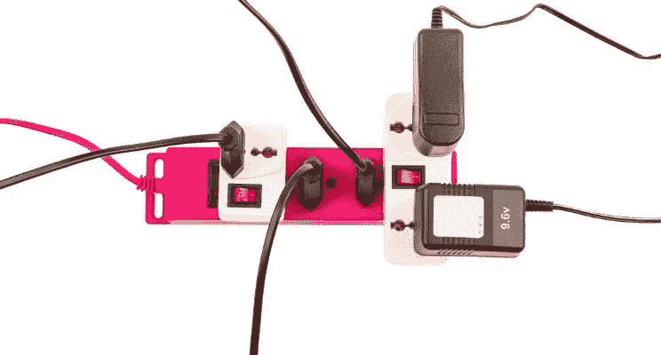

# 你想用区块链做什么？？

> 原文：<https://medium.com/hackernoon/you-want-to-use-blockchain-for-what-f274cb0baec8>

就像节日期间过载的电源插座一样，区块链及其后代加密货币和数字代币是所有问题的答案，当所有问题都是钉子时，它们就是锤子。区块链将解决我们有史以来在商业和技术领域面临的所有问题。

> *区块链将解决我们有史以来在商业和技术上面临的所有问题……不是的。*

# 何时使用区块链

在我的业务中，我花了绝大部分时间帮助企业、企业高管和企业运营团队设计由区块链驱动的商业模式；我帮助他们将新的商业模式 100%与区块链的能力结合起来，并为新的分布式经济设计业务。

有充分的理由使用区块链。正如我之前所写的，理解商业可能性可以让你将创新提升到一个全新的水平。在谈论、建议和支持用例开发的时候，我注意到，简单地说，在哪里划分区块链的使用界限并没有被很好地理解。因此，你可以问自己以下问题，以帮助你理解区块链是否就是答案:

1.  **不可变:**您的企业是否受益于保存可信数据或交易历史的不可变分类账——“基于价值而非信息”——以在此类交易中加强信任？
2.  **信任:**您的企业是否受益于某种程度的信任，而这种信任在历史上是通过基于合同的书面协议来实施的，并且是通过集中的业务流程执行来授予的？
3.  **监管:**你的企业是否需要一个所有权和身份明确的不可否认的监管链？
4.  **安全性:**您的企业是否需要一种分布式、可信且基于共识的技术能够提供的安全级别？是否需要加密和数字签名来证明真实性、身份等？
5.  **数据可访问性:**您的业务是否受益于其数据的匿名性和开放性，同时消除了复杂的公司和资源生态系统，这些生态系统需要执行一项不够充分的服务工作，而对等、可信、开放的分类帐可以执行这项工作。
6.  **多方:**您的企业是否需要多方读取相同的信息并写入共享的分类帐，因为不应该有任何特定的一方处于控制之下？
7.  **点对点:**您的业务是否受益于以网络方式执行，在这种方式中，对等点相互作用以直接获得结果，而无需中介？

如果以上任何一个问题都是否定的，你应该认真回顾并诚实地问自己，*“我能否用基于传统集中范式和技术的传统商业模式来建立我的企业？”*

# 关于加密货币和代币的问题

除了上面概述的基本措施之外，当你设计你的业务时，如果你的业务需要一个内在的资金来源，其中付款由系统而不是第三方支付，一个令牌，你需要问自己以下问题:

1.  **加密货币:**如果参与和价值交换需要上述功能，您的企业是否需要或受益于现有或私有货币？
2.  **代币:**你的企业是否需要一种公用代币，通过这种代币将货币兑换成一个闭环交换系统，从而使你的商业模式能够以其他方式无法运作？

如果你对上述问题的回答是肯定的，那么你肯定需要区块链，然而，如果你拿走了这两者中的任何一个，并且你的业务没有崩溃，*“你不需要加密货币，你可能也不需要区块链。”*

# 决定决定

当我帮助企业明白他们追求的想法不需要区块链时，我觉得自己做得很好。在不需要的时候使用区块链是一个非常昂贵的提议，会影响生存。如果你试图在没有重新设计商业模式的情况下，强行将区块链融入你当前的业务，往好了说，你是在浪费金钱，阻碍你的业务运营，往坏了说，是在危及你的业务未来。然而，设计一项由区块链推动的业务是一项不断发展的技能；直到两年前，大多数人还不具备这项技能，商业设计的经济和运营模式只是略有不同。

*如果您喜欢这篇文章，请点赞或分享到您的网络中，这样其他人也可以从中受益。*

> 然而，设计一项由区块链推动的业务是一项不断发展的技能；直到两年前，大多数人还不具备这项技能，商业设计的经济和运营模式只是略有不同。

最后，如果你的商业模式需要上述能力，或者如果你的商业模式是为新区块链经济而设计的，并且在这些方面表现出色，那么区块链就是你的选择。

*原载于 2017 年 10 月 27 日*[*https://www.linkedin.com*](https://www.linkedin.com/pulse/you-want-use-blockchain-what-timothy-myers/)*。*