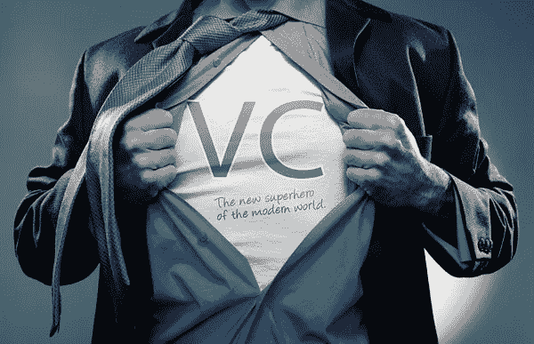

# 你不会相信造成风险投资性别歧视危机的简单错误

> 原文：<https://medium.com/hackernoon/you-wont-believe-the-simple-error-responsible-for-venture-capital-s-sexism-crisis-948c27d426df>

这个模型太简单了:人员不足如何导致更少的风险投资支持的女性为中心的企业创始人。

Thanks to Alley Watch For This Hilarious Image

当涉及到关于女性的新闻[骚扰](https://techcrunch.com/2017/06/23/female-founders-accuse-vc-justin-caldbeck-of-making-unwanted-advances/)、[性别歧视欺凌](http://www.chicagotribune.com/news/opinion/editorials/ct-uber-tech-culture-sexism-edit-0618-md-20170616-story.html)和[让女性首席执行官沉默](https://www.axios.com/how-lightspeed-responded-to-caldbecks-behavior-with-stitch-fix-founder-2449360633.html)时，Venture 这个月并不顺利，这些新闻展示了女性在科技领域的可悲状况，为关于女性在风险投资过程中如何被看待的[的](https://hbr.org/2017/05/we-recorded-vcs-conversations-and-analyzed-how-differently-they-talk-about-female-entrepreneurs)[清醒研究](https://hbr.org/2017/06/male-and-female-entrepreneurs-get-asked-different-questions-by-vcs-and-it-affects-how-much-funding-they-get)提供了真实世界的例子。但我对其根源有一个非常简单的理论。这是一个错误的算法。

由于机器学习如此流行，让我们来学习一下风投，尤其是男性风投，是如何被他们自己的心智模型引入歧途的(对于一个软弱的个人算法来说，这是人之常情)。

统计学中有一个非常基本的概念:欠拟合与过拟合。

*过拟合*是模型或算法与底层数据*拟合得太好时发生的情况。当不影响或改善预测时，该模型包括所有外来噪声甚至数据。*

**欠拟合*另一方面，当模型无法捕捉数据的潜在趋势，因此无法建立有效的预测模型时，就会发生这种情况。该算法错过了趋势，因为它看到的只是一堆没有意义的独立数据点。[对模型进行欠拟合时，它的泛化能力会增加](https://datascience.stackexchange.com/questions/361/when-is-a-model-underfitted)*

**欠拟合模型过于简单，无法进行预测，因此数据根本不符合算法。当数据没有向风险投资家展示他想看到的东西时，他就通过了(即使有可预测性和数据可以显示出来)。**

*在人类算法或心理模型的情况下，这意味着非常真实的数据趋势被错过，因为它们对人的当前心理模型没有任何意义。*

> *在这种情况下，默认的输入假设是，女性创始人能力较弱，女性不如男性有能力，T2 没有风险投资，CEOS 没有风险投资，或者她们的企业不值得投资。*

*这种偏见是风险投资家自己头脑中的[学习](https://hackernoon.com/tagged/learning)算法中错误假设的错误。高偏差会导致算法错过固有特征和目标输出之间的相关关系。**这里的目标产出是风险投资规模的回报，以及女性创始人的内在特征。***

> *由于硅谷对我们的精英制度坚信不疑，许多人，尤其是男性，[有高估自己才能的倾向](https://link.springer.com/article/10.1007%2Fs11199-015-0486-9)(导致他们的预测心智模型或肉空间算法的准确性假设)。**男人自以为比自己聪明。所以他们让不准确的简单模型来引导他们。***

*通过过度拟合，模型捕获新数据点的元素并对其进行调整，即使它没有提高其预测能力(甚至使其恶化)。在欠拟合的情况下，新的数据点会丢失，并且模型不会改进。*

***另一方面，欠拟合是模型过于简单的结果。**认为曲棍球棒增长；非常简单易懂。这就是为什么几乎所有高增长公司都会受到关注。如果一家企业增长足够快，那它一定很好。但是没有人看引擎盖下明白为什么。增长的一些原因可能是:*

> *高额的营销支出，一旦被切断，将会抑制增长*
> 
> *一种随机的时尚，是一种特征，而不是一种商业*
> 
> *风险投资参与的人群的早期大规模采用不会保持规模*
> 
> *将战术业务(订阅、flash 销售)误认为战略业务*

*因此，可资助项目的外部迹象长期倾向于不适合。很少有风险投资公司偏离这种“高增长等于成功”的模式，这就是我们如何获得大量失败的原因，如 Secret(归零)、Fab(以其电子邮件列表的价值出售)、Quirky(归零)或 Groupon(永远不会恢复其原始价值)。*

*这并不意味着所有高增长企业都注定要失败。恰恰相反。仅仅是我们的糊状肉空间算法的这些心理模型将噪声与相关数据结合在一起，并相信它们都符合模型。*

*我们认为我们看到了别人看不到的模式。风险投资家认为一家公司的高增长是由巨大的营销支出带动的(男性经营的公司几乎总是比女性手头上有更多的资金可以花),并将这种增长归因于某种东西，而不是单一的美元投入对美元的投入*

*但是回到最基本的，我们并不像我们认为的那样聪明。风险投资错过了更微妙的业务或不熟悉的业务的潜在趋势，因为有不适应的趋势。简而言之:*

> *他们想得太简单了。*

*另一个简单的心理模型阻碍了风险投资获得更多样化的持续回报？某些类型的业务不值得冒险(这是一种生活方式的业务，或者这个类别不可能有风险大小的回报，因为“插入网络效应、凸性等老生常谈，模型纯度，这个类别在过去从未显示过，等等”)。*

*在这种情况下，风险投资者非常容易不适应，因为他们的心理模型没有纳入他们个人不经常经历的领域的数据点。它没有映射到他们的心理模型中，因此阻碍了任何建设性的预测能力。*

*这和资金有什么关系？我们必须问自己，投资者实际上是如何做出决策的——他们的心理模型或算法实际上是如何工作的——他们真的正确地理解并训练了他们的心理模型，并看到了潜在数据的真实趋势吗？*

*好的预测模型反映了手头的数据。如果我们要找谁，应该资助什么；实际上，这些数据应该是 T2 能够创业的人口数量。嗯，任何人都可以(尽管不是每个人都适合成为企业主、创始人或企业家)。因此，从理论上讲，创始人基数应该大致与总人口基数相关。但事实并非如此。一点也不。*

*有没有注意到我们是如何让数千名 20 多岁的白人男性创始人获得融资的，尽管他们之前没有成功创办公司的记录——只是因为他们碰巧看起来和听起来像乔布斯/盖茨/扎克伯格？*

*这个装配不足的问题有多严重？即使一只基金明确声称拥有包含并努力理解所有数据点的尽职调查模型，而不仅仅是“嘿，高增长”或“漂亮的顶线”,也会因为不适应而挣扎并忽视伟大的企业。*

*以我的公司 [Stowaway](https://stowawaycosmetics.com/) 为例——对消费者来说，它看起来像一家化妆品公司，因为我们生产和零售的一系列化妆品在某些人眼里“可能”没有风险支持(尽管许多直接面向消费者的业务，如眼镜、鞋子、床垫，以及三家 razer 公司和我们一样有风险支持)，但实际上，它是一家 CRM 电子商务公司，其预测数据商业模式的基础是通过更好的产品设计增加消费&精确的消费者知识——不足的趋势是简单地说，化妆品作为一个垂直行业是没有风险支持的。尽管这是一个同义反复，因为我们实际上是风险投资支持的。*

*我们对一家总部位于硅谷的顶级基金进行了尽职调查，该基金以其数据驱动模型为傲。他们的座右铭是明确地使用公司数据的预测模型来避免偏见。但是你的偏见和你的人类心理算法一样好。在公司的两个不同阶段(种子期和我们的早期扩展期)，经过两次独立的努力，他们无法推断出有意义的数据来说服自己。对他们来说，这看起来不像是成功，因为在他们的*简单*模型中，数据并不合适。那是不合适的。*

*但是对于那些将所有数据点与训练有素的心智模型结合起来的人来说，这是完全直观的。一位顶级数据科学家和一家专门在美容垂直行业工作的一级私募股权公司有一张思维地图，可以看出为什么该行业不仅有风险回报的技术基础，而且还有去稳定我们空间的拐点(这是与创造风险规模回报相关的一个常见特征)。*

*这个风险团队无法看到对客户、数据科学家和领域专家来说非常明显的东西，这是因为他们无法看到任何有意义的东西，因为他们的模型太简单了。那是不合适的。*

*不合身导致他们在两个完全不同的阶段因为两个完全不同的原因两次错过偷渡者。如果通道不相同，这不是一个好的预测模型，因为这意味着模型不会随着时间的推移随着更多的输入而改进。可悲的是，在数据和预测建模方面，这只基金可能是硅谷拥有的最好的基金。但可惜的是，即使是最优秀的风险投资家，人类算法也会阻碍他们。*

*这个故事的寓意？**改善你自己的个人心智算法，修正哪些输入可以改善你的预测，你会发现更多不同的创业公司，回报更好。***

******

> *[黑客中午](http://bit.ly/Hackernoon)是黑客如何开始他们的下午。我们是 [@AMI](http://bit.ly/atAMIatAMI) 家庭的一员。我们现在[接受投稿](http://bit.ly/hackernoonsubmission)，并乐意[讨论广告&赞助](mailto:partners@amipublications.com)机会。*
> 
> *如果你喜欢这个故事，我们推荐你阅读我们的[最新科技故事](http://bit.ly/hackernoonlatestt)和[趋势科技故事](https://hackernoon.com/trending)。直到下一次，不要把世界的现实想当然！*

**