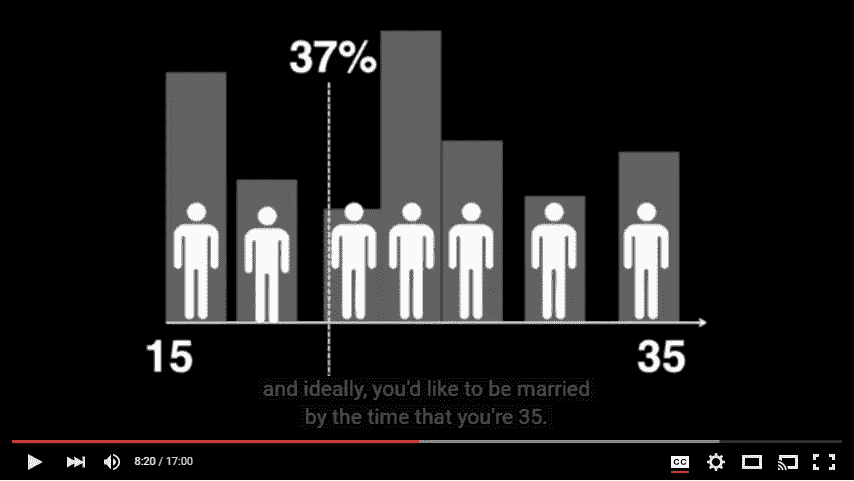

# 你不会和初恋结婚:创业也是如此。

> 原文：<https://medium.com/hackernoon/you-wouldn-t-marry-your-first-crush-the-same-goes-for-founding-your-startup-764ff35e2336>

虽然上面的陈述对一些人来说似乎是显而易见的，但潜在的困境仍然存在:你如何知道你的想法是否是正确的？你不能确定，但是一点数学推理可能会对你的思考有所帮助……

创办一家创业公司是一项巨大的承诺，包括做出牺牲和投入大量的时间和金钱。不可掉以轻心。你可能会遇到许多[初创公司](https://hackernoon.com/tagged/startup)的想法，并对其中一些想法进行测试，得出不同的结果。但是偶尔，你可能会认为你正在做一件大事。然后，是时候严肃地问自己一个大问题了:*我应该去争取吗？*

因为如果你这样做了，你就要碰壁了——毫无保留。希望你选对了，因为你一生中不会有很多机会。创业失败可能需要一段时间才能恢复，因为它们往往让创始人没有多少金融资本。(请注意，这与许多离婚案并无不同。)

虽然我们不能确定我们的决定，但我们肯定可以提高我们的机会。怎么会？通过拒绝足够多的机会来获得一个好的基线，从而做出统计上最优的选择。

## 最优停止理论

在 7 分 30 秒的 TED 视频“[爱情的数学](https://youtu.be/yFVXsjVdvmY?t=7m13s)”中，演讲者解释了最佳停止理论如何帮助决定什么时候是结婚的最佳时机。我发现这同样适用于初创企业。

为了便于讨论，我们将把约会世界的规则简化为:

*   你无法知道在[未来](https://hackernoon.com/tagged/future)是否还有更适合你的。
*   你不能违背你的决定。

给定这些规则，最佳策略是什么？

> 因此，根据数学计算，在你约会窗口的前 37%的时间里，你应该拒绝所有可能结婚的人。然后，你应该**选择下一个出现的人**，他比你以前见过的任何人都要好。现在，如果你这样做，事实上，可以从数学上证明这是最大化你找到完美伴侣的机会的最好方法。

[The mathematics of love](https://youtu.be/yFVXsjVdvmY?t=7m13s)

这种行为在某些种类的鱼身上观察到，它们在交配季节的前 37%会系统地拒绝求婚者。当然，当把它应用到我们复杂的人类生活中时，这一切都是有保留的，但这一理论直觉上是有道理的，因为我们确实倾向于自然地采用这种行为。

## 约会理论在创业中的应用

我当然可以看到这两个困境之间的相似之处，所以拒绝前 37%的创业机会是有道理的。然而，对于初创公司来说，前提有点不同，所以还有改进的空间。

第二条规则是“你不能违背你的决定”，需要对初创公司进行调整。在约会的世界里，一旦你甩了某人，就这样。你不能在几年后回到他们面前说“好了，我准备好了！你是我最好的选择！”另一方面，初创公司则不同。例如，你可能最初会认为一个想法超前了，所以你把它放在一边，同时尝试其他的创业想法。如果几年后你还没有锁定任何其他东西，并且最初的想法已经成熟，可以上市，你可以回去。

鉴于这种微小的差异，这将如何影响创建决策中的最优停止理论？虽然门槛最初设定在 37%，但*你可以再次拒绝*的事实应该会促使你拒绝**超过 37%的创业想法。**

所以，剩下的问题是，您如何知道自己的支持率为 37%？你如何估计一个人会遇到多少创业机会？首先，让我们考虑一下你“创业约会”的时间范围。诺姆·乏色曼在他的书《创始人的困境》中说，你“发现的能力”在 25 年的经验中达到顶峰。在那之后，它是下坡。所以，也许您可以将时间范围设置为 25 年左右。

所以，假设你保持*一个你认真考虑过的新创业想法的恒定比率*，**你不应该在你第一个 9.25 年的工作经验**之前有所飞跃。现在，我不会把这个数字看得太重，但有一点是肯定的，如果你已经想创业几年了，还没有完全投入，那你就没什么好担心的了。

你所能做的最糟糕的事情就是全力以赴去实现你的第一个创业想法。就像和你高中时的恋人结婚…

没有看过很多创业创意，你怎么能做出明智的决定呢？迷恋你最初的想法太容易了(我去过那里)。更好的策略是善于识别最适合你的创业想法，就像在约会生活中，你如何学会识别你想要的生活伴侣一样。

就我个人而言，看到我从一个创业想法跳到另一个想法的速度有多快，我充满了怀疑，我从来没有坚持过任何一个想法超过几个月。坚持不懈是企业家最受尊敬的品质之一，从外表上看，我没有这种品质。老实说，当一个熟人问我的项目进展如何时，我很尴尬地不得不承认我已经转移到了别的事情上。

但是我不再因为放弃而感到软弱。在每一个新的商业想法中，我都把它推进到足够远，以便从每一次经历中学习。有坚持不懈的时候，也有转向其他事情的时候。而在你的前 37%，最有可能是后者。

## :-P

> [黑客中午](http://bit.ly/Hackernoon)是黑客如何开始他们的下午。我们是 [@AMI](http://bit.ly/atAMIatAMI) 家庭的一员。我们现在[接受投稿](http://bit.ly/hackernoonsubmission)，并乐意[讨论广告&赞助](mailto:partners@amipublications.com)机会。
> 
> 如果你喜欢这个故事，我们推荐你阅读我们的[最新科技故事](http://bit.ly/hackernoonlatestt)和[趋势科技故事](https://hackernoon.com/trending)。直到下一次，不要把世界的现实想当然！

