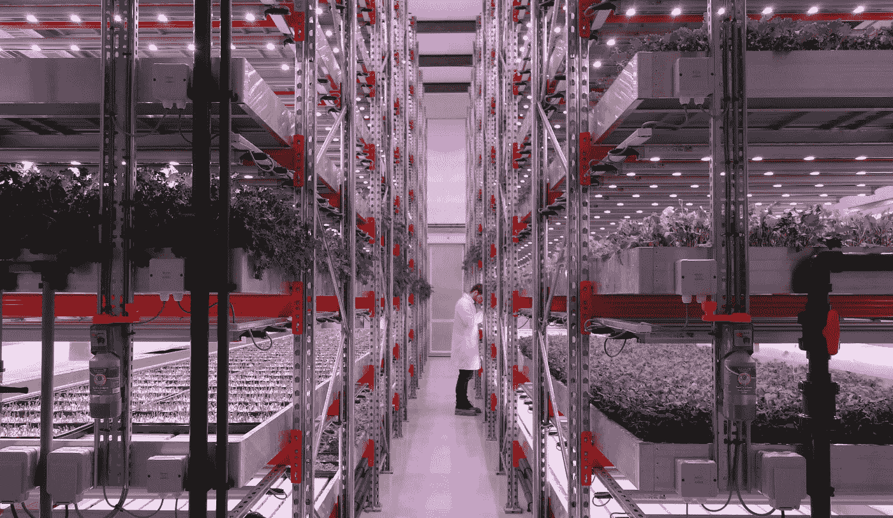

# 年轻的农业企业家们，你们的时代到了！

> 原文：<https://medium.com/hackernoon/young-agripreneurs-your-time-is-now-c498810dba35>

CoolFarm test site at GrowUp Urban Farms in the UK. More than 500 square meters of salads, herbs and fish inside a vertical commercial aquaponics warehouse.

> [***这是为农首写的一篇文章***](http://www.farmingfirst.org/2016/02/joao-igor-young-agripreneurs-your-time-is-now/) *。在这篇客座博文中，*[*cool farm*](http://cool-farm.com/)*首席设计官兼联合创始人若昂·伊戈尔(joo Igor)为想要涉足 agritech 的年轻创业者们出谋划策。CoolFarm 将出席 2016 年 2 月 16 日至 17 日在阿布扎比举行的* [*全球农业创新论坛*](http://www.innovationsinagriculture.com/) *。*

如今，当我们走向 2050 年时，我们可以感受到这种狂热，届时 90 亿人将需要用更少的资源来养活。我们也可以证明对本地食物需求的快速增长——仅在北美就从 2005 年的 10 亿美元增长到去年的近 70 亿美元。

所以，如果你关心可持续发展，食品，健康，你想成为一个有意义的解决方案的一部分，为什么不开始在农业科技工作呢？

千禧一代正在改变与农业相关的陈旧和不公平的污名。今天，在世界许多地方，务农不再是一项单调、密集和低工资的工作。新一代农民将他们的心投入到技术中。这是一个极其重要的发展，因为年轻人认为科技“超级酷”。年轻人想使用它，学习它，用它做更多的事情。

CoolFarm 就是这样诞生的。我们是生活在城市的四个年轻人，试图通过使用我们自己的专业技能创造一种可以在我们自己的房子里轻松种植高质量蔬菜的产品来改善我们不健康的生活。垂直农业的趋势吸引了数百万美元的风险投资，像菲利普斯这样的品牌正在改进 led 以在仓库中种植蔬菜。大家都盯着呢！

我们发现了一个市场，但在开始业务时，我们遇到了许多与生产、价格策略和分销相关的挑战。这就是我们如何克服这些挑战，并获得今天 CoolFarm 销售的产品。

**I .加入全球加速计划** 对于 CoolFarm 来说，这是一个改变游戏规则的事件。我真的觉得我们变得更强大了，这要归功于我们在全球加速计划、 [IC2 Institute](http://ic2.utexas.edu/) 和 [Lisbon Challenge](http://www.lisbon-challenge.com/) 的最初阶段所做的所有业务发展。如果你有一个可扩展的概念来解决市场需求，这就是你需要去的地方。通过加入创业项目，你会学到很多东西，并接触到有经验的企业家。保持谦逊，从他们的故事、错误和成功中学习。

**二。打造最好的团队** 创业初期最重要的是团队，你永远需要最好的信徒在你身边。这是无法回避的，你会惊讶于投资者是如何真正承认这一事实的。团队就是一切。钱是后来才有的。

**三。选择合适的投资者** 像所有的创业公司一样，CoolFarm 需要尽快开始融资，因为上市时间是必不可少的。认识不同类型的投资者非常重要，如果可能的话，也要认识国外的投资者。不要和第一个告诉你你的 excel 表格对他来说足够好的投资者握手。你需要微笑，放松，最重要的是，找到一个真正与你志同道合的投资者。这与股权或估值无关，而是与信仰有关。你的完美投资者可能就在眼前，你可以比你想象的更快找到他，但你仍然需要保持批判性。对 CoolFarm 来说，这不是时间的问题，而是找到最好的。

我们现在正在建立一个针对作物的先进控制系统，专为蔬菜种植者设计，与所有温室和仓库兼容。我们还试图创建一个极具启发性的品牌，目标是到 2050 年让人们了解全球对农业可持续性和食品需求的关注和挑战。

你也可以成为这个令人兴奋的行业的一部分，以商业规模和生态可持续的方式在城市生产高质量的食品，关心人民，商业和减少对环境的影响。做好事真的可以获利。**年轻的农业企业家们，你们的时代到了！**

> [黑客午间](http://bit.ly/Hackernoon)是黑客们下午的开始时间。我们是 [@AMI](http://bit.ly/atAMIatAMI) 家庭的一员。我们现在[接受提交](http://bit.ly/hackernoonsubmission)并很高兴[讨论广告&赞助](mailto:partners@amipublications.com)的机会。
> 
> 如果您喜欢这个故事，我们建议您阅读我们的[最新科技故事](http://bit.ly/hackernoonlatestt)和[趋势科技故事](https://hackernoon.com/trending)。直到下一次，不要把世界的现实视为理所当然！

