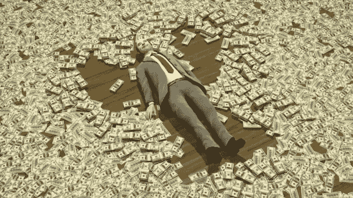
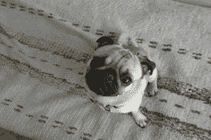
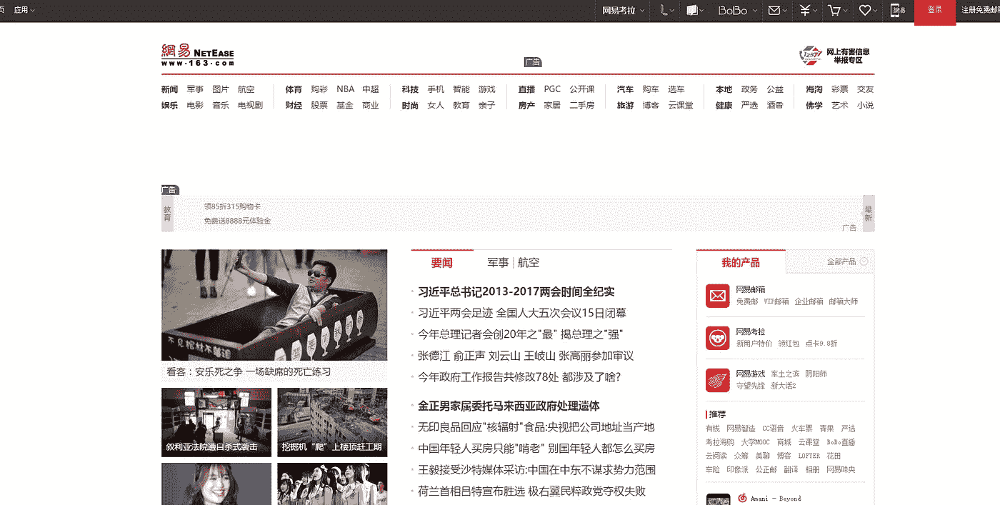

# 你的银行试图扼杀我的公司

> 原文：<https://medium.com/hackernoon/your-bank-tried-to-kill-my-company-15ab35bd732d>

你的创业公司或副业项目有大约 390 亿种死亡方式，包括糟糕的创始人、糟糕的时机、融资失败、糟糕的信息传递、“时间不够”、自负、糟糕的招聘、未能找到适合市场的产品，以及糟糕的想法。

去年，我听说了另一个大事件。一个没有人在你的孵化器或加速器项目中谈论的问题。一个没有 Quora 帖子可以参考，也没有 Sam Altman 博客文章可以剖析的问题。

一个沉默的杀手。银行。

故事开始于去年秋天，当我们在 [Benja](http://benja.co) 为伟大的一年画上句号时，电子商务公司 [I](http://andrewjchapin.com) 与[汤米·古德](https://twitter.com/airdrummingfool)于 2014 年开始合作。

我们所有的图表都在右边:我们的[移动应用](https://itunes.apple.com/us/app/benjamin-sixty-second-deals/id969818137?mt=8)的用户数量翻了 10 倍，我们的电子邮件列表在增长到 15，000 名订户的过程中保持了 25%的开放率(超过行业平均水平 9%)，我们成功推出了第二款产品，一款互动在线展示广告单元，实际上是在印刷现金。

我开始为我们的投资者准备年度总结，在总结中，我将阐述收入从 100 万美元增长到 500 万美元的计划。2016 年的包装基本上是这样的:

## 但是，在今年剩下的八周时间里，我们有空间开始我们雄心勃勃的增长计划。我想把它调到 11。

我们 2017 年增长计划的一个核心组成部分是从提供个性化购物转向为他人购物的体验。

改变游戏规则，我知道。

我们在购物应用程序中加入了礼物模式，并想出了其他方法来鼓励用户传播爱心。随着假期的临近，我们想提供本杰明礼品卡——我们将提供 1000 张 10%折扣的礼品卡，这将在年底前提高我们的现金状况。

此外，那些购买礼品卡的人会赠送礼品卡，或者必须与我们完成未来的交易——这些都是好事。该活动在我们的应用程序中上线，我们安排了一封电子邮件来推广该产品。

## 我们很快销售一空:仅仅几天时间，超过 50，000 美元的购物卡就销售一空。

$50,000 in benjamin gift card sales? Mission accomplished.

三个星期过去了。礼品卡的兑现速度很慢，但这是意料之中的事——我们认为这些产品中的大多数都是节日礼品，我们预计会在 1 月初看到购买量。

事情进展顺利。我计划感恩节休假去参加一个朋友的婚礼，然后去印度旅游。这将是我两年半前创办公司以来的第一周休假。

出发的日子到了。

我滚下床，向厨房走去。我打开手机。

637 封邮件。

## 我打开收件箱，看到它们都是来自我们的支付处理器，通知我们 637 次退款。我的心沉了下来。

对于外行人来说，拒付是当客户打电话给银行说他们不承认或没有授权收费时发生的事情。

银行通常向客户提供有条件的信贷——有争议金额的临时信贷——在他们调查此事期间。银行展开调查，并在 90 天内决定客户争议是否合法。

银行联系商户[支付](https://hackernoon.com/tagged/payment)处理器并说“嘿，我们的客户说他们没有这么做。怎么了？”

支付处理器联系商家并说“嘿，顾客说他们没有这样做。你能证明吗？”支付处理器从商家银行账户中提取有争议的美元金额。

The payment processor, to us.

商家有几天时间提取交易信息并发送给银行(通过支付处理器提供的表格)。从那里，银行看一看，并决定是否客户或商家是正确的。

## 交易的输家被套牢了。

## **银行是法官、陪审团和刽子手。**

我走到餐桌旁，打开我的笔记本电脑。我敲了敲键盘，等待 Chrome 在我们的支付处理器上加载仪表盘。

## 在屏幕顶部，我们的支付处理器余额显示为 **-$59，555。**

## 这些邮件绝对是真的。

我点击进入争议选项卡。它们就在那里:637 笔交易，大多数被银行标记为“欺诈”。

我浏览了一下。到处都是红旗。

大多数有争议的交易来自本杰明应用的首次用户，他们表现出我们以前从未见过的奇怪购买行为，比如一位客户在银行卡被拒绝之前购买了 20 张 100 美元的礼品卡。

我是本杰明的超级粉丝，甚至我认为 20 张 100 美元的礼品卡对一个人来说太多了。

还有另一个奇怪的趋势:几乎所有新客户的电子邮件地址都以 163.com 结尾，他们的 IP 地址来自犹他州的盐湖城。

## 我必须去看看 163.com 到底是怎么回事。

We’re not in Kansas anymore.

163.com 和犹他州的盐湖城没有任何关系。这是一个中国门户网站，看起来类似于雅虎或美国在线——一个提供新闻、搜索和免费电子邮件地址的网站。

事实证明，这些电子邮件地址在阿里巴巴和易贝上很受骗子的欢迎。

这些有争议的交易都没有意义。由于我们的支付处理器没有联系电话，我只能发邮件等待。在我等待的时候，我翻遍了互联网寻找答案。就在那时，我学会了一个我永远不会忘记的术语:**梳理**。

刷卡是信用卡欺诈的一种形式，在这种情况下，被盗的信用卡被用来购买易于变现的物品，如预付费礼品卡或热门服务的礼品卡。梳理者获得这些物品，并使用它们或在二级市场上出售它们以获得现金。

当一切都解决了，持卡人带着他/她能够清算的任何东西离开，信用卡被盗的消费者提交退款申请并拿回他们的钱，而商家或银行被留下来拿包。

很明显我们是刷卡攻击的受害者。

优点:

1.  我们从一开始就限制了 benjamin 礼品卡的数量，因此有明确的暴露范围。
2.  很少一部分 benjamin 礼品卡已经成功兑换了产品，这意味着我们仍然有从消费卡中扣除的现金。如果我们需要退还礼品卡订单，我们可以这样做，而不会损失太多(在大多数情况下)。我认为这意味着持卡人无法在二级市场上动用我们的购物卡。在这种情况下很好，但总的来说有点悲伤。

坏消息:

1.  我们如何确定哪些礼品卡需要停用，哪些不需要停用？
2.  每次提交退款申请时，我们的支付处理器都会收取交易金额**和每次退款 15 美元的费用**，不管争议的结果如何。这意味着无论如何我们都要支付 9555 美元的费用。哎哟。
3.  我们如何应对 637 争议交易？似乎很明显，我们质疑的是少数已经兑换实物产品的人——尽管表格不允许出现这种情况——但我们有没有试图解释其他人身上发生了什么？
    我们不想承担近 1 万美元的费用— **如果我们同意在没有争议的情况下全额退还这些交易，我们的支付处理器难道不应该对所发生的事情表现出一定程度的同情吗？**
4.  应对 637 争议包括获取时间戳、IP 地址、电子邮件地址、服务器日志等等。那有很多文书工作。
5.  我从旧金山到新德里的飞行时间是 17 个小时，现在还有 8 个小时，而且**我无法与我们支付处理器的任何人取得联系**。不清楚我应该或者可以做什么，电话那头也没有人。我一个人在大海中央的一个木筏上，一场飓风正快速袭来。

对我们这种规模的公司来说，无论是 9555 美元、近 60000 美元还是介于两者之间的金额，都将是一个沉重的打击。这场轰动至少持续了几周，也许是一两个月。

事实证明这是我最不关心的。在我们艰难地处理了一堆退款后，一两周没有得到任何帮助，他们扔下了一个炸弹: **Benja 必须在五天内找到一个新的支付处理器。**

## 在五天内找到一个新的支付处理器是不可能的。

即使我们使用新支付处理器的应用程序立即获得批准(这是不可能的)，并且我们的开发人员能够在一夜之间实现新处理器(这是不太可能的)，也存在其他限制，比如苹果批准 iOS 应用程序更新所需的时间。(而有人不马上更新自己的 app 会怎么样？)

支付处理器不在乎。他们的立场很明确:Benja 的退款率超过了可接受的水平，银行(据称)说他们必须停止与我们做生意。答案是最终的。

## 这里的重点是:为什么银行没有做好保护客户的工作，为什么商家必须收拾残局？

我的卡在附近的杂货店被拒付了 9 美元，因为 Capital One 在关注我的安全。在正常的日常地点进行正常的日常购物引发某种欺诈警报并不罕见。这只是发生了，我很感激。

不知何故，有人用一张卡连续进行了 20 次相同的交易。他们以前从未使用过我们的应用或服务。同样的事情又发生了十四次。再重复十二次。(此后，我们在软件端对 24 小时内相同事务的数量进行了限制。)虽然我不知道哪些银行允许这种活动，但我知道 Visa、MasterCard 和 AmEx 都允许这种活动。

**为什么银行在——我不知道——两三次之后没有将这些交易标为可疑？**

就此而言，我们的支付处理器怎么会没有介入呢？显而易见，他们有兴趣防止退款。也许他们应该考虑软件方面的解决方案，以防止欺诈和退款，特别是当他们积极推销自己是该领域的专家时。只是一个想法。

当你是一个初创公司的创始人时，你有很多事情要做。当你雇佣另一家公司，并信任他们做好工作，就像我曾经雇佣一个承诺防止欺诈的支付处理员一样，你希望他们做好自己的工作。

相反，你的大银行和业内最大的支付处理商之一留给 Benja 一张 20，000 美元的账单。

我们付清了费用，更换了处理器，并建立了我们自己的防欺诈解决方案。我在印度玩得很开心。

我叫安德鲁·查平，是商品广告网络 [*Benja*](http://benja.co) *的创始人&兼首席执行官。我为《观察家》***撰稿，我在博客中记录我们建立新的消费电子公司的每一步，* [*微小的电缆*](/tag/tinycables) *。我是红袜队的球迷。**

******

> *黑客中午是黑客如何开始他们的下午。我们是这个家庭的一员。我们现在[接受投稿](http://bit.ly/hackernoonsubmission)并乐意[讨论广告&赞助](mailto:partners@amipublications.com)机会。*
> 
> *如果你喜欢这个故事，我们推荐你阅读我们的[最新科技故事](http://bit.ly/hackernoonlatestt)和[趋势科技故事](https://hackernoon.com/trending)。直到下一次，不要把世界的现实想当然！*

**