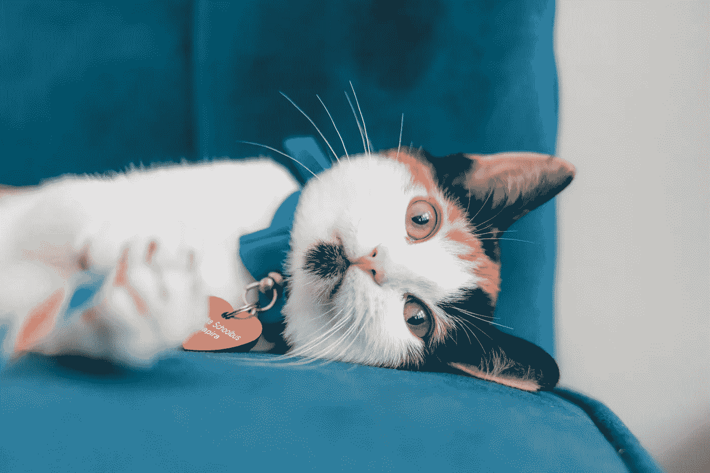
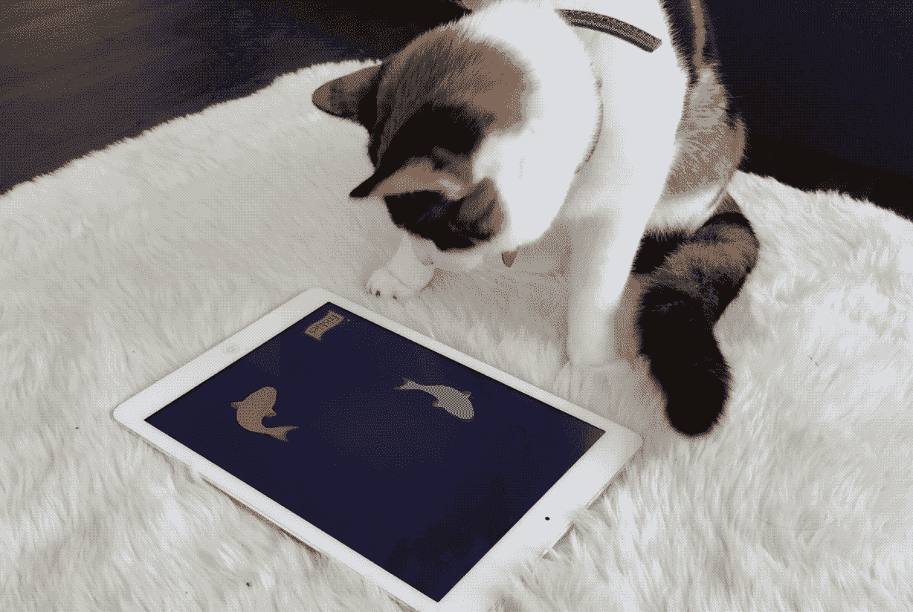
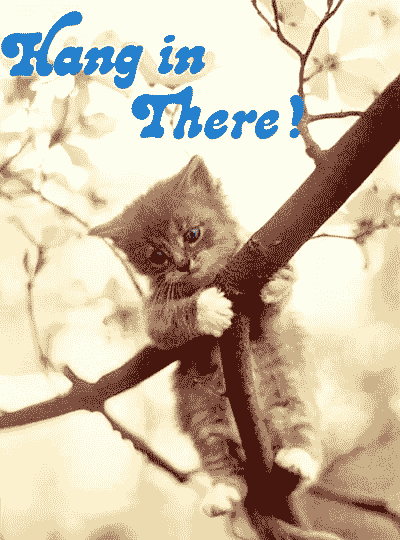
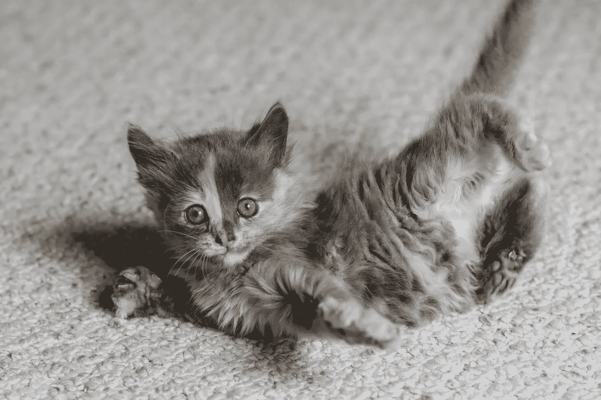

# 你的猫是千禧一代，他甚至不能

> 原文：<https://medium.com/hackernoon/your-cat-is-a-millennial-and-he-literally-cant-even-5b540cd42cc1>

Cupcake Schoolbus has never been able to even.

有权，傲慢，懒惰，被宠坏，自恋。这就是我们今天听到的关于幼猫的一切。在过去美好的日子里，我们的猫很乐意去抓老鼠，住在谷仓里。现在，他们希望能吃到有机的冷冻干燥火鸡大餐，而他们却整天在网上聊天，在 youtube 上看自己，做我们通常认为是“浪费时间”的事情(因为如果你看不到自己做某事的价值，那自然是浪费时间)。从另一个角度来看，这些猫是灵活的、自我表达的、敢于冒险的和创新的。无论你如何看待你的千禧猫，试图改变它们都是愚蠢的。接受现实，迎合他们的需求，或者干脆不养猫。随着你学会应对新常态，这些策略可能会帮助你管理自己的千禧一代新贵团队。

Cupcake Schoolbus’ high score in [Cat Fishing](https://www.gamesforcats.com/) is 140

# 提供一个有趣的、以猫为中心的工作场所

今天的猫需要享受它们的环境，需要持续的刺激，除非它们想让你滚开，不要打扰它们。给他们明亮的互动游戏空间，配备纸箱、专用的猫用 iPads，以及为千禧猫设计的家具，如[昂贵的 mod 壁架](https://www.catastrophicreations.com/product-category/popular-items/)和[专门的猫吊床](http://catabove.com/cat-hammock-stand-and-hammock.html)。如果你给它们提供各种新玩具和充足的地方来抓挠和打盹，你很可能会有快乐和多产的猫。权威专家建议小睡豆荚和猫的比例为 5:1。

> 他们不喜欢被忽视。它们会喵喵叫着它们毛茸茸的脸，直到你喂它们或者打开你刚刚关上的任何一扇门。

# 在他们的层面上交流，也就是楼层

千禧猫期待慈爱的主人倾听他们的每一句话，他们的生活围绕着他们。他们不喜欢被忽视。它们会喵喵叫着它们毛茸茸的脸，直到你喂它们或者打开你刚刚关上的任何一扇门。然而，如果你试图在他们不感兴趣的时候与他们互动，他们会直接忽略你。他们有更好的事情要做。这没什么？他们完全无事可做，他们想保持这种状态。强迫你的猫加入谈话会适得其反(还有点悲伤)。只要有空，让他们在需要陪伴或输入 instagram 帖子上使用的标签时来找你(老实说，你不知道)。

# 迎合他们独特的动机

所有千年猫都被溺爱到情感无能。他们甚至不能为自己做简单的事情，比如洗衣服或者清理垃圾箱。他们期待科技为他们做这些事情。如果技术不存在，他们会更加努力去发明它，而不是去做原创的东西本身。有人称之为懒惰，但正如我们所知，近代历史上最伟大的创新都来自于猫。今天的猫有一个独特的动机，那就是它们想让世界变得更美好(为了它们自己)。利用这一点，给他们提供一些激发他们个人兴趣的项目，不要指望他们会把时间浪费在辛苦的工作上。

> 当情况变得艰难时，显然给你的猫最有效的建议就是坚持住。

[Hang in There!: Inspirational Art of the 1970s](https://play.google.com/store/books/details?id=KEMFmlv1uKcC&source=productsearch&utm_source=HA_Desktop_US&utm_medium=SEM&utm_campaign=PLA&pcampaignid=MKTAD0930BO1&dclid=CIGp3sOPzdQCFYsuaQodzIUBWA), a must-read by Jennifer McKnight-Trontz

# 给他们不断的赞美

猫只对正面强化有反应。不要麻烦给他们一个称赞三明治(又名便便三明治)，即使它是纯素食和无麸质的。在每一次互动中洒下鼓励的话语，赞美他们的成就，无论多么微不足道。如果你担心你的猫正走向失败，对它们直截了当、坦诚相待，但要知道，如果你过于挑剔，你的话将会遭到白眼。这些猫从小就被教育要相信自己无所不能。如果你试图用你自己的经验来劝阻他们，他们根本不会相信你。他们必须自己学习和经历失败。当现实来临时，情况变得很糟糕，显然给你的猫最有效的建议就是坚持住。

# 培养他们的领导潜力

如果你认为你的猫不是一家之主，那你就错了。千禧猫是天生的领袖。但由于他们宽松和放任的教养，他们不尊重传统的权威，也不会对僵硬的协议或权力的展示做出良好的反应。不要试图成为你的猫的老板。相反，你应该努力成为他们的导师。鼓励他们自信的态度，当你引导他们追求时，要平易近人。这些是世界上见过的最懂电脑的猫。作为互联网时代的原住民，他们擅长社交媒体和自我推销。认识并利用他们天生的能力，从他们自己的经历中构建启发性的故事，这些故事将塑造未来的世界。

没错，每一个老一辈的猫，从猫开始就看不起年轻的暴发户。这是因为所有年轻的猫普遍不如那些更老、更聪明、更有生活经验的猫。这条规则没有例外。我想我们都同意，不管个体差异如何，对一大群猫进行一概而论总是最好的。

[This young kitten is obviously inferior to older, wiser cats in every way.](https://www.gcatrescue.com/)

如果你喜欢这篇文章，一定要推荐它，让好的想法像夏日微风中的一簇猫毛一样传播开来。

> [黑客中午](http://bit.ly/Hackernoon)是黑客如何开始他们的下午。我们是 [@AMI](http://bit.ly/atAMIatAMI) 家庭的一员。我们现在[接受投稿](http://bit.ly/hackernoonsubmission)并乐意[讨论广告&赞助](mailto:partners@amipublications.com)机会。
> 
> 如果你喜欢这个故事，我们推荐你阅读我们的[最新科技故事](http://bit.ly/hackernoonlatestt)和[趋势科技故事](https://hackernoon.com/trending)。直到下一次，不要把世界的现实想当然！

