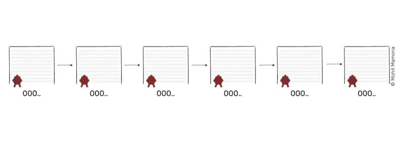
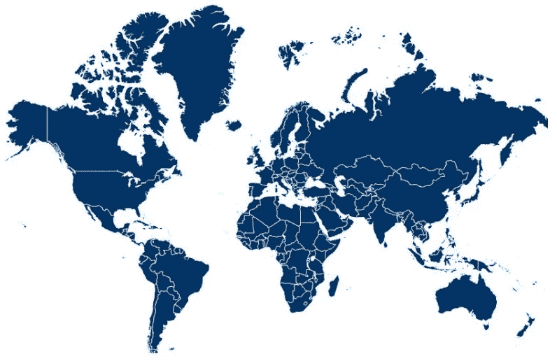

# 到 2027 年，每家公司都将使用区块链

> 原文：<https://medium.com/hackernoon/your-company-will-use-blockchain-in-less-than-10-years-heres-how-6d9da452fa8d>

## 是这样的。

大约十年前，中本聪,[比特币](https://thenextweb.com/topic/bitcoin/)的发明者,[在一篇长达八页的研究论文](https://bitcoin.org/bitcoin.pdf)中描述了如何通过比特币分散资金，从而悄悄地瓦解了银行等提供信任的组织。当时，没有多少人理解这八页隐藏在自己内心的潜力。

不，我不是在说分散资金。我指的是权力下放本身。在这八页中，中本聪不仅解释了我们如何重新控制我们的钱——他还为陌生人提供了一种安全合作的新方法。

你可能遇到过否认区块链潜力的人，他们告诉你不要相信炒作。我的建议是:不要太关注他们。

> 不适应未来分散化世界的企业将很快成为过去的企业。

在本文中，我们将讨论区块链在未来不到十年内融入贵公司的五种不同方式。让我们从最基本的开始:区块链到底是什么？

简单地说，区块链就是一个数据库。它是一个不断增长的包含不同类型数据的数据库，具有非常显著的特性:

1.  数据一旦存储在数据库中，就永远不能被修改或删除。区块链的每一张唱片都是永恒的。
2.  没有任何个人或组织维护该数据库；几千个人这样做，每个人都有一个数据库副本。

要了解几个人如何能够保持他们的数据库副本与其他人的数据库副本同步，请想象一下:

一个网络中有十个人。每个人都拿着一个空文件夹和一张白纸坐着。每当有人在网络中做一些重要的事情，比如转移资金，他们就会向网络中的每个人宣布。

每个人都在自己的页面上记下每个公告，直到页面填满。当他们满了，每个人都必须通过解决一个数学难题来密封他们页面的内容。解决一个数学难题可以验证每个人的页面都有相同的内容，并确保它们永远不会被修改。谁先封了他们的页面，谁就会得到一定数量的密码。

一旦页面被密封，它就会被添加到文件夹中。新的一页被带出，这个过程将永远继续下去。

久而久之，这些包含重要记录(交易)的页面(块)被添加到文件夹(链)中，从而形成数据库(区块链)。

> 详细版本见[理解区块链的终极指南](https://hackernoon.com/wtf-is-the-blockchain-1da89ba19348)。

由于其独特的属性，区块链技术可以用于许多不同的行业，从银行和会计到娱乐业。

下面，我们将讨论区块链对你公司的五种不同影响。

# 1)合同📝

> "在合同签署之前，没有什么是真实的."
> —格伦·丹齐格

**你会把不属于“做生意”的生意叫做什么**区块链将对组织之间的互动方式产生巨大影响。做生意意味着与其他方进行交易，以促成一些不可能单独完成的事情。在这样的安排中，这两个组织需要确保它们能够相互信任。

在 2017 年，这种信任是由一套列出所有参与条款和条件的页面或合同提供的。当一方不遵守合同中提到的承诺时，可以通过法律强制执行，但这可能会导致一个昂贵而及时的过程。所以在很多情况下，因为违约而打官司根本不值得。

使用区块链技术，这些合同中的许多可以转换成智能合同。与传统合同不同，智能合同由软件代码组成，由区块链网络执行。这些智能合约的美妙之处在于，它们在部署后无法修改，这确保了交易中的任何一方都无法不履行自己的职责就离开。

智能合约是在区块链上用代码编写的，一旦被触发，就完全不可更改。

想象一下，你在一个乐队，你想把你的音乐卖给别人，这意味着你必须传输一个音频文件。你怎么确定买家收到后会付钱？同时，买家也可能会持怀疑态度，认为如果他们先付款，你就不会发送音频文件。智能合同确保一旦买家转账，音频文件将立即发送给买家。一旦部署，没有人能阻止合同的执行。所以双方都可以信任代码。

# 2)付款💸

> "如果你认为没人关心你，试着拖欠几次付款."
> —史蒂夫·赖特

如果你的业务需要国家间的支付交易，区块链也会派上用场。区块链最大的承诺之一就是有一天它会取代货币。当然，这将需要如此彻底的转变，即使不需要几十年，也需要几年才能实现。但现在，我们已经可以利用区块链在几分钟内，而不是几天内，在全球范围内转移资金。

分散资金的好处之一是，支付可以在同行之间直接转移，而没有任何中介机构，如银行，来减缓这一过程。有鉴于此，跨境汇款无疑将是你的另一个采用区块链的业务领域。

# 3)招聘👩🏻‍🚀

> “我们将成为机器人的看护者。这就是下一代作品的发展方向。”格雷·斯科特

[**专家预测**](https://gizmodo.com/robots-are-already-replacing-human-workers-at-an-alarmi-1793718198) **机器人总有一天会**接管我们的工作。但在那一天到来之前，各地的首席执行官仍将需要人类来管理他们的公司。

然而，与机器人不同的是，人没有商标或信誉徽章。这就是为什么为你的公司找到合适的员工是一项艰巨的任务。

但是，如果这些关于可能的新雇员的信息被公之于众会怎么样呢？正如本文中的[所探讨的，区块链可以为更快、更便宜、更不可信(你不必相信另一个人的真实性)的背景调查铺平道路。每个人都会有一系列反馈，这些反馈会在他们的职业生涯中由过去的雇主积累。这将使新的雇主能够迅速审查这一线索，并决定这个人是否是这份工作的合适人选。](https://hackernoon.com/what-role-can-blockchain-play-when-hunting-for-a-new-job-1ede32aa0711)

对新雇主来说足够方便，但如果这条线索包含虚假信息会发生什么？假设你的前任老板是一个可恶、可怕的人——那么你会永远被他们的负面反馈困扰吗？

为了确保这种情况不会发生，参考系统应该是双向的。通过这种方式，员工也可以给他们的雇主打分，如果需要的话，还可以互相打分。一个在系统中名声不好的雇主给出的差评比一个被证明值得信任的人的权重要低。

# 4)云存储💾

> “每朵云的背后都是另一朵云。”
> —朱迪·嘉兰

**如果你在经营一家企业，**你有可能将公司数据存储在云中。根据云服务提供商 BCSG 最近的一份报告，越来越多的中小型公司正在转向云计算。目前，64%的小企业主平均拥有三个云解决方案，预计在未来三年内将增加到 72%。

区块链在分散云存储中发挥着巨大的作用，因为它们允许陌生人相互协作。您可以将文件保存在全球数千台设备上，而不是存储在单一的中央服务器上。

工作原理是这样的:你上传的每个文件将被分成几个小块，每个小块将被存储在网络中的几个设备上。哪个特定块存储在哪个特定设备上被记录在区块链上。如果您需要检索该文件，系统将根据这些信息为您汇编它。

你的数据在分散存储中会比云存储更安全。虽然集中式云存储将您的文件存储在多个备份上，但分散式存储将您的数据保存在更多的设备上，因此增加了可靠性。

此外，在集中式系统中，系统的强度取决于一个公司的服务器有多安全。使用分散的网络，不只有一个设备包含完整的文件，这使得黑客几乎不可能获得数据。

# 5)更少的层级，更好的治理👨🏻‍🔧

> 在一个权力不局限于少数人手中的环境中，公司会蓬勃发展，然而这就是组织通常的结构。

**这些当前的权力结构**是在协调一大群人时效率低下的结果。区块链本身并不是一项新技术——它只是我们几十年来一直拥有的技术的结合:点对点网络和密码学。类似地，区块链上的解决方案是由几个移动的部分组成的，它们完美地协同工作。

在区块链的基础上使用智能合同的组合，[社区可以有一个没有等级的治理](https://thenextweb.com/contributors/2017/08/13/blockchain-can-build-communities-completely-free-hierarchy/#.tnw_wURQ1aEr)。很有可能，你的企业很快就会几乎没有官僚作风，所有影响整个组织的重大决策都可能通过透明的投票程序做出，这种投票程序在区块链上进行。

每个提案都以智能合同的形式提交，每个人都可以投票。如果达到了公司章程中规定的门槛，提案就获得批准，可以采取进一步的措施。

# 区块链来了……

这是少数几个你的企业可能比你预期的更快采用区块链的领域，但是可能性是无穷的。你可以用几种思维模式来思考区块链。当谈到识别区块链在商业中的潜力时，我喜欢把区块链看作是让陌生人一起工作的一种方法。无论是你的员工，还是你的合作伙伴，或者供应链，或者其他任何人，区块链将很快以多种方式渗透到你的组织中。

## 感谢阅读！:)如果你喜欢，请鼓掌支持👏🏻还有分享帖子。请随意发表评论💬下面。

—

***关于作者***

[https://twitter.com/mohitmamoria](https://twitter.com/mohitmamoria)

*莫希特·马莫里亚是*[***【godtoken.org】***](https://godtoken.org)*(一家加密基金)的首席执行官，也是*[***KnowyKnowy***](https://knowyknowy.com)*的编辑，我在那里用简单的英语教授困难的科目。*

他定期为世界上最大的出版物撰稿，包括 HackerNoon、TechCrunch、TheNextWeb、CoinTelegraph 等。这个故事最早出现在 then next web*上* [*。*](https://thenextweb.com/full-stack/2017/10/17/your-company-will-use-blockchain-in-less-than-10-years-heres-how/)

*有反馈吗？在推特上做朋友***。*🙌🏻*