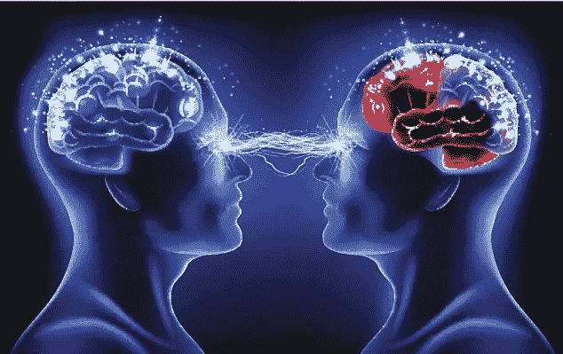

# 你的思想是决策者。

> 原文：<https://medium.com/hackernoon/your-mind-is-the-decision-maker-3d436b070150>

你的头脑是知识的工厂。是仓储中心。它是你储存情绪事件和情绪感受的仓库。大多数神学家认为，心是潜意识。这是我们没有意识到的部分。就像冰山的一角，七分之六是我们的意识。
**意念非常强大。**它决定了你的感受。你不能决定一种感觉。你决定一个焦点，你的焦点创造了感觉。你的思想如此非凡，以至于所有恶魔的力量都集中在你的思想上。撒旦不会抓住你的手。他用你的思想工作。你必须增加对你思想的尊重。你必须关注它，保护它，意识到它可以毁灭你，也可以成长壮大你。你的大脑接受信息，好的或坏的，对的或错的，并放大它。所以，更新和训练你的思维是很重要的。

> [黑客中午](http://bit.ly/Hackernoon)是黑客如何开始他们的下午。我们是 [@AMI](http://bit.ly/atAMIatAMI) 家庭的一员。我们现在[接受投稿](http://bit.ly/hackernoonsubmission)并乐意[讨论广告&赞助](mailto:partners@amipublications.com)机会。
> 
> 如果你喜欢这个故事，我们推荐你阅读我们的[最新科技故事](http://bit.ly/hackernoonlatestt)和[趋势科技故事](https://hackernoon.com/trending)。直到下一次，不要把世界的现实想当然！

