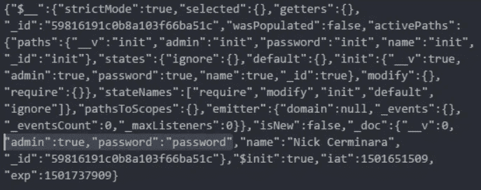

# 你的 Node.js 认证教程(可能)是错误的

> 原文：<https://medium.com/hackernoon/your-node-js-authentication-tutorial-is-wrong-f1a3bf831a46>

**TL；dr:** 我继续搜索 Node.js/Express.js 认证教程。它们都不完整，或者在某种程度上犯了安全错误，可能会伤害新用户。这篇文章探讨了一些常见的认证陷阱，如何避免它们，以及当教程不再对您有所帮助时，您该如何自救。我仍在寻找一个健壮的、一体化的解决方案，用于 Node/Express 中的认证，与 Rails 的[设计](https://github.com/plataformatec/devise)相媲美。

> **更新(8 月 7 日)** : RisingStack 已经伸出援手，[不再在他们的教程中明文存储密码](https://github.com/RisingStack/nodehero-authentication/commit/9d69ea70b68c4971466c64382e5f038e3eda8d8a)，选择在他们的示例代码和教程中转移到 bcrypt。
> **更新(8 月 8 日):**编辑标题为*你的 Node.js 认证教程(很可能)是错的*，因为这篇帖子已经改进了其中的一些教程。
> **更新(8 月 10 日):**[*Dan mcg Han*](https://twitter.com/dmcghan)*发现其中一个教程解决了我在本文档中不知何故漏掉的一个问题。我现在省略了格拉芙，因为 Medium 不允许删除。毕竟，我也会犯错。😊本文末尾有一个附录。* **更新(2018 年 5 月 27 日):*这个帖子仍然有很多浏览量，但这个帖子现在已经有几个月了，可能包含过时的信息。从那以后，我不再试图强化节点生态系统；它正在往野火上泼水。生态系统的增长优先于安全性，您必须决定这些风险是否是您的组织可以接受的。***

在我的业余时间，我一直在钻研各种 Node.js 教程，因为似乎每个拥有博客的 Node.js 开发者都发布了他们自己的教程，告诉他们如何以正确的方式做事，或者更准确地说，以他们自己的方式做事。成千上万被扔进服务器端 JS 大漩涡的前端开发人员正试图从这些教程中拼凑出可操作的知识，要么是通过 cargo-cult-copypasta，要么是免费使用 *npm install* ，因为他们疯狂地争夺外包经理或广告代理创意总监为他们设定的最后期限。

Node.js 开发中一个比较有问题的事情是，认证在很大程度上被留给了个体开发人员*。*express . js 世界中*事实上的*认证解决方案是 [Passport](http://passportjs.org/) ，它提供了一系列*策略*用于认证。如果你想要一个类似于 [Plataformatec 为 Ruby on Rails 设计的](https://github.com/plataformatec/devise)的健壮解决方案，你很可能会被指向 [Auth0](https://auth0.com/) ，一个已经将认证作为服务的初创公司。

与 Devise 相比，Passport 只是一个身份验证中间件，并不为您处理身份验证的任何其他部分:这意味着 Node.js 开发人员可能会使用他们自己的 API 令牌机制、密码重置令牌机制、用户身份验证路由和端点，以及当今流行的任何模板语言的视图。因此，有很多专门为 Express.js 应用程序设置 Passport 的教程，但几乎所有的教程都存在这样或那样的错误，而且没有一个教程正确地实现了工作 web 应用程序所需的完整堆栈。

> **注意**:我并不是想骚扰这些教程的开发者，而是想利用他们的认证错误来说明在开发你自己的认证系统时所固有的安全问题。如果你是一个教程作者，一旦你更新了你的教程，请随时联系我。让我们让 Node/Express 成为新开发者更安全的生态系统。

# 错误一:凭证存储

让我们从凭据存储开始。存储和调用凭证是身份管理的标准工作，传统的做法是在您自己的数据库或应用程序中完成。Passport 是一个中间件，只是简单地说“这个用户很酷”或“这个用户不酷”，它需要 [passport-local](https://github.com/jaredhanson/passport-local) 模块来处理您自己数据库中的密码存储，该模块由与 Passport.js 本身相同的开发人员编写。

在我们进入这个教程兔子洞之前，让我们提醒自己 OWASP 的一个[密码存储](https://www.owasp.org/index.php/Password_Storage_Cheat_Sheet)的伟大备忘单，它归结为“用独特的盐和单向自适应成本函数存储高熵密码”。或者，真的，科达·黑尔的 [bcrypt meme](https://codahale.com/how-to-safely-store-a-password/) ，尽管[有一些争议](https://security.stackexchange.com/a/6415)。

> **有经验的开发人员注意:**如果您*真的*想使用最先进的凭证存储，[*argon 2*](https://github.com/P-H-C/phc-winner-argon2)*是密码哈希竞赛的获胜者，现在在 Node.js 中有了[一些简单的支持。不幸的是，为 Node.js 生态系统中的新手用户实现 Argon2 的文档仍然缺乏，并且考虑到这是针对阅读教程的人，在接下来的几个月里坚持使用 bcrypt 似乎是一个不错的权衡。](https://github.com/emilbayes/secure-password)*

*作为一个新的 Express.js 和 Passport 用户，我首先要看的是 *passport-local* 本身的示例代码，感谢[给了我一个可以克隆和扩展的示例 Express.js 4.0 应用程序](https://github.com/passport/express-4.x-local-example)。然而，如果我只是复制 pasta 这个，我不会留下太多，因为在这个例子中没有数据库支持，它假设我只是使用一些设置帐户。*

*不过，没关系，对吧？*这只是一个内部网应用*，开发人员说，*我还有其他四个项目分配给我，下周到期*。当然，本例中的密码没有经过任何散列处理，[并以明文形式存储在本例中的验证逻辑旁边](https://github.com/passport/express-4.x-local-example/blob/master/db/users.js)。这一次甚至没有考虑凭证存储。*

*让我们使用 *passport-local* 搜索另一个教程。我在“节点英雄”系列中找到了[这个来自 RisingStack 的快速教程，但它对我也没有帮助。他们，](https://blog.risingstack.com/node-hero-node-js-authentication-passport-js/)[也在 GitHub](https://github.com/RisingStack/nodehero-authentication) 上给了我一个示例应用程序，但是它有[和官方的](https://github.com/RisingStack/nodehero-authentication/blob/7f808f5c8ea756155099b7b4a88390c356cf31be/app/authentication/init.js#L8)一样的问题。 **( *Ed。8/7/17:* RisingStack 是**[**现在在他们的教程应用中使用 bcrypt**](https://github.com/RisingStack/nodehero-authentication/commit/9d69ea70b68c4971466c64382e5f038e3eda8d8a) **。)***

*你可以指责我挑选指南，如果挑选指南意味着从谷歌搜索结果的第一页中选择，那你就是对的。让我们从 TutsPlus 中选择[排名更高的结果*护照-本地*教程。这个更好，因为](https://code.tutsplus.com/tutorials/authenticating-nodejs-applications-with-passport--cms-21619)[使用代价因子为 10 的 brypt 进行密码散列](https://github.com/tutsplus/passport-mongo/blob/master/passport/login.js)。谷歌上最热门的搜索结果，scotch.io 的教程也使用了成本系数为 8 的 bcrypt。这两个都很小，但是 8 真的很小。如今大多数 bcrypt 库使用 12。[成本因子 8 是针对十八年前](https://www.usenix.org/legacy/publications/library/proceedings/usenix99/provos/provos_html/node6.html)**原始 bcrypt 论文发布时的管理员账户。***

***除了密码存储之外，这两个教程都没有实现密码重置功能，这是留给开发人员的一个练习，并且有其自身的缺陷。***

# ***错误二:密码重置***

***密码存储的一个姐妹安全问题是密码重置，没有一个顶级的基础教程解释如何使用 Passport 进行重置。你得跟着另一个。***

***有一千种方法可以把事情搞砸。我见过的最常见的密码重置错误的情况是:***

1.  *****可预测的令牌。**基于当前时间的令牌就是一个很好的例子。由不良伪随机数生成器生成的令牌不太明显。***
2.  *****不好储藏。**在您的数据库中存储未加密的密码重置令牌意味着如果数据库遭到破坏，这些令牌实际上就是明文密码。用密码安全的随机数生成器生成长令牌可以阻止对重置令牌的远程暴力攻击，但不能阻止本地攻击。重置令牌是凭据，应如此对待。***
3.  *****无令牌过期。**不使您的令牌过期给了攻击者更多的时间来利用重置窗口。***
4.  *****没有二次数据验证。**安全问题是对复位的*事实上的*数据验证。当然，接下来开发者还得选择*好的安全问题*。[安全问题自有问题](https://www.kaspersky.com/blog/security-questions-are-insecure/13004/)。虽然这看起来像是安全过度，但是电子邮件地址是您拥有的，而不是您知道的，并且合并了身份验证因素。您的电子邮件地址成为每个帐户的关键，只是发送一个重置令牌到电子邮件。***

***如果你是新手，试试 OWASP 的[密码重置备忘单](https://www.owasp.org/index.php/Forgot_Password_Cheat_Sheet)。让我们回到节点世界在这方面为我们提供了什么。***

***我们将转移到 *npm* 一会儿，然后[寻找密码重置](https://www.npmjs.com/search?q=password%20reset&page=1&ranking=popularity)，看看是否有人做过这个。有一个五年前的包来自(通常很棒的)子栈。在 Node.js 时间轴上这个模块是侏罗纪的，如果我想吹毛求疵的话， [Math.random()在 V8](https://security.stackexchange.com/questions/84906/predicting-math-random-numbers) 中是可预测的，所以[它不应该用于令牌生成](https://github.com/substack/node-password-reset/blob/master/index.js#L73)。还有，它不用护照，我们继续。***

***堆栈溢出并没有太大的帮助，因为 Stormpath 公司的开发人员关系部喜欢在每一个可以想到的关于这一点的帖子上宣传他们的 IaaS 初创公司。他们的文档也随处可见，他们还有[一个关于密码重置的博客](https://stormpath.com/blog/the-pain-of-password-reset)。然而，所有这一切都是徒劳的，因为 Stormpath 已经解散，[，它将在 2017 年 8 月 17 日](https://stormpath.com/)完全关闭。***

***好吧，回到谷歌，这似乎是唯一存在的教程。我们将使用谷歌搜索 *express passport 密码重置的第一个结果[。这里是我们的老朋友 *bcrypt* 再次，在文本中使用了一个更小的成本因子 5，对于现代使用来说，这个成本因子*太小了。*](http://sahatyalkabov.com/how-to-implement-password-reset-in-nodejs/)****

**然而，与其他教程相比，本教程相当可靠，因为它使用 *crypto.randomBytes* 来生成真正随机的令牌，如果它们没有被使用，就会过期。然而，上述实践的#2 和#4 并没有被这个全面的教程所重视，因此密码令牌本身很容易受到第一个身份验证错误，凭证存储的影响。**

**幸运的是，由于重置过期，这是有限的使用。然而，如果攻击者通过 BSON 注入对数据库中的用户对象拥有读取权限，或者由于配置错误而可以自由访问 Mongo，那么这些令牌就特别有趣。攻击者可以为每个用户发布密码重置，从数据库中读取未加密的令牌，并为用户帐户设置自己的密码，而不必通过 GPU 平台对 bcrypt 哈希进行代价高昂的字典攻击。**

# **错误三:API 令牌**

**API 令牌是凭证。它们与密码或重置令牌一样敏感。几乎每个开发人员都知道这一点，并试图守住他们的 AWS 密钥、Twitter 秘密等。接近他们的胸部，但是这似乎没有转移到正在创作的代码中。**

**让我们使用 [JSON Web 令牌](https://jwt.io/)作为 API 凭证。拥有一个无状态的、可列入黑名单的、可声明的令牌比使用了近十年的旧 API key/secret 模式要好。也许我们的 junior Node.js dev 以前在某个地方听说过 jwt，或者看到了 *passport-jwt* 并决定实施 JWT 战略。无论如何，在 Node.js 的势力范围内，每个人似乎都在向 JWT 移动。(德高望重的[托马斯·普塔切克会认为 JWT 是坏的](https://news.ycombinator.com/item?id=13866883)，但恐怕那艘船已经驶到这里了。)**

**我们会在 Google 上搜索 *express js jwt* ，然后在 Node.js 中找到 [JWT 密钥明文存储在存储库](https://medium.com/u/8d4c0a555bc3#L13)中。**

*   **我们将[使用对称密码来存储密码](https://github.com/pandeysoni/User-Authentication-using-JWT-JSON-Web-Token-in-Node.js-Express/blob/master/server/config/common.js#L54)。这意味着我可以获得加密密钥，并在发生违规时解密所有密码。加密密钥与 JWT 秘密共享。***   **我们将使用 AES-256-CTR 来存储密码。我们不应该使用 AES 来启动，这种操作模式没有帮助。我不确定为什么特别选择了这种模式，但是这个选择本身就让密文具有延展性。**

**Welp。让我们回到谷歌，我们找到下一个教程。Scotch 在他们的 passport-local 教程中对密码存储做得很好，[只是忽略了他们之前告诉你的内容，并在本例中以明文形式存储密码](https://github.com/scotch-io/node-token-authentication/blob/master/app/models/user.js#L7)。**

**呃，为了简洁起见，我们暂且不考虑这个问题，但它对 copypasta 团队没有帮助。这是因为更有趣的是，本教程[还将 mongoose 用户对象序列化为 JWT](https://github.com/scotch-io/node-token-authentication/blob/master/server.js#L81) 。**

**让我们克隆 Scotch 教程存储库，遵循说明并运行它。在 Mongoose 发出一个*弃用警告*或三个警告之后，我们可以点击[*http://localhost:8080/setup*](http://localhost:8080/setup)*来创建用户，然后通过使用默认凭证“Nick Cerminara”和“password”提交到/api/authenticate 来获得一个令牌。如邮递员显示的那样，令牌被返回。***

******

***A JWT token returned from the Scotch tutorial.***

***请注意，JSON Web 令牌是签名的，但不是加密的。这意味着两个句点之间的大斑点是 Base64 编码的对象。快速解码，我们得到一些有趣的东西。***

******

***I love my passwords in plaintext in tokens.***

***现在，任何拥有*甚至过期令牌*的人都拥有您的密码，以及存储在 Mongoose 模型中的任何其他内容。鉴于这个是通过 HTTP 传输的，我本可以从网络上嗅出它。***

***下一个教程呢？接下来的教程， [*Express，Passport 和 JSON Web Token (jwt)认证面向初学者*](https://jonathanmh.com/express-passport-json-web-token-jwt-authentication-beginners/) *，*包含相同的信息泄露漏洞*。来自一家名为 [SlatePeak 的初创公司的下一篇教程做了同样的连载](http://blog.slatepeak.com/creating-a-simple-node-express-api-authentication-system-with-passport-and-jwt/)。此时，我放弃了寻找。****

# ***错误四:限速***

***正如我在上面提到的，我在这些认证教程中没有发现提到速率限制或帐户锁定。***

***在没有速率限制的情况下，对手可以进行在线字典攻击，运行像[Burp intrusor](https://portswigger.net/burp/help/intruder_using.html)这样的工具，希望获得使用弱密码访问帐户的权限。帐户锁定也有助于解决这个问题，它要求用户在下次登录时提供更多的登录信息。***

***记住，速率限制也有助于可用性。 *bcrypt* 是一个 CPU 密集型函数，在没有速率限制函数的情况下，使用 bcrypt 会成为应用级拒绝服务的媒介，尤其是在高工作因子的情况下。用户注册或登录密码检查的多个请求是一种简单的方法，可以将轻量级 HTTP 请求转化为服务器的高成本时间。***

***虽然我没有可以指向这些的教程，但是 Express 有大量的限速中间件，例如 [express-rate-limit](https://github.com/nfriedly/express-rate-limit) 、 [express-limiter](https://www.npmjs.com/package/express-limiter) 和 [express-brute](https://github.com/AdamPflug/express-brute) 。我不能谈论这些模块的安全性，甚至没有看过它们；一般来说，我建议在生产环境中运行一个反向代理，并允许 nginx 或其他负载均衡器对请求进行速率限制。***

# ***认证很难。***

***我相信教程开发者会为自己辩护说“这只是为了解释基础知识！肯定没有人会在生产中这样做！”然而，我怎么强调都不为过*这是多么的错误。当代码出现在你的教程中时，这一点*尤其是*正确。人们会相信你的话——毕竟，你比他们更有经验。****

**如果你是初学者，不要相信你的教程。教程*中的 copy pasta*可能会让你、你的公司和你的客户在 Node.js 世界中陷入认证麻烦。如果你真的需要强大的、生产就绪的、一体化的身份验证库，那就回到更容易上手、更稳定、更成熟的东西上来，比如 Rails/device。**

**虽然 Node.js 生态系统是可访问的，但对于需要快速编写生产 web 应用程序的基于 JavaScript 的开发人员来说，它仍然有很多优势。如果你有前端背景，不了解其他编程语言，我个人认为拿起 Ruby 站在巨人的肩膀上比从头开始写这些类型的东西时快速学会如何不搬起石头砸自己的脚更容易。**

**如果你是教程作者，*请*更新你的教程，*尤其是*样板代码。这些代码将会被复制到其他人的生产 web 应用程序中。**

**如果您是 Node.js 的铁杆开发者，希望您已经了解了一些在您使用 Passport 的身份验证系统中不要做的事情。你可能会出错。在这一篇文章中，我还没有涵盖所有可能出错的地方。你的工作不应该是为你的 Express 应用程序创建你自己的 auth。应该有更好的。**

**如果你对更好地保护节点生态系统感兴趣，请在 Twitter 上给我发消息。**

> **这篇文章是由 espresso 带给你的，因为我没有清酒了。**

## **附录(最后更新于 2017 年 8 月 10 日)**

**这篇文章是出于对我所看到的问题的失望而写的，不知何故，它有了自己的生命。它收到了更多的回应，更多的反馈，引起了比我预期的更多的争议。很明显，这是其他开发者的一个挫败点。**

**如果你在这篇文章中发现错误，请给我发消息，我们会努力改正。我们不需要的是另一个被误导的帖子。那与我们所需要的正好相反。**

**然而，我恳求你:让我们不要只在这个帖子上工作。让我们在未来让生态系统变得更好。如果你发现错误或有其他实践，你在生产中学到的东西，或简单的改进，请随时 DM 我。**我们的下一个最佳步骤似乎是编写一个活文档**，其中包含围绕 Node/Express 身份验证的“备忘单”式最佳实践，直到有成熟、可靠的解决方案为止。**

**为此，我已经在 GitLab 上建立了[知识库。请随意提出问题、您的建议或提出一些拉动式请求，让我们开始行动。这个周末一有机会，我就会去做。](https://gitlab.com/micaksica/nodeauth-best-practices)**