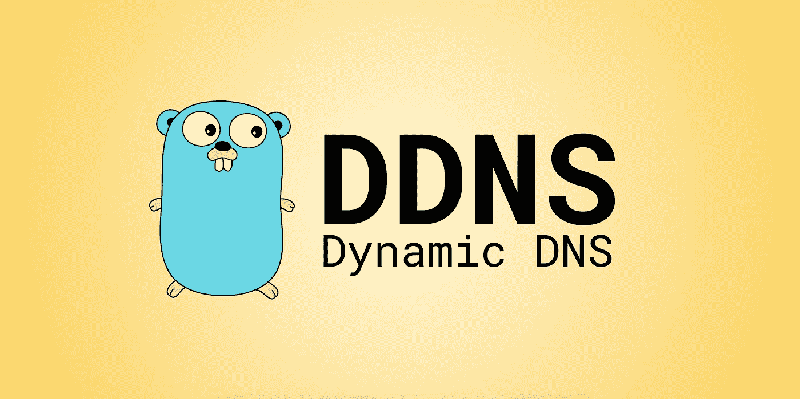

# 你的个人 DDNS

> 原文：<https://medium.com/hackernoon/your-personal-ddns-4ef7bbb189de>



根据维基百科，DDNS 是:

> *动态 DNS(*[*【DDNS】*](https://hackernoon.com/tagged/ddns)*或 DynDNS)是一种自动更新域名系统(DNS)中的名称服务器的方法，通常是实时地，利用其配置的主机名、地址或其他信息的活动 DDNS 配置。—维基百科(* [*来源*](https://en.wikipedia.org/wiki/Dynamic_DNS) *)*

DDNS 服务最常见的用途是当您的 IP 地址动态变化时，访问您家中或办公室的计算机。你可能听说过像[动态域名](https://dyn.com/dns/)或[无 IP](https://www.noip.com/) 这样的服务。你创建帐户，在你的机器上安装客户端，他们给你一个域来访问你的计算机。这些服务最常见的缺点如下:

*   这些服务不是免费的(或在有限的时间内)
*   您绑定到一个 DNS 提供商
*   自定义域是一个额外的功能

我希望在 DDNS 服务中看到哪些附加功能:

*   指定的 DNS 记录应在 IP 更改时更新。不仅是 A，还有 TXT 记录等等
*   当 IP 更改时，我希望得到通知
*   应该是免费的

最终，我没有找到具备这种功能的服务，于是 [**个人 DDNS 客户端**](https://github.com/skibish/ddns) 就这样诞生了。

决定在 [Golang](https://golang.org/) 中编写客户端。

对于 DNS 提供商，我选择了数字海洋网络。为什么？

*   我用数字海洋做宠物项目
*   他们的网络堆栈是免费的
*   数字海洋为他们的内部服务提供了惊人的 API

DigitalOcean DNS 成为客户端的后端。为了让一切工作，你需要有一个数字海洋帐户，并设置一个你想使用的域名。你可以按照这个教程来设置你的域名。但是我们会继续。

# 如何设置 DDNS 客户端？

这个例子将使用 Ubuntu Linux。您可以将同样的方法应用于您喜欢的任何发行版。

# 客户端安装

首先要做的是，您应该使用以下命令下载客户端:

```
> curl -L https://github.com/skibish/ddns/releases/download/2.1.3/ddns-`uname -s`-`uname -m` > /usr/local/bin/ddns> chmod +x /usr/local/bin/ddns
```

现在`ddns`二进制将在`/usr/local/bin/ddns`可用。要检查它是否已安装，请在终端中运行`ddns -h`。如果您将看到以下输出:

```
Usage of ddns:
  -check-period duration
    	Check if IP has been changed period (default 5m0s)
  -conf-file string
    	Location of the configuration file (default "$HOME/.ddns.yml")
  -req-timeout duration
    	Request timeout to external resources (default 10s)
```

你已经准备好前进了。

# 配置文件设置

要通过 DigitalOcean 使用客户端，您需要获得 OAuth 令牌。如何生成，[看这里](https://www.digitalocean.com/community/tutorials/how-to-use-the-digitalocean-api-v2)。

客户端需要一个配置文件，其中描述了更新 DNS 记录的规则。

在您的主目录中创建一个名为`.ddns.yml`的文件。最简单的设置如下:

```
token: "TOKEN"              # DigitalOcean token
domain: "example.com"       # Domain to update
records:                    # Records of the domain to update
  - type: "A"               # Record type
    name: "@"               # Record name
```

在这种情况下，域名**example.com**中名为 **@** 的记录**将被更新为您的 IP。如果要更新多条记录，请添加它们。**

```
token: "TOKEN"
domain: "example.com"
records:
  - type: "A"
    name: "@"
  - type: "A"
    name: "www"
  - type: "TXT"
    name: "info"
```

现在，如果您将启动客户端，一切都应该工作。

恭喜你！你有你自己的 DDNS。

# 把 DDNS 放在背景中

但是如何让它在后台工作呢？一个好的解决方案是在您的 linux 机器上注册一个新的服务。

创建一个文件`/etc/systemd/system/ddns.service`(你想在`sudo`用户下创建这个文件)。将下面指定的配置粘贴到其中:

```
[Unit]
Description=DDNS client with DigitalOcean as backend
After=network.target

[Service]
ExecStart=/usr/local/bin/ddns
User=<YOUR USERNAME>
Type=simple
Restart=always

[Install]
WantedBy=default.target
```

在此配置中，将`<YOUR USERNAME>`更改为您的用户名。保存文件。

当您处于`sudo`用户状态时，启用并启动该服务。

```
$ systemctl enable ddns
$ systemctl start ddns
```

酷，现在你有一个服务，将在计算机启动后启动。

# 高级配置

一开始，我说过，通过电子邮件获得通知是一个优势。如何设置通知？

目前支持的通知只有 SMTP。如果还有更多，你可以在项目的 [README.md](https://github.com/skibish/ddns/blob/master/README.md) 中找到。

```
token: "TOKEN"
domain: "example.com"
records:
  - type: "A"
    name: "@"
notify:
  smtp:
    user: "foo@example.com"
    password: "1234"
    host: "smtp.example.com"
    port: "465"
    to: "foobar@gmail.com"
    subject: "My DDNS sending me a message"
    secure: true # Optional flag. Set it, if you will send emails with SSL
```

通过这种配置，您现在可以发送电子邮件了。

但是你的邮件很可能会出现在垃圾邮件文件夹中。如何解决这个问题？我们可以为该域名创建 SPF 记录，并为电子邮件提供商将您的 IP 标记为安全。

```
token: "TOKEN"
domain: "example.com"
records:
  - type: "A"
    name: "@"
  - type: "TXT"
    name: "@"
    data: "v=spf1 ip4:{{.IP}} include:_spf.example.com ~all"
notify:
  smtp:
    user: "foo@example.com"
    password: "1234"
    host: "smtp.example.com"
    port: "465"
    to: "foobar@gmail.com"
    subject: "My DDNS sending me a message"
    secure: true
```

一条新的 **TXT** 记录被添加了一个**数据**字段。该字段是可选的。但是当它被设置后，你可以使用[Golang](https://hackernoon.com/tagged/golang)[text/template](https://golang.org/pkg/text/template/)引擎的全部潜力。在这种情况下，当 IP 将被更新时，这个 TXT 记录也将被更新。

使用这个 SPF 记录的例子，考虑您需要再添加两个 IP，但是它们是静态值。怎么办？对于这种情况，您有**参数**。

```
token: "TOKEN"
domain: "example.com"
records:
  - type: "A"
    name: "@"
  - type: "TXT"
    name: "@"
    data: "v=spf1 ip4:{{.IP}} ip4:{{.ipOne}} ip4:{{.ipTwo}} include:_spf.example.com ~all"
params:
  ipOne: "10.10.10.10"
  ipTwo: "20.20.20.20"
notify:
  smtp:
    user: "foo@example.com"
    password: "1234"
    host: "smtp.example.com"
    port: "465"
    to: "foobar@gmail.com"
    subject: "My DDNS sending me a message"
    secure: true
```

正如你所看到的，设置是灵活的，你可以使用这个工具更新你的 DNS 中的很多东西。

# 下一步是什么

下一步是添加选择 DNS 提供商的功能，因为有人可能正在使用 [Cloudflare](https://www.cloudflare.com/dns/) 。但这是下一个版本的一个步骤，我很乐意接受贡献:)

[个人 DDNS 已经开放，可以在 GitHub 上使用](https://github.com/skibish/ddns)。