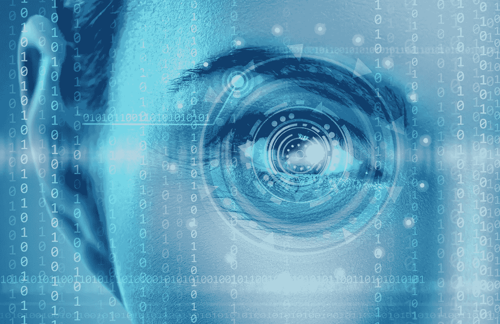

# 你的手机可以像你一样识别你的朋友

> 原文：<https://medium.com/hackernoon/your-phone-can-recognise-your-friends-as-well-as-you-can-171919044fc9>

你如何认出你的朋友，或者区分他们？你可以指出像棕色头发或方下巴这样的特征，但这只能缩小一点范围。这些特征在人与人之间并不独特。然而，不知何故——你已经积累了足够的经验去了解——即使你的朋友已经改变了他们的头发颜色或者做了一个有趣的鬼脸。

这种基于经验的推理迄今为止已经超出了计算机的能力，但最近在**计算机视觉**领域的进展正在迅速缩小人类和软件在各种视觉任务上的表现之间的差距——并挑战长期以来关于计算机能做什么或不能做什么的假设。就在过去几年里，研究人员创造了**人工智能**(ai)，它能够像人类一样准确地识别照片中的人、物体和场景[。也许更令人惊讶的是:这些人工智能并没有“硬连线”这些能力，而是从它们的人类创造者提供给它们的例子中学习。](https://blogs.microsoft.com/next/2015/12/10/microsoft-researchers-win-imagenet-computer-vision-challenge/)

脸书现在可以在照片中自动识别和标记您或您的朋友。微软的 OneDrive 可以根据你用手机拍的照片生成#手或者#人像等标签。 [FaceApp](https://techcrunch.com/2017/02/08/faceapp-uses-neural-networks-for-photorealistic-selfie-tweaks/) 可以修改人物的照片来改变面部表情——甚至是照片主体的性别！在 [**Object AI**](http://objectai.com) ，我们正在为电子商务照片和数字出版创建一个[智能照片编辑器，它可以自动检测照片中的产品，并自动执行照片编辑的耗时部分。所有这些服务都依赖于被称为人工神经网络的人工智能软件。](http://objectai.com/)

# 人工神经网络和深度学习

人工神经网络(通常简称为“**神经网络**”)试图模拟神经元在人脑中的工作方式。对神经网络的研究可以追溯到至少 75 年前，但是早期神经网络的计算能力受到可用计算硬件的限制。就在十年前，许多人认为神经网络是一种理论上的新奇事物，没有在现实世界问题中的有用应用。

进入一个专门的计算机硬件，称为图形处理单元(GPU)。GPU 是为视频游戏提供高速三维计算机图形而创建的；他们擅长同时进行数百或数千个简单的数学计算。神经网络研究人员意识到，由 GPU 执行的简单、高速计算也非常适合神经网络的计算需求。最后，神经网络获得了足够的计算能力！

计算能力的突然增加意味着神经网络可以由比以前可行的多得多的神经元组成。更多的神经元意味着更大的学习能力，特别是如果这些神经元被分组为扁平的“层”，然后依次堆叠和连接在一起。研究人员发现，这些由许多堆叠层组成的“更深”的神经网络比早期的“浅”神经网络强大得多:早期的层学会检测输入数据中的简单概念，而后期的层学会将这些简单概念组合成更复杂的概念。**深度神经网络** (DNNs)诞生。

使用一种叫做“**深度学习**的方法，对大量训练数据进行深度神经网络训练，以响应给定的输入产生适当的输出。如果 DNN 训练有素，它就能够“泛化”:当给它一个从未见过的新输入时，它能够根据以前的经验输出一个合适的输出。如果这听起来相当含糊不清(输入是什么？输出是什么？)，这是因为 DNNs 几乎可以应用于任何需要经验做出判断的例子。

# 用于计算机视觉的深度神经网络

例如:假设我们想要创建一个计算机视觉人工智能，它可以判断照片中的人是微笑还是皱眉。可以给一个深度神经网络一万张微笑的照片，和一万张皱眉的照片。这就是训练数据。在训练过程中，DNN 会数千次地遍历训练数据中的所有图像；每一次，它都会给出关于图像中出现微笑/皱眉的最佳预测。如果 DNN 的预测对该图像是正确的，那么没有神经元设置改变。如果 DNN 的预测是不正确的，那么整个 DNN 的神经元设置会稍微调整，以鼓励 DNN 下次做出不同的(希望更正确的)预测。理想的最终结果是，在训练结束时，神经元设置会产生所有训练图像的正确答案，并很好地推广到新的“看不见的”图像。

那么这和人工智能识别人有什么关系呢？简单地说，可以训练一个用于计算机视觉的深度神经网络来检测照片中的相关“特征”——在这种情况下，是实际的面部特征:眼睛、鼻子、眉毛、嘴巴、脸颊、下巴……给定足够多的神经元和足够多的训练照片，DNN 可以学习识别使一个人看起来像他们的共同特征和特性，具有不可思议的准确性。给定足够多的你或你朋友的照片(这将是训练数据)，高级人工智能就可以“猜测”新照片中描绘的是谁。如果你手动标记这张图片，这张图片会被添加到训练数据中，人工智能会在下一次预测中变得更加智能。

# 接下来会出现什么软件

如果这听起来像是社交媒体的噱头，请三思；这个软件可能意味着生与死的区别。因为 DNNs 可以被训练识别如此多不同的输入(并相应地采取行动)，它们在预防道路和空中事故方面找到了应用。例如，Drive.ai 正在将 DNN 的[图像分析集成到无人驾驶汽车](https://www.technologyreview.com/s/602600/deep-driving/)中，以便快速识别行人或其他危险。Iris Automation 正在为无人机构建[基于图像的危险规避系统，这将帮助无人机避开人和障碍物，即使是在完全的新手手中。](https://techcrunch.com/2016/06/27/iris-automation-is-bringing-eyes-and-situational-awareness-to-drones/)

在计算机视觉和深度学习领域，研究人员刚刚开始探索似乎无穷无尽的新挑战。威尔·奈特(Will Knight)在《麻省理工科技评论》(MIT Technology Review)上写道，计算机视觉和人工智能的未来任务之一将是[分析一幅图像，并理解场景](https://www.technologyreview.com/s/545906/next-big-test-for-ai-making-sense-of-the-world/)中正在发生的事情，而不仅仅是它包含什么:脸书可以告诉你你的图像中是否包含披萨，但披萨是正在制作、烹饪还是被食用？是在烤箱里，盘子里，还是在别人手里？能够回答这些问题将代表着计算机“理解”方面的巨大飞跃。

因此，如果你对迄今为止只在科幻小说中看到的人工智能应用感兴趣，请在未来几年里关注计算机视觉领域。毕竟，你的电脑已经在盯着你了！

感谢您花时间阅读本文。如果你喜欢这篇文章，请点击下面的♡，这样其他人就会在 Medium 上看到它。

看看我们的[人工智能智能照片编辑器](http://objectai.com/)，在 Twitter 上关注[人工智能对象](https://twitter.com/ObjectAI)，或者在脸书上关注[人工智能对象](https://www.facebook.com/ObjectAI)！

> [黑客中午](http://bit.ly/Hackernoon)是黑客如何开始他们的下午。我们是 [@AMI](http://bit.ly/atAMIatAMI) 家庭的一员。我们现在[接受投稿](http://bit.ly/hackernoonsubmission)并乐意[讨论广告&赞助](mailto:partners@amipublications.com)机会。
> 
> 如果你喜欢这个故事，我们推荐你阅读我们的[最新科技故事](http://bit.ly/hackernoonlatestt)和[趋势科技故事](https://hackernoon.com/trending)。直到下一次，不要把世界的现实想当然！

