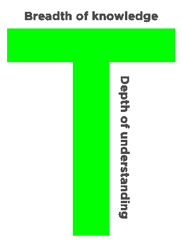

# 你的项目经理需要设计和编码

> 原文：<https://medium.com/hackernoon/your-project-manager-needs-to-design-and-code-893fb75af526>

早在今天的流媒体服务之前，就有录像机了。穴居人和女人会穿上他们的腰部衣服，去当地的音像店租一盘 VHS 录像带在他们的电视上观看——如果他们想要的还没有被检查出来的话。

理论上，电视/录像机组合听起来是个好主意。一个就够了，为什么还要买两个？不幸的现实是，制造商迫于压力，不得不降低价格，降低质量。

早期创业员工就像电视/录像机组合。随着公司规模的扩大，他们雇佣专门的员工——这些员工拥有构成这些神奇的独角兽雪花的组成技能。完全有道理。

但是有些角色受益于广泛的技能组合。编码和管理自己项目的设计师可以与工程师更紧密地合作，并说商业语言。听起来很有价值，对吧？

## 齿轮的生活并不可怕

创始人会为了省钱不择手段。他们甚至违反了消防条例。我见过 75 个人挤进一个不超过 30 人的办公室。情况一度变得如此糟糕，你不得不要求厨房柜台的工程师搬走，这样你就可以使用水槽了。

但是当一个公司发展到 100 多人时，就会发生一些事情。首席执行官变得小心翼翼。管理层出现了。雄伟，摇滚明星，独角兽雪花变成齿轮。

在你把我的声明当成对美国公司的痛苦控诉之前，我想澄清一下，我认为这是多么美好。就看大都会吧。

弗里茨·兰的反乌托邦电影经典将工厂工人描绘成庞大机器的一部分。虽然这听起来很可怕，但这部电影对人的机械使用证明了在校准的和谐中工作是美丽的。

> 没有人反对授权的必要性。但是，当一个人可以做所有三个人的工作时，雇佣三个人是明智的经济决策吗？

如果你有标准化的角色，这会简化招聘过程。每次组建团队，都可以根据需要把人从一个团队调到另一个团队。有一个专门的人来管理 JIRA 并不是什么都没有…

听起来很值得。嗯。那么 T 型员工的价值是什么呢？

抱歉，让我倒回去。招聘人员有一个术语叫做 T 型员工。垂直线代表员工技能的深度。水平线表示员工与其他领域的专家合作得如何，然后将他们学到的知识应用到自己的工作中。

所以我会再次提出这个问题，T 型员工在设计和开发方面的价值是什么？

## UX 现在正在设计

如果我不引用自亨利·福特以来美国最著名的社团主义者的话，这就不是一篇中篇文章，“设计不仅仅是它看起来和感觉起来的样子。设计就是它的工作方式。”

虽然每个产品设计师都听说过这句话，但在 UX 设计的背景下想到这句话还是很有意思的。这是硅谷自己的救世主大胆捍卫用户体验——说明它曾经是多么的事后诸葛亮。

今天，在这个有 [Bootstrap](http://getbootstrap.com/) 和其他可定制 UI 套件的时代，视觉设计已经变得更加商品化，UX 已经成为区分非凡和平凡的主要设计挑战。

## UX 的生死由密码决定

任何人都可以在 Keynote 中模拟工作流或交互，但是将 UX 转化为专业级代码/产品会迫使设计不断发展。

有数据模型约束、Javascript 错误和设计惯例要遵守。根据我的经验，直观的 UX 设计是在编码过程中通过不断的试验和错误发现的。

你真的希望一个设计师把静态的 Photoshop 模拟交给一个离岸开发团队，还是希望同一个设计师在他们编码的时候把 UX 处理得尽善尽美？

与后端工程师一起编码的设计师的优势是双重的。任何接触代码库的人都更有权力告诉真正的工程师该做什么。管理层相信这些混合员工能够以最廉价的方式解决复杂的问题。

简而言之，独角兽有杠杆😎

## 任何给定的混乱

有这么多新的网络技术，甚至有更多年轻的创业公司在使用它们。这导致了产品中各种各样的职位和职责。适用于一家初创公司的方法不一定适用于另一家。

在产品开发的情况下，从头到尾拥有一个特性的几乎每个方面是一个竞争优势。它会带来更好的沟通、清晰的愿景和主人翁的自豪感。

每个功能都需要有人把球扔进端区。让四分卫看看场地，拟定战术，并在关键时刻自己执行，难道没有价值吗？我确实这样认为。否则他们只是另一个头部受伤濒临破产的可怜虫。

> [黑客中午](http://bit.ly/Hackernoon)是黑客如何开始他们的下午。我们是 [@AMI](http://bit.ly/atAMIatAMI) 家庭的一员。我们现在[接受投稿](http://bit.ly/hackernoonsubmission)并乐意[讨论广告&赞助](mailto:partners@amipublications.com)机会。
> 
> 如果你喜欢这个故事，我们推荐你阅读我们的[最新科技故事](http://bit.ly/hackernoonlatestt)和[趋势科技故事](https://hackernoon.com/trending)。直到下一次，不要把世界的现实想当然！

