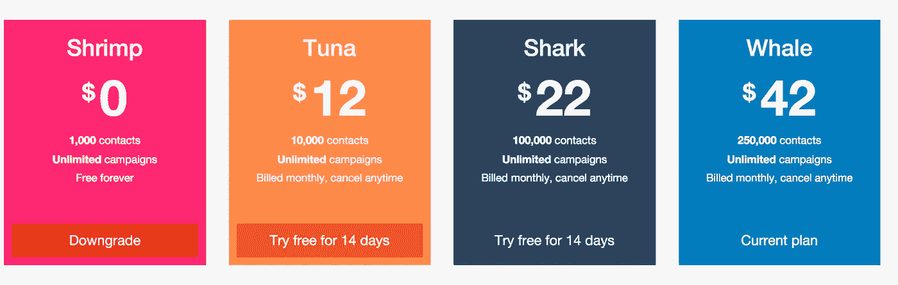
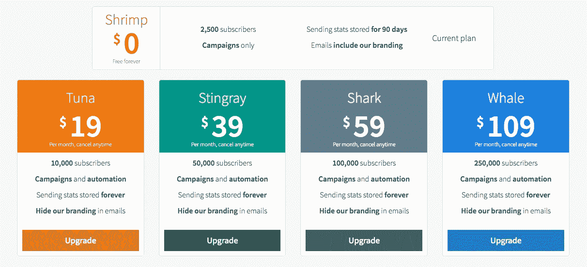
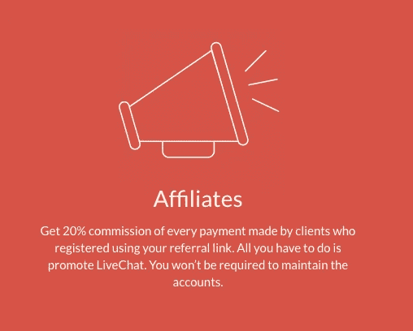
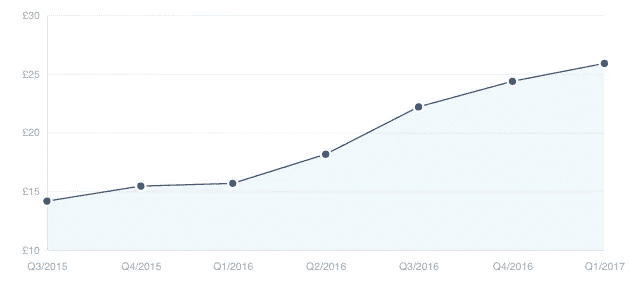

# 你的 SaaS 充电不足

> 原文：<https://medium.com/hackernoon/your-saas-isnt-charging-enough-ef4252708537>

当我们在 2015 年末首次将定价添加到[email ctopus](https://emailoctopus.com)时，我们定价背后的理念很简单。比我们的竞争对手便宜得多。

值得考虑的是，在那个时候，这个平台只是一个兼职项目，与全职工作所能提供的薪水和保障不相上下。EmailOctopus 提供的资金是“啤酒钱”,我们还没有期望成为一项全职业务。在兼职项目中，这种态度并不罕见，你从中赚到的任何钱都被视为奖金——这可能会导致你低估你的时间，更重要的是，你的业务。

Our initial pricing at EmailOctopus, which made it almost impossible to reinvest money back into the business

在早期阶段对你的副业项目定价过低，会让它更难变成一项全职业务。如果你开始时每个计划每月只收取 5 美元，那么你需要 1000 个付费用户才能接近硅谷/伦敦开发者的工资。很容易陷入这个怪圈，你收取很低的费用(因为你可以),但却无力承担业务增长的费用。

运行你的 [SaaS](https://hackernoon.com/tagged/saas) 时要记住的最重要的事情是，用户利用你是因为你提供的价值。定期问问自己，我们的客户从我们的产品中获得价值了吗？如果我们提高价格，它们的价值还会远远超过定价吗？确定用户认为你的产品有什么价值。作为一个电子邮件[营销](https://hackernoon.com/tagged/marketing)平台，我们太专注于发送电子邮件，以至于我们经常忘记我们的用户并没有付钱让我们这么做。他们付钱让我们发送电子邮件，这样他们就可以和他们的客户群交流。

价格竞争是一件非常容易接受的事情。如果你的 SaaS 是现有产品的更简单或更轻便的版本，那么降低你的价格是一个很好的方法，这样你就可以抓住那些不需要更昂贵的替代品提供的所有花哨功能的用户。在 EmailOctopus，这是我们的核心主张——我们专注于使电子邮件营销变得简单且经济高效。我们没有 Mailchimp 的脸书广告活动工具和移动应用程序，也不需要数百名投递工程师(因为亚马逊 se 为 EmailOctopus 客户处理投递),我们的定价反映了这一点。

The current EmailOctopus pricing, our 2nd iteration on our original pricing.

提价的一个好处是，向上游转移通常会带来更好的顾客标准。作为一个大打折扣的电子邮件营销平台，我们向垃圾邮件发送者和需要大量支持和监控的不太受欢迎的客户敞开了大门。了解产品对其业务的价值的用户会为其付费。他们是你想要的用户。

# 那么，我应该把价格提高到什么程度呢？

这是一个只有你，在你的 SaaS 公司里，才能回答的问题，它是基于你需要进行的研究。你需要考虑几件事:

If you have an affiliate scheme, like LiveChat, your pricing model will need to consider this

你的收购成本。许多公司提供代销商计划，向代销商提供可观的 MRR 分成。他们的价格必须调整，以反映这一点，在极端情况下，如 ConvertKit，他们提供 30%的佣金给分支机构。实质上就是说，你的价格需要提高 30%。谷歌付费广告(Adwords)也不便宜，脸书的广告也不便宜。你需要考虑定价对客户终身价值的影响，因为 LTV 越高，你就越有能力出价。涨价的一个好处是你可以花更多的钱给他们做广告。

你产品的价值。这一点我已经在上面深入讨论过了，但是你提供的价值越多，你可以收取的费用就越多。考虑使用你的平台的各种角色，确保你的定价和计划反映出你为他们提供的价值。PriceIntelligently 有很多关于这方面的博客，我建议[阅读](http://www.priceintelligently.com/blog/bid/179505/A-No-Bull-Straightforward-Guide-to-Value-Based-Pricing-Strategy)。我们的上一轮价格调整增加了一个额外的计划，这是我们在研究和分析了现有计划和现有客户的使用模式后增加的。

Our pricing comparison against our other competitors based upon 12 emails per month, we also maintain a sheet for features.

你的竞争对手收费多少？在 EmailOctopus，我们的核心主张是我们的定价比 Mailchimp 低得多。我们提供一个更简单、更轻便的平台，并认为电子邮件营销定价过高。在改变价格之前，我们真正花时间做的一件事是对我们的竞争对手提供的东西做大量的研究，我们会在定期更新的电子表格中显示出来。这项研究并不总是导致价格上涨，事实上，我们最近的变化包括延长我们的免费计划，以确保我们仍然是最便宜的平台之一。

# 我现有的用户会怎么想？

公司对待现有客户的方式多种多样，最常见的是祖父辈。当不追溯时，你基本上不会为在帐户的整个生命周期内保持同一产品的客户提高价格。随着公司规模的扩大，你可能会认为这是对待一开始支持你的用户的公平方式，这也是我们在 EmailOctopus 所做的。我们的早期客户是给我们的礼物，他们帮助我们更多地了解我们的定价模式，并帮助推动产品的方向，我们喜欢善待他们。

Our original grandfathered customers from our price increase in July 2016 slowly decrease over time as they churn and upgrade.

其他选择是向现有客户提供折扣。在祖父折扣的情况下，您将与客户达成一致，在未来 6 个月或 12 个月内保持同样的低价格，确保您公平对待他们，但在中期内获得额外收入的好处。如果他们的计划有显著的，但也许不是显著的改进，折扣就更容易证明是合理的。

最勇敢的决定是立即提高他们的价格，以你的新计划。在这样做之前，你要确认你的客户群对价格不太敏感。如果你在过去 3 年里一直宣传自己是最便宜的，然后提高价格，与竞争对手持平，如果不是更高的话，那么你可能会让一些客户感到不安。如果您对平台进行了重大改进，客户会喜欢他们的计划，那么立即直接提价是最容易做到的。你需要仔细清楚地向顾客解释这次涨价。这是 Expensify 做得特别好的事情。

# 后期价格上涨

涨价后，关注你的转化率(潜在客户>付费和访问>潜在客户)以及对新客户的影响。经过深思熟虑的提价几乎不会显著影响转换率，但肯定会增加 ARPA(每个账户的平均收入)。

Our ARPA has increased from £14 to almost £26 per month

增加你的 SaaS 业务 ARPA 是增加你每月收入的最快方法，而不用担心扩大营销支出或影响你的技术稳定性。

在 EmailOctopus，它帮助我们扩大规模，招聘更多员工，并对产品进行更多投资。如果不丢掉我们开始时的副业思想，这是我们无法做到的。

> [黑客中午](http://bit.ly/Hackernoon)是黑客如何开始他们的下午。我们是 [@AMI](http://bit.ly/atAMIatAMI) 家庭的一员。我们现在[接受投稿](http://bit.ly/hackernoonsubmission)并乐意[讨论广告&赞助](mailto:partners@amipublications.com)机会。
> 
> 如果你喜欢这个故事，我们推荐你阅读我们的[最新科技故事](http://bit.ly/hackernoonlatestt)和[趋势科技故事](https://hackernoon.com/trending)。直到下一次，不要把世界的现实想当然！

