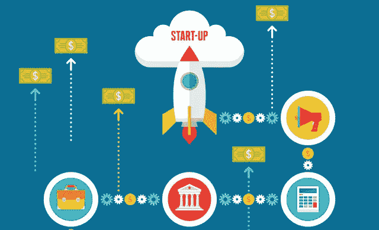

# 你的创业成长战略从品牌战略开始

> 原文：<https://medium.com/hackernoon/your-startup-growth-strategy-starts-with-brand-strategy-4158e97ae30e>

你在创业。什么时候应该投资品牌战略？

换个说法，什么时候需要成长？你什么时候需要获得新客户，建立自己的文化，招聘合适的人？

对于一家主要工作是增长的初创公司来说，品牌战略可能是一个关键工具。所以关于什么时候需要品牌战略这个问题的答案是:不是在最开始的时候，但很可能比你想象的要早。

我们最近给一家秘密模式的软件创业公司贴上了标签，这家公司的首席执行官是一位非常成功的连续创业者。他与 emotional Brand 合作过几次。这一次，他比以往任何时候都更早地让我们加入进来，因为他已经看到了品牌战略是如何推动增长的。

当他的初创公司离开隐形模式，进入增长模式时，正如它准备好要做的那样，它将由正确的客户洞察、正确的价值主张和正确的信息驱动，以取得成功。

# 太早；太晚

这并不意味着你在第一天就需要品牌战略。创业公司在担心其他任何事情之前，让他们的产品建立起来并经过测试是正确的。如果你没有一个可行的产品，你就没有任何东西来发展一个品牌或一家公司。所以早期，视野狭窄是好的。

下一个阶段，成长阶段，是品牌战略能够产生有意义的影响的阶段。品牌战略可以通过识别谁是你的最佳客户，并阐明你在解决他们每天面临的痛点方面比其他人做得更好，来推动你的增长战略。

品牌战略定义了您公司独特的品牌体验、您与市场对话的声音，以及将为您带来合适人选的信息。

如果你的品牌不清晰，你的增长战略将很难定义长期目标和实现目标的短期策略。

# 避免在增长开始前就停止增长

几年前，我们就在这个位置上与一个初创客户合作过。该公司有一个伟大的团队和一流的风险投资支持。它在最初的朋友和家人客户群中取得了成功，但当实施其增长战略时，它遇到了阻碍。

该公司试图用一个科技含量很高的产品故事来建立自己的业务，而不是直接解决它为客户解决的挑战。它的风险投资公司给我们送来了创业公司。

在与 Emotive Brand 合作三个月后，这家初创公司准备重新推出一个新的故事，并迅速开始实现其目标。自那以后，这家初创公司让我们参与了许多项目，以保持其故事在竞争格局变化中的相关性。

随着你的创业公司为成长模式做准备，你的团队也会成长。品牌战略阐明了你是谁，你相信什么可以帮助内部和外部，帮助你招募合适的人，建立强大的内部文化。

无论你的初创公司是准备内部增长、外部增长还是两者兼而有之，[品牌战略](https://www.emotivebrand.com/business-strategy/)可以让你的增长战略更聪明、更清晰、更成功。

Emotive Brand 是一家与高增长 B2B 公司合作的品牌战略公司。

有关我们如何帮助初创公司创建敏捷品牌战略以满足其最迫切需求的更多信息，请访问 [**快进**](https://www.emotivebrand.com/high-growth-companies/) **。**

*原载于 2017 年 9 月 28 日*[*www.emotivebrand.com*](https://www.emotivebrand.com/startup-growth-strategy-starts-with-brand-strategy/)*。*