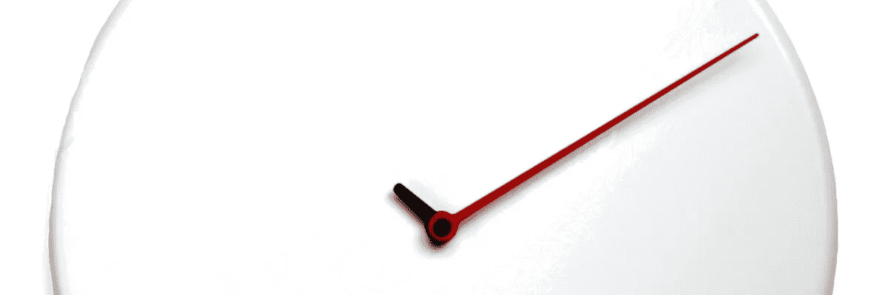
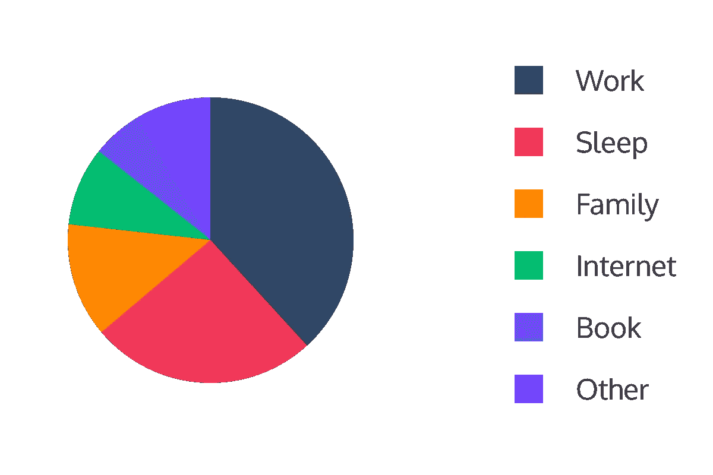
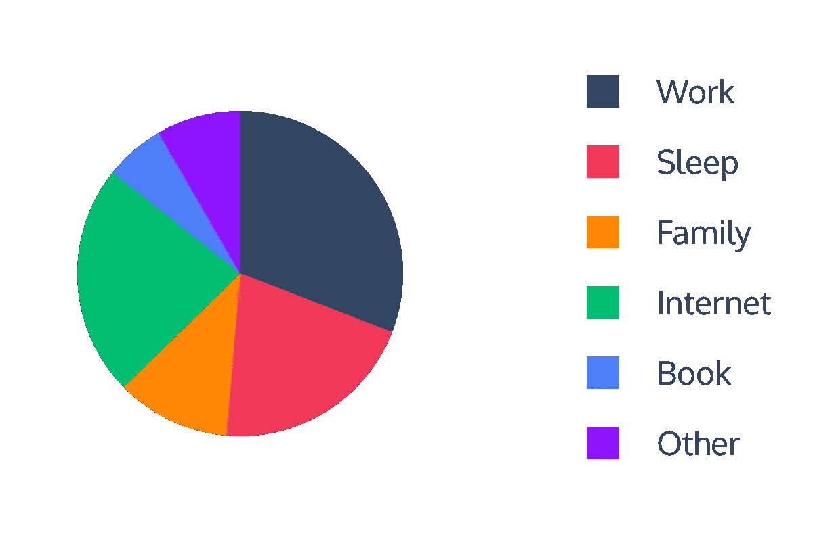

# (你的)时间是宝贵的

> 原文：<https://medium.com/hackernoon/your-time-is-in-valuable-fc0f1f6f43c3>

Image by Modobath

一天是 86400 乘以 9192631770 个铯原子辐射周期。也就是说，24 小时是一段很长的时间，但是我们花了很多时间在无用的东西上，尤其是在互联网上。想知道你一天花多少时间在互联网上吗？

这是一张饼状图，显示了我们通常是如何度过一天的:

你猜怎么着[馅饼是骗人的](http://theportalwiki.com/wiki/Cake)。这是一个更现实的饼图:

我们在工作期间、与家人在一起，甚至在睡觉前都花时间上网。我们睡得更少，工作更少，和家人在一起的时间更少。我们花在互联网上的时间比我们预计的要多。在 [**1，063，858，250+**](http://www.internetlivestats.com/total-number-of-websites/) 网站中，海量的信息摆在那里，我们花了太多的时间去寻找**值得关注的内容**。

不情愿地说，我们都这样做。我们往往会偏离我们的主要目的。在研究我们的工作或家庭作业时，我们会发现自己在看猫咪视频，在 reddit 帖子上发表评论，或者在脸书上给朋友加标签。

所以，应该有解决的办法。我一直希望有一款[产品](https://hackernoon.com/tagged/product)能够呈现**值得关注的内容**并帮助我**节省上网时间**。

打个比方:

Medium 说这是一篇 2 分钟的文章，您已经学会了

*   第二个的科学代表是什么
*   来自门户网站视频游戏的**网络迷因**
*   世界上有多少网站
*   有一种**产品正在开发**，它旨在提供**高质量的内容**并防止你**在互联网上浪费时间**

这里有一个想了解更多的提示

A hint

激动吗？[跟着](http://twitter.com/CihadTurhan)，评论，打♥

> [黑客中午](http://bit.ly/Hackernoon)是黑客如何开始他们的下午。我们是 [@AMI](http://bit.ly/atAMIatAMI) 家庭的一员。我们现在[接受投稿](http://bit.ly/hackernoonsubmission)，并乐意[讨论广告&赞助](mailto:partners@amipublications.com)机会。
> 
> 如果你喜欢这个故事，我们推荐你阅读我们的[最新科技故事](http://bit.ly/hackernoonlatestt)和[趋势科技故事](https://hackernoon.com/trending)。直到下一次，不要把世界的现实想当然！

