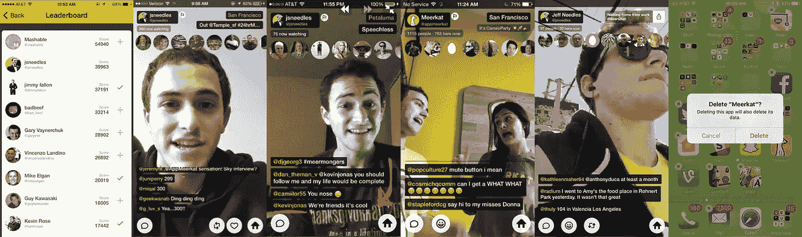

# 你直播了！谁在乎呢。

> 原文：<https://medium.com/hackernoon/youre-live-who-cares-df916d70f79e>

….很少人。可能没人。

去年[直播](https://hackernoon.com/tagged/livestreaming)是我的[生活](https://hackernoon.com/tagged/life)。我流了几乎所有的东西。我甚至[在一家直播公司找到了一份工作](/@jsneedles/why-i-left-my-dream-job-358a6e71814b)。但随着时间的推移，我突然意识到:“这并不总是超级有趣。人们真的不(也不应该)关心我的日常生活。”至少不会是在猫鼬上看我的人。

让我这么说吧——我非常感谢去年观看、支持、评论和喜欢转发的所有人。无论是清晨的编码会议、产品搜索评论还是 24 小时的 meerathon，你都在那里，你(大部分)都很友好，并且乐于助人。我感谢你们每一个人。

## 对大多数人来说，活着并不是一种自然的状态。

作为一个独立的业务或平台，广播公司和观众(一对多)模式下的移动直播是不可持续的。作为现有网络的一个特征，它是有意义的(但几乎没有意义)。

我花了好几个月的时间为 Meerkat 分析数据；用户就像他们创造的信息流一样短暂。思考为什么，会引出一个非常重要的问题。

# 你为什么流口水？

## 1)你很出名，并试图与你的粉丝“联系”

这个很简单。你去的平台有你最大的观众群。您希望与该平台实现最佳集成。你的直播流现在只是你在那个平台上出现的另一种形式的内容。

## 2)你想出名

抱歉，没人会因为直播而出名。你要去的地方有真正有价值的重放能力和简单的本地共享。但你的内容将不会面向直播互动，而直播互动是直播的优势，因为那不会很好地重播。你基本上只是在现场录制你上传到 youtube 的视频。你会意识到这是大量的工作和低质量的工作…所以你会停下来专注于后期制作。

这里可以讨论一下 YouTubers、Viners、Snapchatters 等是如何出名的，那么为什么 live streamers 不会呢？在我看来，答案在于媒介。对于大众消费来说，实时事件的可发现性和可共享性是不可行的。正是那些其他平台固有的异步&分布式消费，才能让人出名。LIVE 没有这个，现实一点，我相信永远也不可能。

## 3)你想得到报酬

再一次，超级简单——谁在付钱给广播公司？答案从来不是猫鼬。这是我非常自豪的事情。除了其他社交帖子、提及等，直播流是品牌可以购买的套餐的一部分...不是独立的，你必须在其他地方存在。还有 YouNow，主要是针对较年轻的飘带。当粉丝可以直接支持广播公司时，就有了直接的动机来传输内容，也是你的观众认为有价值的内容的晴雨表。

## 4)你在寻找“社区”

我确实相信在 Meerkat 的早期，广播员和观察者之间有一种真正的亲密关系。但我不知道有多少人出现(作为彩带或观察者)成为某个新社区的一部分。关于你的兴趣的流媒体当然可以帮助你吸引志同道合的人，并且可以形成社区…但直播是实现这一点的正确工具吗？它不是更适合作为现有的朋友/陌生人社区的延伸吗？

## 5)你喜欢营销(自我推销)

这是一个大的。我个人最不喜欢的一个。人们从一个平台跳到另一个平台，兜售他们的“服务”，试图成为(被认为是)专家。他们信奉“规则”和“智慧”，这很糟糕。仅仅因为你是第一个，并不意味着你是专家。

## 6)隐形传态流

这是大多数流媒体的发展方向，也是直播一直蓬勃发展的地方。这是心灵传输。它是一个会议，一个事件，一个一次性的东西，给观察者一种身临其境的感觉，但局限于早期使 Meerkat 有趣的交互性和自发性。品牌将继续从中看到价值，这是排名第五的人“证明”他们的直播实力的好方法。

## 7)直播很有趣

这是一个让我。非常有趣。但重点是“曾经”——它变得很老，很快。但即使从一开始，我总是问为什么人们在看。这些人是最难留住的:如果乐趣依赖于收视率，那么 streamers 必须有一个观众，但人们为什么要看这个平均乔？这真是一个先有鸡还是先有蛋的问题，人们不会再回来观看了。一个人如何将娱乐性偷窥转变为长期价值？

# 在一起，但分开。

视频直播有惊人的潜力将人们聚集在一起。但是它没有也不能从“我想和任何人说话”开始——为了建立一个舒适的、可理解的媒介，它必须从“我想和我认识的人说话”开始。远离现场的运动可能看起来很小，但它是不朽的。还有一些其他的东西——从“我”到“我们”的转变，不仅仅是我一个人在屏幕上…而是我们在一起，视频对对话中的所有人都同等重要。

在从公共媒体到私人媒体的转变中，“我”到“我们”的转变是势在必行的，也是违反直觉的。

在任何人将 [Houseparty](http://joinhouse.party) 比作 Skype、Hangouts、Oovoo 或任何已经存在多年的东西之前……使用这个产品。求你了。这是一种完全不同的体验，使谈话成为一种流畅的体验。开始和结束之间的界限模糊…就像在一个聚会上，你可以走到某人面前，说嗨，然后走开…没有承诺，没有任何形式。这不是一次会议，这是一次谈话。

# 但是你在那里工作

我愿意。是真的。 [Houseparty](http://joinhouse.party) 是一种新型社交互动的基础，建立在我们每天经历的真实世界的概念之上。对我来说，从 Meerkat 开始过渡是非常艰难的。但是当我们看到在 Houseparty 上的使用激增时…这是显而易见的。RIP Meerkat，但欢迎参加派对。

像这样？显示它与💚下面。

到处分享，我不会介意。

另外，你可以[在推特上关注我](http://twitter.com/jsneedles)。

> [黑客中午](http://bit.ly/Hackernoon)是黑客如何开始他们的下午。我们是 [@AMI](http://bit.ly/atAMIatAMI) 家庭的一员。我们现在[接受投稿](http://bit.ly/hackernoonsubmission)并乐意[讨论广告&赞助](mailto:partners@amipublications.com)机会。
> 
> 如果你喜欢这个故事，我们推荐你阅读我们的[最新科技故事](http://bit.ly/hackernoonlatestt)和[趋势科技故事](https://hackernoon.com/trending)。直到下一次，不要把世界的现实想当然！

