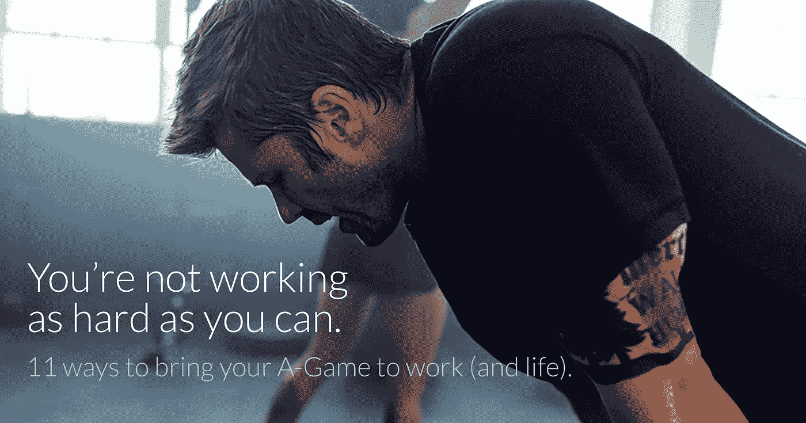

# 你没有尽最大努力工作

> 原文：<https://medium.com/hackernoon/youre-not-working-as-hard-as-you-can-feb62bb0985f>

## 11 种把你的 A 级游戏带到工作(和生活)中的方法。

[*最初发表于此。*](http://www.sean-johnson.com/what-hard-work-looks-like/)

在自己做了三个月之后，我妻子把我拖进了一家 CrossFit 健身房。

在我们婚姻的大部分时间里，我每周都坚持锻炼一到两次，主要是举重，而且我通常会感觉很好地离开健身房。我以为我知道健身意味着什么。

CrossFit 告诉我，我不知道艰苦的锻炼应该是什么感觉。

第一次会议是最糟糕的。就像被卡车撞了一样。你的身体告诉你它真的要死了。一点也不好玩。

锻炼不会变得更容易。但你至少知道未来会发生什么。你也发现自己在慢慢进步。两周之后，他们让我从头开始重复这项训练，我发现我节省了 30 秒的时间。我还是很糟糕，但感觉很好。

 [## 职业阶梯不在办公室

### 关于成功的一个肮脏秘密:一半是关于你不在办公室时做了什么。

medium.com](/@intentionally/the-career-ladder-isnt-in-the-office-43cfe5e3b066) 

最重要的是，我明白了我的身体，即使是现在的梨形，也远比我想象的更有能力。当你看到等待你的重复次数——200 次俯卧撑或 100 次打嗝或其他——你认为你不可能做到。但是你挺过去了。即使你在白板上的时间比其他人都少(我一直都是)，你也会有一种满足感。

你现在知道艰苦的锻炼是什么感觉了。当你知道那天你投入了工作时，你会很满足。

# 大多数人不知道什么是努力。

我认为大多数人在职业生涯中不知道什么是努力。

有一群人不知道也不在乎。他们认为他们的工作是不可避免的罪恶，最好的方法是保持低调，做足够的事情来避免被解雇。谢天谢地，这不是大多数，他们通常会很快被发现。

问题在于第二类人，我相信这是我们大多数人。这个团队关心他们的工作，并且真心想做好。他们每天都出现，并相信他们真的尽了最大努力。当他们的老板因为他们没有做得更多而感到沮丧时，他们不明白这一点。他们正在尽可能努力地工作。

至少他们是这么认为的。

# 他们为什么不知道？

也许他们不知道，因为他们从未真正被推动过。他们从来没有坚实的模型可以遵循，比如一个家庭灌输给他们的思想，或者一个老师推动他们超越他们认为可能的极限。

也许这是知识工作的本质。大部分时间都在电脑后面，如果你没有明确的交付成果，比如模型、代码或电话，就很难识别谁是真正的忙碌，谁只是在混日子。

也许是因为他们的同龄人也不知道。他们周围的大多数人都和他们一样无知。在一个典型的办公室里，可能会有一两个人真正了解艰苦工作的感觉，并坚持不懈地去做。

不管什么原因，影响都是可怕的。

# 不知道是为什么你可能不喜欢你所做的事情。

许多人被教导去追求他们热爱的东西。他们接受了一份工作，并不那么喜欢它，跳到一个新的工作，并重复。

> 越来越多的证据表明，他们不喜欢自己的工作，因为他们不擅长，这种激情来自于掌握，而不是相反。
> 
> 通往成功的道路是努力工作。

社会科学家称之为“刻意练习”。虽然大多数人的一天都是由 T2·卡尔·纽波特所说的“肤浅的工作”组成，但热爱工作的人却追求深度的工作，即需要高度集中注意力的工作。这种专注会带来更快的进步，从而带来精通，进而带来激情。

不知道如何努力深入地工作会让你不太可能找到你热爱的事情。

# 不知道是你无法升迁的原因。

我在纽约的第一份工作是在一家营业额很高的初创公司。这是因为大多数人没有得到提升，也没有经常加薪。

但有些人做到了。

有 5、6 个人很快得到了提升，并在很短的时间内获得了丰厚的加薪。不出所料，所有这些人都留了下来。这些人在帮助公司最终销售方面发挥了重要作用。

这些人来自不同的背景，有着不同的个性和技能。然而，他们的共同点是理解什么是艰苦的工作。有些开发人员和设计师的影响力是同龄人的 10 倍。有一个销售人员，他的销售额总是比团队中的其他人高出几个数量级。

公司里的许多人看到这些人揭竿而起，感到沮丧并离开了。他们可能没有做的是，诚实地问自己，创始人在这些人身上看到了什么。

如果你在一家没有严格的等级制度和晋升时间表的公司里，看着其他比你年轻或加入时间晚的人在职位上排在你前面，也许有必要问问自己为什么。

虽然肯定会有无意识的(或有意识的)偏见驱动着这些决定，但这些很大程度上是你无法控制的。你个人能做些什么来改变这种情况吗？这是值得反思的。说实话。

# 不知道也许是你不尽如人意的原因。

“工作狂”这个短语暗示着它是一种嗜好。虽然我非常相信平衡(经历过初创公司绞肉机和两个小孩，我是你会发现的关闭一切和活在当下的最大倡导者)，但我理解他们为什么会有这种感觉。

就像艰苦的锻炼会释放内啡肽，让你感觉良好一样，我认为工作狂这样做部分是因为他们喜欢这种感觉。

看一集加里·维纳查克的 DailyVee 系列。他每天工作 14 个小时，因为他有远大的目标(比如拥有喷气式飞机)，并且知道延长工作时间是实现目标的一种方式。但他也工作了那么长时间，因为他热爱它。你不会得到他在乎钱的印象。他关心工作本身。

努力工作不一定意味着长时间工作。你可以在办公室呆上 14 个小时，却一件有意义的事情也做不成。

但是，工作最多的人和工作最努力的人之间往往存在关联——就像锻炼一样。

再说一次，我不提倡 14 小时工作制。我的团队工作 8。我所提倡的是给这 8 小时带来更高的强度。

> 我觉得你的工作日应该有点像锻炼。你应该可以坐火车回家，感觉自己 100%的付出了。它让你更容易与家人联系，阅读或打开啤酒，尽情观看《西部世界》。因为你知道这是你应得的。

# 如何开始更努力地工作

让我们假设你接受这个前提。你实际上是如何学会做这件事的？

# 1.决定开始更加努力地工作。

第一步就是下定决心去做。下定决心在周一出现，并带来更高水平的强度和专注度。就像你试图培养的任何性格特征一样，你不能随心所欲。你必须做出决定。

# 2.做好不舒服的准备。

要明白这样工作很像开始一个新的锻炼程序。开始的时候，会觉得不舒服。那是可以预料的。

预见到这一点，提前想出应对策略。告诉自己“当我受挫想退出的时候，我会 _ _ _ _ _ _ _ _ _”你的空白可以有多种形式——提醒你新的关注点将帮助你实现的目标，一天结束时你犒劳自己的奖励，等等。

# 3.衡量你的效率和专注程度。

如果不跟踪你的锻炼，几乎不可能提高你的体力。跟踪告诉你什么时候你真正推动了它，什么时候你走过场了。当你遇到瓶颈时，它也能帮助你保持动力。

我建议在这里也这样做。你可以从 1-10 的范围内开始追踪你的专注程度。或者你可以变得更有趣，记录你的时间，评估有多少%花在了有意义的工作上。一旦你有了基线，你就可以为自己设定改进的目标。

# 4.给自己恩典。

你会搞砸的。每天都是。人生成功的秘诀之一是学会在你想成为的人和你现在的人之间舒适地生活。当你陷入困境时，不要自责。掸掉身上的灰尘，下定决心明天做得更好。

# 5.找一个知道努力是什么样子的导师。

你周围的人已经知道这是什么样子了。家庭是移民的人通常知道。参加过大学水平比赛的运动员通常都知道。花数年时间演奏一种乐器的人通常知道。

找到这些人。带他们去吃早餐。尽你所能询问他们的日常生活，他们的动力是什么。试着找出你可以应用的常见模式。考虑向前迈出一步，让他们成为你的私人教练，让你负起责任。

# 6.建立更新程序。

当我说你想努力工作时，这并不意味着不停地工作。这是耗尽精力的秘诀。当你锻炼时，你会有一段高度集中和休息的时间，在锻炼期间和锻炼日之间都是如此。

做同样的事情——每 90 分钟左右，创造一个可以帮助你充电的仪式。离开你的桌子。和一些同事聊聊。去散步。从你最喜欢的地方拿一杯咖啡。小睡 15 分钟。

虽然这听起来有些放纵，但如果你把它作为对 90 分钟努力工作的奖励，我保证你的一天会更有效率，即使有休息时间。

同样重要的是，在晚上和周末建立让你充电的常规。我和妻子发现，晚上看电视或电影并不能给我们更多的能量或生命——它们通常会耗尽我们的能量或生命。辛苦一天后，以紧张的调子结束是没有帮助的。我们的日常活动包括烹饪(这是我们喜欢的)，和孩子一起阅读，伸展身体，花时间祈祷或冥想，洗澡，享受彼此的陪伴。

# 7.将你的任务从最重要到最不重要排序。

对大多数人来说，他们的意志力在一天中逐渐减弱。一个好的做法是，在第一个 90 分钟里，集中精力完成你最重要的任务。每天早上(或前一天晚上)问自己清单上的哪件事会产生最大的影响。如果你今天什么也没做，哪一件事会让你觉得这一天仍然很成功？

# 8.找出你的无效诱因。

这些年来，我们大多数人都养成了一些坏习惯，这让我们无法真正专注于工作。对许多人来说，这包括不断查看电子邮件或进入脸书，启动一个互联网死亡螺旋，30 分钟后你就会摆脱。对于其他人来说，这是一个不断需要起床走动。

通常会有一个触发事件引发这样的模式。努力找出诱因，并制定应对策略。这可能包括安装屏蔽特定网站或完全关闭互联网接入的软件。它可以是运用冥想中的策略，当你分心时温柔地注意到自己，认识到它并重新集中注意力。可能会更极端，在手腕上套个橡皮筋，当你站起来分散注意力的时候自己啪的一声。

这些模式不是生活的事实——它们只是习惯，是可以打破的。

# 9.创建一个激励性的积极触发程序。

另一方面，你可以故意设计触发器来告诉你的大脑参与你积极的日常活动。

这可能包括在你的书桌旁点燃一支蜡烛。沏一杯茶。播放特定的 Spotify 频道。有一个鼓舞人心的 YouTube 视频在排队。再次审视你的总体目标，提醒自己为什么要开始工作。尝试不同的方法，看看什么有效。

# 10.设定可量化的目标。

如果你不知道你要去哪里，就很难鼓起这样做的动力。设定可衡量的目标，这样你就可以监控自己的表现。进步可以激励人。

如果你和你的老板有一个合作的目标设定过程，为你自己设定一个你知道需要努力才能达到的延伸目标。如果你的公司没有为你设定目标，不要以此为借口——自己设定目标。

# 11.找一个负责任的伙伴或团体。

许多人都体验过拥有一个健身伙伴或教练来监督他们的智慧。对你的工作也这样做。

找出你认为这些想法会引起共鸣的人。把这篇文章发给他们。要求建立一个小组，每天或每周互相检查。报告你的强度等级，等级也是 1-10。这不必是正式的——一个简单的群组文本线索就足够了。

# 从今天开始更加努力地工作。

工作不应该是你生活的全部。但是对于你花在工作上的时间，你应该把你的一切都投入进去。如果你这样做了，我相信你会更喜欢你的工作。你可能会得到提升。你将发展一项技能，这项技能可能会转化到你生活的其他领域。我猜你会发现自己总体上出奇地快乐。

*原载于 2016 年 12 月 8 日*[*【www.sean-johnson.com】*](http://www.sean-johnson.com/what-hard-work-looks-like/)*。*

> [黑客中午](http://bit.ly/Hackernoon)是黑客如何开始他们的下午。我们是 [@AMI](http://bit.ly/atAMIatAMI) 家庭的一员。我们现在[接受投稿](http://bit.ly/hackernoonsubmission)并乐意[讨论广告&赞助](mailto:partners@amipublications.com)机会。
> 
> 如果你喜欢这个故事，我们推荐你阅读我们的[最新科技故事](http://bit.ly/hackernoonlatestt)和[趋势科技故事](https://hackernoon.com/trending)。直到下一次，不要把世界的现实想当然！

