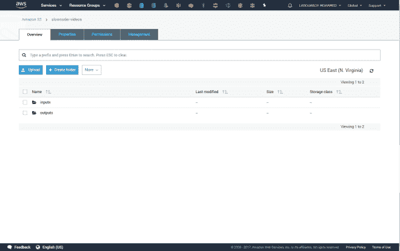
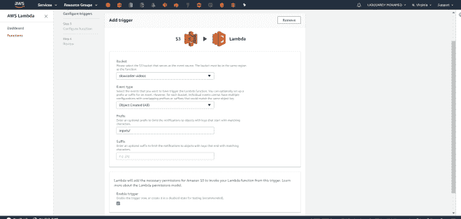
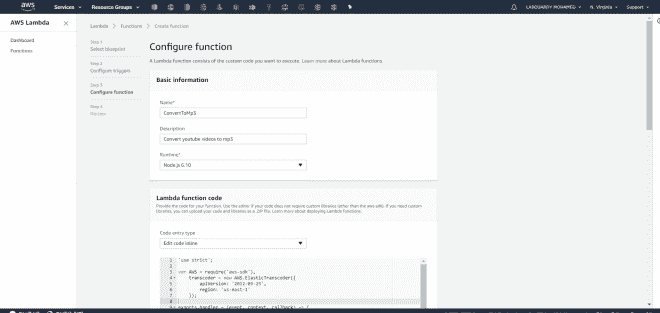
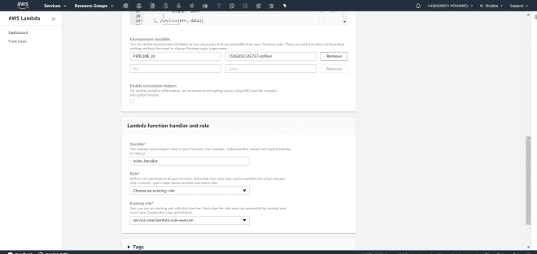
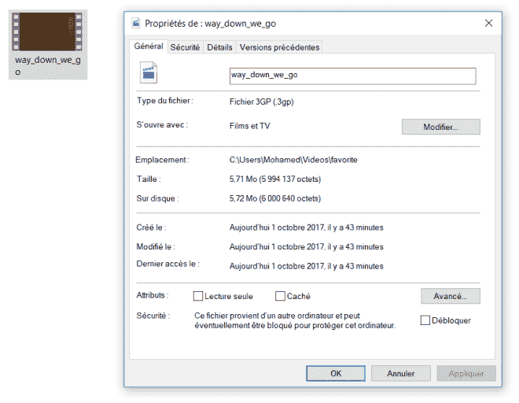
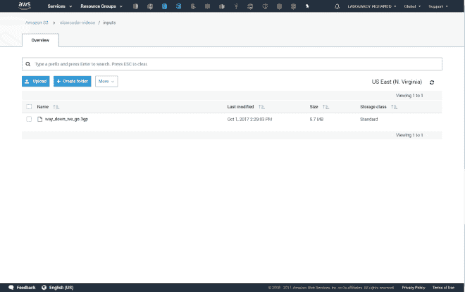
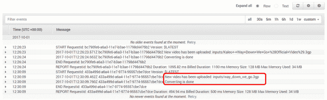
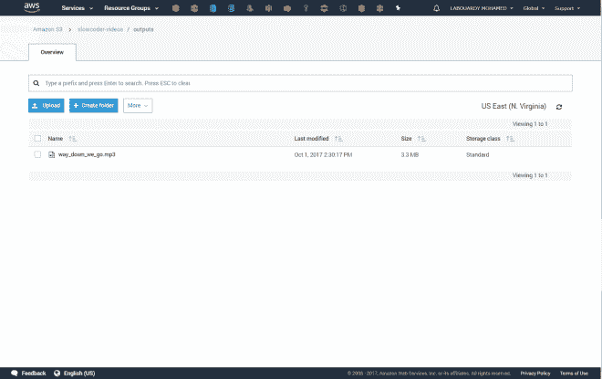

# 使用 S3、拉姆达和弹性转码器将 Youtube 转换为 MP3

> 原文：<https://medium.com/hackernoon/youtube-to-mp3-using-s3-lambda-elastic-transcoder-df2c5903dea8>

在本教程中，我将向你展示如何使用 **AWS Elastic Transcode** r 将一个 **Youtube** 视频转换成 mp3 文件。我们该如何做呢？

我们将创建一个 **Lambda 函数**来消费 **S3** 发布的事件。对于上传到桶中的任何视频， **S3** 将通过传递事件信息来调用我们的 **Lambda** 函数。 **AWS Lambda** 执行该功能。当该函数执行时，它读取 **S3** 事件数据，将一些事件信息记录到 **Amazon CloudWatch** 。然后，开始转码作业。

让我们开始，通过创建一个 **S3 桶**来存储*输入*文件(视频)和*输出*文件(音频) :

接下来，让我们定义一个**代码转换器管道**。流水线本质上定义了一个队列，用于将来的转码作业。要创建一个管道，我们需要指定输入桶(视频将在那里)。

注意:记下**管道 ID** ，我们稍后会用到

创建好管道后，进入 [AWS 管理控制台](https://console.aws.amazon.com/)，导航到 **Lambda** 服务&点击**创建 Lambda 函数**，添加 **S3** 作为 **Lambda** 函数的事件源:

我使用了下面的[节点。JS 代码](https://github.com/mlabouardy/lambda-examples):

该脚本执行以下操作:

*   从事件对象中提取上传文件的文件名
*   创建一个**代码转换器 jo** b 并指定所需的输出
*   启动作业

注意:你可能注意到在上面的函数中使用了预置(**1351620000001–300040**)。它描述了如何编码给定的文件(在这个例子中是 mp3)。可用预设的完整列表可在 [AWS 文档](http://docs.aws.amazon.com/elastictranscoder/latest/developerguide/system-presets.html)中找到。

最后，将**管道 id** 设置为**环境变量**，并选择一个 **IAM** 角色有权限访问**弹性转码器**:

创建后，将视频文件上传到*输入*桶:

> AWS S3 CP way _ down _ we _ go . 3gp S3://slow coder-videos/inputs/

如果一切顺利，您应该在您的*输出*桶中看到该文件:

**S3** 将触发我们的**λ**功能。然后它将执行我们的功能。并将 **S3** 对象名记录到 **CloudWatch 日志**:

几秒钟后(或几分钟，取决于视频的大小)，您应该会看到一个新的 **MP3** 文件已经由**弹性转码器作业**在*输出*目录中的 **S3 桶**中生成:

