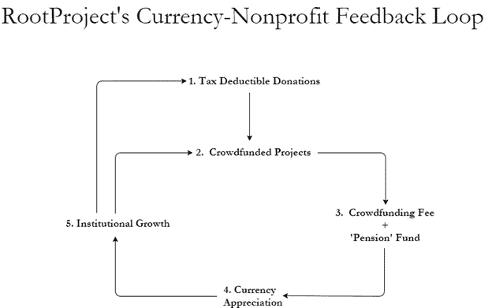
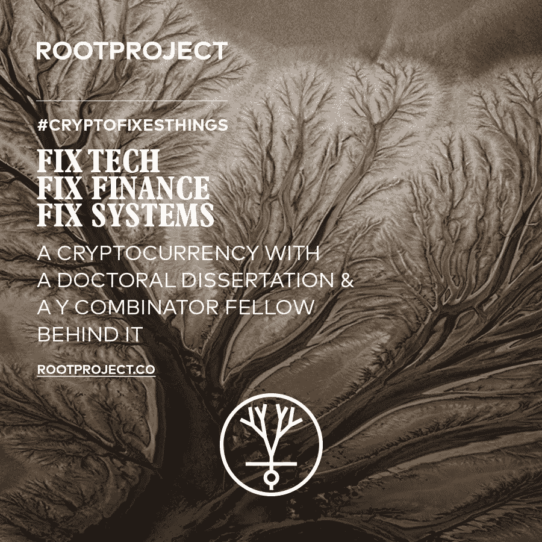

# 你错过了加密货币最重要的部分。

> 原文：<https://medium.com/hackernoon/youve-missed-the-most-important-part-of-cryptocurrencies-4f7ee5b9f1a1>

*作者 Nicholas Adams Judge 博士是*[*root project*](http://rootproject.co)*的联合创始人。另一位联合创始人是 Y Combinator 研究员克里斯·普莱斯。他们的非营利组织的 pre-ICO 超过了目标的 512%。ICO 于 2017 年 11 月 17 日结束。除了合理的薪水，联合创始人没有任何报酬。*

我是政治经济学家。我的博士论文是关于货币市场模型的。加密货币的力量甚至比加密货币社区的人所理解的还要强大。

RootProject’s Token, ROOTS

我是一名“政治经济学家”，而不是普通的“经济学家”，因为我既关注市场，也关注制度。制度决定了谁会赢得战争，哪些国家会获得自由，以及经济增长的速度。思考加密货币的最佳方式是什么？问问他们创造了什么新的机构能力。

要做到这一点，收起你的理论，收起你的意识形态。没人在乎。相反，想想反馈循环。把 0.99 提高到一个大数字，你会得到零。把 1.01 提高到一个很大的数字，你接近无穷大。如果一个机构每天的努力都是前一天的 99%，那它就失败了。如果这个数字变成 101%，它就会扩大，变成谷歌或苹果——直到有东西把这个数字推回到 1 以下。

加密货币的高明之处在于，流动资产可以和新机构一起设计，创造货币价值——机构规模反馈回路。

称之为加密货币的反馈环理论。它最令人兴奋的结果是:非盈利行为可以为投资者创造价值。加密货币带来了市场的力量和投资者的自身利益；非营利组织带来了道德相关性。

这确实给非营利组织带来了危险——但这就像说比特币会被走私者利用，所以让我们放弃它吧。它忽略了更大的故事。让我们通过我们在 RootProject 所做的事情来说明这个主要的故事，它的预 ICO 目前正在进行中。每个部分都很简单。它们是如何组合在一起的，如上图所示。

*   一个众筹平台让人们和机构为帮助社区或当地企业的项目筹集资金。不是典型的众筹费用，而是筹集资金的 10%用于在公开市场上购买我们的货币 ROOTS，从而推动价格上涨。我们称之为货币-费用模型。非营利组织基于美国城市的一系列新项目。我们从最近的数据中得知，这些日间工作项目在帮助人们摆脱极端贫困方面非常有效。重要的是，它还让大多数捐赠可以减税，在美国，这实际上是 30 %- 40%的政府补贴。

    ——员工(和一名经理)获得完成项目所需的 90%的资金(这 90%的项目支出率对于运营最好的非营利组织来说是典型的)。工人以美元支付工资，但除此之外，他们还可以获得 50%的工资，存入一个中期养老基金，该基金持有(仅)我们的加密货币。像 10%的费用一样，养老基金的货币是在公开市场上购买的——这又一次推高了价格。

    ——随着我们代币的价格上涨，非营利组织可以扩张，为我们的加密货币创造更多需求。大型机构的大型众筹项目涉及烧钱。

    有机需求进入系统。这很好:需要工作和接触像避难所和医疗保健这样的东西的人得到了他们(在我们的[白皮书](https://docs.wixstatic.com/ugd/903af2_2e38351151e5444b8a488fb9ee7af43a.pdf)中有更多这方面的内容)。但真正令人兴奋的是，这种需求不会在一次性事件中消失。通过设计，它进入了一个反馈循环，在那里它不断增长，自我繁殖。没有加密货币是不可能的，这从根本上改变了非营利活动的制度经济学。帮助我们实现这一目标，我们将证明一种模式，在这种模式下，非营利工作拥有与大型全球逐利公司相同的市场力量。

    想玩世不恭就玩世不恭。或者帮助我们建立一个新世界。

