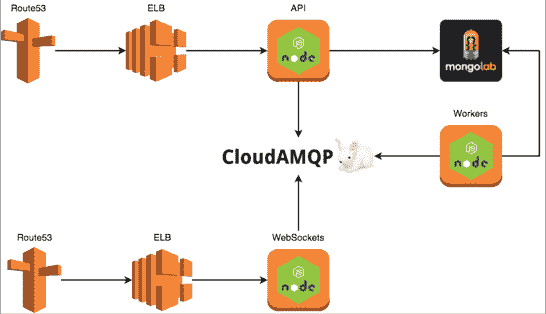
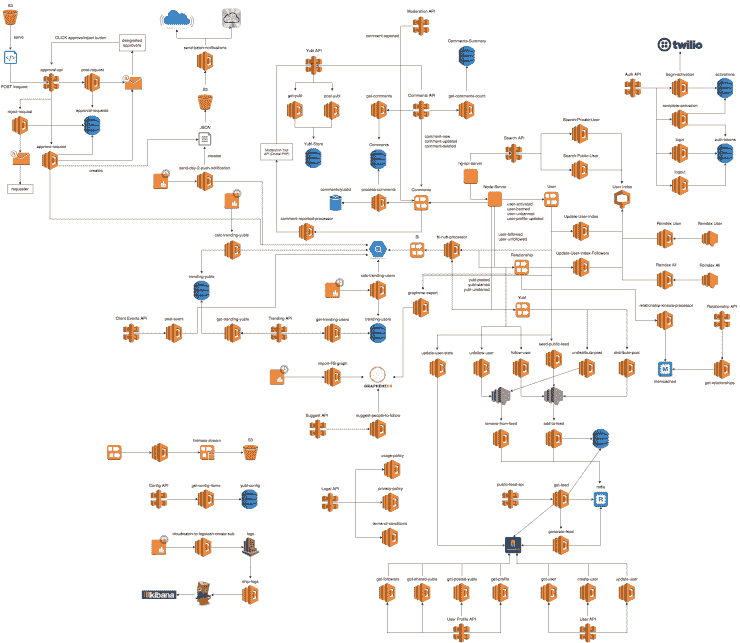

# Yubl 的无服务器之路—第 1 部分，概述

> 原文：<https://medium.com/hackernoon/yubls-road-to-serverless-part-1-overview-ca348370acde>

# 这条路到此为止

第 1 部分:[概述](/@theburningmonk/yubls-road-to-serverless-part-1-overview-ca348370acde)

第 2 部分:[测试和持续交付策略](/@theburningmonk/yubls-road-to-serverless-part-2-testing-and-ci-cd-72b2e583fe64)

第三部: [ops](https://hackernoon.com/yubls-road-to-serverless-part-3-ops-6c82139bb7ee)

第 4 部分:[构建可伸缩的推送通知系统](https://hackernoon.com/yubls-road-to-serverless-part-4-building-a-scalable-push-notification-system-62b38924ed61)

第 5 部分:[建立一个更好的推荐系统](https://hackernoon.com/yubls-road-to-serverless-part-5-building-better-recommendations-with-lambda-bigquery-and-1d74407f3b3a)

自从 [Yubl 的关闭](http://theburningmonk.com/2016/11/yubl-a-sad-end-to-a-wonderful-journey/)以来，有相当多的人询问我们最终采用的无服务器架构，以及我们在这一过程中学到的一些东西。

因此，这是我分享我们学到的一些经验的系列文章的第一篇。但是，请记住这一特定领域的变化速度，这样我们遇到的一些挑战/问题可能在您阅读本文时已经解决了。

ps。我在 2016 年 *Leetspeak* 上关于 *Amazon Lambda* 的演讲中已经涉及了这个系列的很多方面，你可以在这里找到演讲的幻灯片和录音[。](http://theburningmonk.com/2016/11/slides-and-recording-of-my-lambda-talk-at-leetspeak-2016/)

# 从整体开始

当我在 4 月份加入 Yubl 时，我继承了一个运行在 EC2 实例上的单片 **Node.js** 后端，混合了 **MongoLab** (托管 **MongoDB** )和 **CloudAMQP** (托管 **RabbitMQ** )。

这个遗留系统有许多问题，有些可以通过增量更改(例如蓝绿部署)来纠正，但其他的需要在架构级别上重新思考。虽然事情在纸面上看起来很简单(在架构图级别)，但所有的复杂性都隐藏在这 3 个服务中，天哪，原来如此复杂！

我的首要任务是与运营团队合作，改进现有的部署渠道，并起草一份我们希望从我们的架构中获得的特性列表:

*   **能够进行小规模的增量部署**
*   **部署应该快速，并且不需要停机**
*   **无锁定步骤部署**
*   **功能可以独立部署**
*   **功能通过消息松散耦合**
*   **将未使用资源的成本降至最低**
*   **最大限度减少运营工作量**

从这里开始，我们决定采用面向服务的架构，考虑到我们的工作负载，Amazon Lambda 似乎是一个完美的工具:

*   大量 API，全 HTTPS，没有超低延迟要求
*   许多后台任务，其中许多有软实时的要求(如发布帖子到追随者的时间线)

# 到无服务器端

可以说，我们知道迁移将是一条漫长的道路，沿途会有许多挑战，我们希望循序渐进地完成迁移，并逐步提高交付速度。

> “从订货到有人说谢谢的时间是唯一重要的声誉衡量标准”
> 
> 丹·诺斯

迁移的第一步是让遗留系统发布系统中的状态变化(例如，用户加入，用户 A 跟随用户 B，等等)。)以便我们可以在遗留系统的基础上开始构建新的功能。

为此，我们更新了遗留系统，将事件发布到 ***Kinesis*** 流。

我们的总体战略是:

*   在这些事件的基础上构建新的特性，这些特性通常有自己的数据存储(如***【DynamoDB】*******cloud search*******S3*******big query****等)。)以及后台处理管道和 API****
*   ***将遗留系统中的现有特性/概念提取到并行运行的服务中***
*   ***这些新服务最初将由同一个共享的 ***MongoLab*** 数据库支持***
*   **其他服务(包括遗留服务)被更新为使用手工制作的 API 客户端通过新的 API 访问封装的资源，而不是直接访问共享的 ***MongoLab*** 数据库**
*   **一旦通过新的 API 完成了对这些资源的所有访问，数据迁移(通常是到 ***DynamoDB*** 表)将在后台开始**
*   **只要有可能，对现有 API 端点的请求都会被转发到新的 API，这样我们就不必等待 iOS 和 Android 应用的更新(这可能需要数周时间),并且可以更早地获得好处**

**经过 6 个月的努力工作，我的 6 名后端工程师团队(包括我自己)彻底改造了我们的后端基础设施。亚马逊对我们与 Lambda 一起做的工作印象非常深刻，当 Yubl 在我们主要股东的心血来潮下被关闭时，我们正在撰写我们工作的案例研究。**

**这是我们最终得到的架构的几乎完整的图片(为了简洁和清晰，省略了一些细节)。**

****

**一些有趣的数据:**

*   **生产中运行的 170 个 Lambda 函数**
*   **大约 1GB 的总部署包大小(在[管理员λ](http://theburningmonk.com/2016/08/aws-lambda-janitor-lambda-function-to-clean-up-old-deployment-packages/)清除未引用的版本之后)**
*   **对于同等计算量，Lambda 的成本约为 EC2 的 5%**
*   **生产部署的数量从 4 月的 9 个/月增加到 9 月的 155 个**

**在本系列的其余部分，我将深入探讨具体的功能，我们如何利用各种 AWS 服务，以及我们如何应对以下挑战:**

*   **集中伐木**
*   **集中式配置管理**
*   **用于 Lambda 函数的具有相关 id 的分布式跟踪**
*   **保持 Lambda 函数温暖，以避免冷启动损失**
*   **自动扩展不能动态扩展的 AWS 资源**
*   **自动清理旧的 Lambda 函数版本**
*   **保护敏感数据(如 mongodb 连接字符串、服务凭证等)。)**

# **链接**

*   **[我在 Leetspeak 的亚马逊 Lambda 演讲的幻灯片和录音](http://theburningmonk.com/2016/11/slides-and-recording-of-my-lambda-talk-at-leetspeak-2016/)**
*   **[清理旧部署包的看门人-Lambda 函数](http://theburningmonk.com/2016/08/aws-lambda-janitor-lambda-function-to-clean-up-old-deployment-packages/)**

**喜欢您正在阅读的内容，但需要更多帮助？我很乐意作为独立顾问**提供我的服务**并帮助您完成您的无服务器项目——架构审查、代码审查、构建概念验证，或者提供关于领先实践和工具的建议。**

**我在**伦敦，英国**，目前唯一在英国的 [**AWS 无服务器英雄**](https://aws.amazon.com/developer/community/heroes/yan-cui/) 。我有近 **10 年**的[经验](https://www.linkedin.com/in/theburningmonk/)在 AWS 中大规模运行生产工作负载。我主要在英国开展业务，但我愿意出差一周以上。要了解我们如何合作，请在这里告诉我更多关于您试图解决的问题的信息。**

**我还可以举办一个内部研讨会，帮助您的无服务器架构进入生产准备阶段。您可以在这里找到关于为期两天的研讨会[的更多信息，该研讨会将带您从 AWS Lambda 的基础知识一直到日志聚合、分发跟踪和安全最佳实践的通用操作模式。](https://theburningmonk.com/workshops/)**

**如果你喜欢按照自己的进度学习，那么你也可以找到与我为曼宁制作的**视频课程相同的研讨会内容。我们将讨论的主题包括:****

*   ****认证 *&* 授权与 API 网关 *&* 认知****
*   ****本地测试 *&* 运行功能****
*   ****CI/CD****
*   ****日志聚合****
*   ****监控最佳实践****
*   ****X 射线分布式跟踪****
*   ****跟踪相关 id****
*   ****性能 *&* 成本优化****
*   ****错误处理****
*   ****配置管理****
*   ****金丝雀部署****
*   ****VPC****
*   ****安全****
*   ****Lambda、Kinesis 和 API 网关的最佳实践****

****代码 **ytcui** 也可以获得**票面价格 6 折优惠**。不过，这个数字只有在我们参加曼宁的早期访问计划(MEAP)时才有效。****