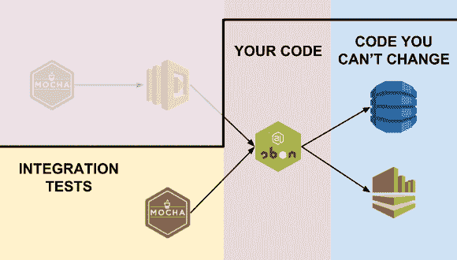
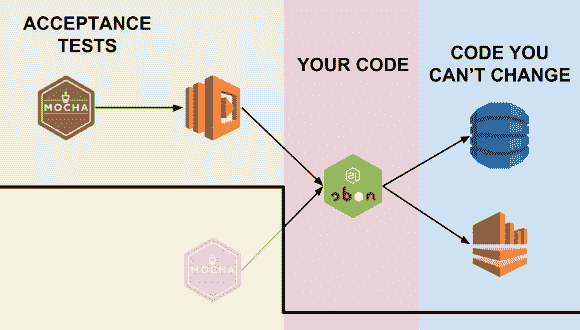
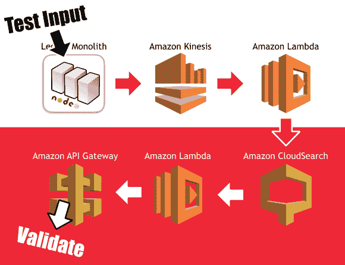
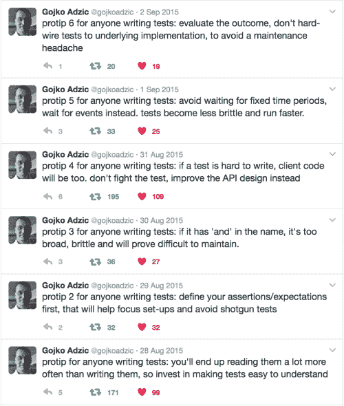
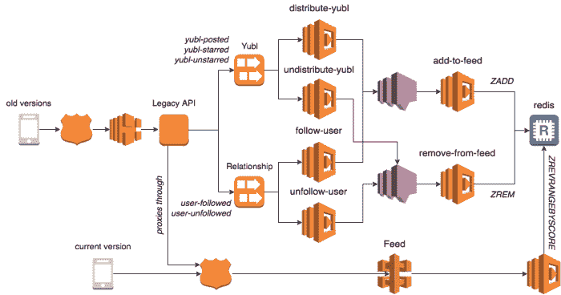
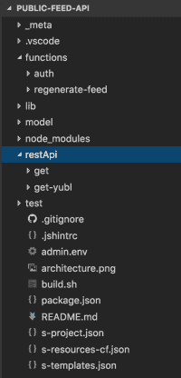
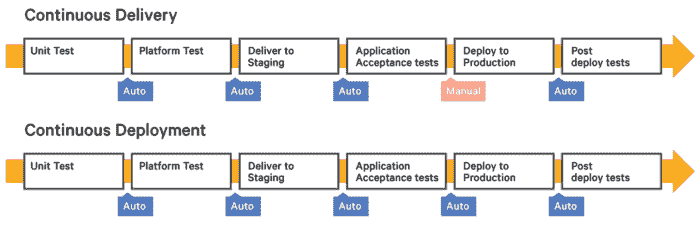
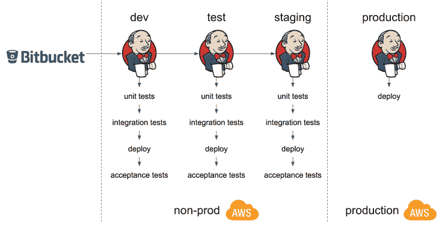

# Yubl 的无服务器之路——第二部分，测试和 CI/CD

> 原文：<https://medium.com/hackernoon/yubls-road-to-serverless-part-2-testing-and-ci-cd-72b2e583fe64>

# 这条路到此为止

第 1 部分:[概述](/@theburningmonk/yubls-road-to-serverless-part-1-overview-ca348370acde)

第 2 部分:[测试和持续交付策略](/@theburningmonk/yubls-road-to-serverless-part-2-testing-and-ci-cd-72b2e583fe64)

第三部: [ops](https://hackernoon.com/yubls-road-to-serverless-part-3-ops-6c82139bb7ee)

第 4 部分:[构建可伸缩的推送通知系统](https://hackernoon.com/yubls-road-to-serverless-part-4-building-a-scalable-push-notification-system-62b38924ed61)

第 5 部分:[建立一个更好的推荐系统](https://hackernoon.com/yubls-road-to-serverless-part-5-building-better-recommendations-with-lambda-bigquery-and-1d74407f3b3a)

和很多人谈过在生产中使用 AWS 的问题后，测试和 CI/CD 总是排在问题列表的前列，所以我想用这篇文章来讨论我们在 Yubl 采取的方法。

请记住，这是我们所做的回忆，以及我们为什么选择这样做。我听到其他人提倡非常不同的方法，我相信他们也有他们的理由，他们的方法无疑对他们很有效。我希望给你尽可能多的背景信息(或者“为什么”)，这样你就可以判断我们的方法是否适合你，并在评论区自由提问。

# 测试

在[成长面向对象软件中，由测试引导](http://amzn.to/2jrKLxx)， *Nat Pryce* 和 *Steve Freeman* 谈到了测试的 3 个层次【第 1 章】:

1.  **验收** —整个系统是否正常工作？
2.  集成——我们的代码会与我们无法改变的代码发生冲突吗？
3.  我们的对象做正确的事情吗，他们容易相处吗？

随着您级别的上升(验收->单元)，反馈循环的速度变得更快，但是您也对您的系统在部署后是否能正常工作缺乏信心。

# 支持验收和集成测试

有了 FAAS 范式，比以往任何时候都有更多的*“我们不能改变的代码”*(AWS 甚至将 Lambda 描述为*“云基础设施的粘合剂”*)，因此集成和验收测试的**价值也比以往任何时候都高**。此外，由于*“我们不能改变的代码”*很容易作为服务访问，这也使得这些测试比以前更容易编排和编写。

我们倾向于编写的函数相当简单，没有复杂的逻辑(大多数时候)，但它们有很多，并且通过消息系统( *Kinesis* 、 *SNS* 等)松散地连接在一起。)和 API。因此，验收和集成测试的 ROI 远远大于单元测试。

正是由于这些原因，我们决定(在[旅程的早期](http://theburningmonk.com/2016/12/yubls-road-to-serverless-architecture-part-1/))将我们的努力集中在编写验收和集成测试上，并且只编写功能的内部工作足够复杂的单元测试。

# 没有嘲笑

在[成长面向对象软件中，由测试](http://amzn.to/2jrKLxx)， *Nat Pryce* 和 *Steve Freeman* 也谈到了为什么你不应该模仿你不能改变的类型【第 8 章】，因为…

> …我们发现模拟外部库的测试通常需要**复杂**才能让代码进入我们需要执行的功能的正确状态。
> 
> 这种测试中的混乱告诉我们，设计是不正确的，但是，不是通过改进代码来解决问题，我们必须在代码和测试中承担额外的复杂性…
> 
> …第二个风险是，我们必须确保我们存根或模仿的行为与外部库实际要做的相匹配…
> 
> 即使我们做对了一次，当我们升级库时，我们也必须确保测试仍然有效

我相信同样的原则也适用于这里，你不应该嘲笑你不能改变的服务。

# 集成测试

一个 *Lambda* 函数最终是当某个输入事件发生时 AWS 代表您调用的一段代码。为了测试它与下游系统的正确集成，您可以从您选择的测试框架中调用该函数(我们使用了 *Mocha* )。

因为目的是测试集成点，所以配置函数以使用与实际部署的代码相同的下游系统是很重要的。如果您的函数需要读取/写入一个 *DynamoDB* 表，那么您的集成测试应该使用真实的表，而不是像 [dynamodb-local](https://www.npmjs.com/package/dynamodb-local) 这样的表。

这确实意味着您的测试会在您的集成环境中留下工件，并且在并行运行多个测试时会导致问题(例如，来自一个测试的工件会影响其他测试的结果)。这就是为什么，作为一个经验法则，我主张:

*   避免硬编码的 id，它们经常会导致测试之间的意外耦合
*   总是在每次测试结束时清理工件

这同样适用于验收测试。

# 验收测试

(这张图片有点误导，因为 Mocha 测试不是以编程方式调用 Lambda 函数，而是通过 Lambda 函数配置的任何输入事件(API Gateway、SNS、Kinesis 等)间接调用它。稍后将详细介绍。)

> …只要有可能，一个**验收** **测试**应该端到端地测试系统**而不是直接调用它的内部代码。**
> 
> 一个端到端的测试只从外部与系统**交互:通过它的接口…**
> 
> …我们更喜欢通过端到端测试来测试系统以及构建和部署系统的**流程** …
> 
> 这听起来像是很大的努力(确实如此)，但是在软件的生命周期中无论如何都要重复做…
> 
> –在测试的引导下，开发面向对象的软件[第 1 章]

一旦集成测试成功完成，我们有充分的信心，我们的代码将在部署时正确工作。代码被部署，验收测试针对部署的系统**端到端**运行。

以我们的*搜索 API* 为例，接受标准之一是*“当一个新用户加入时，他应该可以通过名字/姓氏/用户名进行搜索”*。

验收测试首先设置测试条件——一个新用户加入*——通过从外部与系统交互，并像客户端应用程序那样调用遗留 API。从这里开始，一个*新用户加入的*事件将被触发成*Kinesis*；一个 *Lambda* 函数将处理该事件，并在 *CloudSearch* 的*用户*索引中添加一个新文档；测试将验证用户可以通过*搜索 API* 进行搜索。*

# 避免脆性测试

因为新用户是通过后台进程异步添加到 *CloudSearch* 中的，所以它为系统带来了最终的一致性。当您通过事件/消息解耦特性时，这是一个常见的挑战。当测试这些最终一致的系统时，您应该避免等待固定的时间段(参见下面的 protip 5 ),因为这会使您的测试变得脆弱。

在*“新用户加入”*测试用例中，这意味着您不应该编写这样的测试:

1.  创建新用户
2.  等待 3 秒钟
3.  验证用户是否可搜索

取而代之的是，写一些类似这样的东西:

1.  创建新用户
2.  验证用户可通过重试进行搜索

2.1 如果预期失败，则在重试前等待 X 秒

2.2 重复

2.3 在测试用例失败之前允许 Y 次重试

# 共享集成和验收测试的测试用例

我们还发现，大多数时候，我们的集成和验收测试之间的唯一区别是我们的功能代码是如何被调用的。我们没有重复大量的代码和工作，而是使用一种简单的技术来共享测试用例。

假设您有一个如下所示的测试用例。

有趣的部分在第 22 行:

> 设 RES = yield when . we _ invoke _ get _ all _ keys(region)；

在*当*模块中，函数 *we_invoke_get_all_keys* 将

*   用存根*上下文*对象直接调用功能代码，或者
*   针对部署的 API 执行 HTTP GET 请求

这取决于***process . env . test _ MODE***的值，它是一个环境变量，通过 *package.json* (见下文)或我们用于部署的 *bash* 脚本(稍后将详细介绍)传递到测试中。

# 持续集成+持续交付

虽然我们有大约 170 个功能在运行生产，但是它们中的许多一起工作，为应用程序提供不同的功能。我们的方法是将这些功能分组如下:

*   构成 API 端点的函数被分组到一个项目中
*   某个功能的后台处理功能被分组到一个项目中
*   每个项目都有自己的回购协议
*   项目中的功能一起测试和部署

这种分组策略的基本原理是:

*   实现相关职能的高度凝聚力
*   在有意义的地方改进代码共享(一个 API 的端点可能共享一些逻辑，因为它们在同一个域中运行)

尽管功能被分组到项目中，但它们仍然可以单独部署。我们选择将它们作为一个单元进行部署，因为:

*   很简单，所有相关的功能(在一个项目中)都有相同的版本号
*   很难检测对共享代码的更改是否会影响哪些功能
*   部署速度很快，无论我们部署一个功能还是五个功能，在速度上没有什么区别

例如，在 *Yubl* 应用程序中，你有一个你关注的人的帖子提要(类似于你的 Twitter 时间轴)。

为了实现这个功能，有一个 API(有多个端点)和一堆后台处理功能(连接到 *Kinesis* 流和 *SNS* 主题)。

该 API 有两个端点，但它们也共享一个通用的自定义 *auth* 函数，该函数作为该项目的一部分包含在内(并与 *get* 和 *get-yubl* 函数一起部署)。

后台处理(最初只有 *Kinesis* ，但后来扩展到也包括 *SNS* ，尽管 repo 没有被重命名)函数有许多共享代码，比如下面看到的 *distribute* 模块，以及 *lib* 文件夹中的许多模块。

所有这些功能都作为一个单元部署在一起。

# 部署自动化

我们使用[无服务器](https://serverless.com/)框架来完成我们所有的部署，它负责打包、上传和版本化我们的*功能和 API。它非常有用，解决了我们的大部分问题，但我们仍然需要一个薄薄的层来允许 AWS profile 进入，并将测试作为部署过程的一部分。*

我们可以在 CI 服务器上编写这些步骤的脚本，但是我已经被只存在于 CI 服务器上(而不在源代码控制中)的神奇脚本烧伤过几次。为此，每个项目都有一个简单的 *build.sh* 脚本(如下所示),它为您提供了一个通用词汇表:

*   运行单元/集成/验收测试
*   部署您的代码

我们的 Jenkins 构建配置做得很少，只是用不同的参数调用这个脚本。

# 连续交货

直到今天，我仍然对连续“交付”和连续“部署”感到困惑。似乎有[几种解读](http://stackoverflow.com/a/28628086/55074)，但[这个](https://puppet.com/blog/continuous-delivery-vs-continuous-deployment-what-s-diff)是我听过最多的一种:

不管哪个定义是正确的，对我们来说最重要的是**快速、频繁地将我们的变更部署到生产中的能力**。

虽然我们没有技术上的原因不能自动部署到生产环境中，但我们没有这样做是因为:

*   它让 QA 团队有机会使用实际的客户端应用程序进行彻底的测试
*   它给管理团队一种控制什么时候发布什么的感觉(我不是说这是好事还是坏事，而仅仅是我们想要的)

在我们的设置中，有两个 AWS 帐户:

*   *生产*
*   *非生产*，有 4 个环境—开发、测试、试运行、演示

( *dev* 为开发， *test* 为 QA 团队， *staging* 为类生产， *demo* 为投资人的私有 beta 版等。)

在大多数情况下，当一个变更被推送到 *Bitbucket* 时，该项目中的所有*功能都会被自动测试、部署并提升到 *staging* 环境。部署到*生产*是一个手动过程，可以在我们方便的时候进行，我们通常避免在周五下午部署到生产(原因很明显；-)).*

# 结论

我们谈到的方法对我们的团队来说非常有效，但也不是没有缺点。

就开发流程而言，对集成和验收测试的关注意味着更慢的反馈循环，并且测试需要更长的时间来执行。此外，因为我们不嘲笑下游服务，这意味着我们不能在没有互联网连接的情况下运行测试，当您想在通勤期间工作时，这是一个偶尔的烦恼。

这些是我们做出的明确的权衡，我甚至现在还袖手旁观他们，而且团队中的每个人都有同样的感觉。

在部署方面，我真的错过了金丝雀发布的能力。虽然这被我们的用户群仍然相对较小的事实所抵消，并且人们可以用*λ*函数部署和回滚变更的速度足以限制坏变更的影响。

虽然 *AWS Lambda* 和 *API Gateway* 不支持 canary 版本的开箱即用，但可以在 *Route53* 中使用加权路由为 API 做一个 DIY 解决方案。基本上你会有:

*   用于 *API 网关*和相关*λ*函数的金丝雀阶段
*   首先将生产构建部署到金丝雀阶段
*   在 Route53 中使用加权路由将 X%的流量导向金丝雀级
*   监控度量标准，当您对 canary 构建满意时，将其推广到生产中

同样，这只适用于 API，不适用于后台处理( *SNS* 、 *Kinesis* 、 *S3* 等)。).

就这样了，伙计们，希望你们喜欢这篇文章，第三部分再见！

再见。

# 链接

*   [在测试的引导下，开发面向对象的软件](http://amzn.to/2jrKLxx)
*   [【幻灯片】来自战壕的 AWS Lambda](https://www.slideshare.net/theburningmonk/aws-lambda-from-the-trenches-73911657)
*   [【InfoQ】复杂性在代码之外](https://www.infoq.com/presentations/complexity-simplicity-esb)

喜欢您正在阅读的内容，但需要更多帮助？我很乐意作为一名独立顾问提供服务，并帮助您完成无服务器项目——架构审查、代码审查、构建概念验证，或者提供关于领先实践和工具的建议。

我在**伦敦，英国**，目前唯一在英国的 [**AWS 无服务器英雄**](https://aws.amazon.com/developer/community/heroes/yan-cui/) 。我有近 **10 年**的[经验](https://www.linkedin.com/in/theburningmonk/)在 AWS 中大规模运行生产工作负载。我主要在英国开展业务，但我愿意出差一周以上。要了解我们如何合作，请在这里告诉我更多关于您试图解决的问题的信息。

我还可以举办一个内部研讨会，帮助您的无服务器架构进入生产准备阶段。您可以在这里找到关于为期两天的研讨会[的更多信息，该研讨会将带您从 AWS Lambda 的基础知识一直到日志聚合、分发跟踪和安全最佳实践的通用操作模式。](https://theburningmonk.com/workshops/)

如果你喜欢按照自己的进度学习，那么你也可以找到与我为曼宁制作的**视频课程相同的研讨会内容。我们将讨论的主题包括:**

*   **认证 *&* 授权与 API 网关 *&* 认知**
*   **本地测试 *&* 运行功能**
*   **CI/CD**
*   **日志聚合**
*   **监控最佳实践**
*   **X 射线分布式跟踪**
*   **跟踪相关 id**
*   **性能 *&* 成本优化**
*   **错误处理**
*   **配置管理**
*   **金丝雀部署**
*   **VPC**
*   **安全**
*   **Lambda、Kinesis 和 API 网关的最佳实践**

**代码 **ytcui** 也可以获得**票面价格 6 折优惠**。不过，这个数字只有在我们参加曼宁的早期访问计划(MEAP)时才有效。**