# Yubl 的无服务器之路—第三部分，运营

> 原文：<https://medium.com/hackernoon/yubls-road-to-serverless-part-3-ops-6c82139bb7ee>

# 这条路到此为止

第 1 部分:[概述](/@theburningmonk/yubls-road-to-serverless-part-1-overview-ca348370acde)

第 2 部分:[测试和持续交付策略](/@theburningmonk/yubls-road-to-serverless-part-2-testing-and-ci-cd-72b2e583fe64)

第三部: [ops](https://hackernoon.com/yubls-road-to-serverless-part-3-ops-6c82139bb7ee)

第 4 部分:[构建可伸缩的推送通知系统](https://hackernoon.com/yubls-road-to-serverless-part-4-building-a-scalable-push-notification-system-62b38924ed61)

第 5 部分:[建立一个更好的推荐系统](https://hackernoon.com/yubls-road-to-serverless-part-5-building-better-recommendations-with-lambda-bigquery-and-1d74407f3b3a)

一些人问我关于我们的监控、记录等策略。在[第 2 部分](/@theburningmonk/yubls-road-to-serverless-part-2-testing-and-ci-cd-72b2e583fe64)之后，并且观看了 *Chris Swan* 在[无服务器会议](https://www.meetup.com/Serverless-London/)上谈论[“无服务器操作不是一个已解决的问题”](https://www.youtube.com/watch?v=hFhyQH0QkzI)，这是我们谈论如何使用 AWS Lambda 实现 ops 的好时机。

# 诺普斯。=无操作

“无运营”的概念经常被提到无服务器技术(我自己也做过)，但这并不意味着你不再需要担心运营。

对我来说，“ops”是与保持我的系统**运行**和**在可接受的参数内执行**相关的一切的总称，包括(但不限于)资源供应、配置管理、监控和随时处理任何现场问题。无论您的软件是在云中的虚拟机上运行，还是在本地硬件上运行，还是像小功能一样运行，保持系统正常运行的责任将始终存在。

在您的组织中，需要有人来履行这些职责。可能你有一个专门的运营团队，或者你的开发人员将分担这些责任。

*NoOps* 对我来说，意味着 ***在我的组织中没有 Ops 专业化***——即。没有专门的运营团队——因为履行运营职责所需的**技能和努力不足以证明这种专业化**的必要性。作为一个组织，从财务角度来看，尽可能推迟这种专业化符合您的最佳利益，也许更重要的是，因为 [***康威定律***](http://www.melconway.com/Home/Conways_Law.html) 告诉我们，拥有一个运营团队是最终获得一套运营程序/流程、工具和基础设施的可靠方式，其复杂性反过来将证明所述运营团队的存在是正确的。

在 *Yubl* ，当我们[迁移到无服务器架构](/@theburningmonk/yubls-road-to-serverless-part-1-overview-ca348370acde)时，我们的部署管道变得更加精简，我们的工具链变得更加简单，我们发现对专门运营团队的需求减少了，并且我们正在彻底解散我们的运营团队。

# 记录

每当你从你的 *Lambda* 函数中写入 *stdout* 时——例如，当你在你的 nodejs 代码中执行 *console.log* 时——它会在 *CloudWatch Logs* 中的函数的*日志组*中结束。

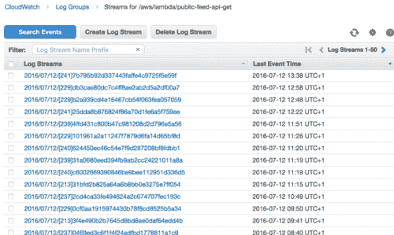

# 集中伐木

然而，日志是不容易搜索的，一旦你有了一打函数，你会想把它们收集在一个中心位置。 *ELK* 栈是目前集中日志记录的事实标准，你可以在 *EC2、*和[上运行你自己的 *ELK* 栈，elastic.co](https://www.elastic.co/)也提供了[托管版本的](https://www.elastic.co/cloud)elastic search 和 *Kibana* 。

要将您的日志从 *CloudWatch Logs* 发送到 *ELK* ，您可以将*日志组*订阅到负责发送日志的***cloud watch-Logs-to-ELK***函数。

您可以通过 AWS 管理控制台手动订阅*日志组*。

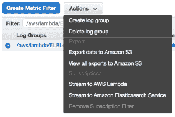

但是，您不希望每个人在每次创建新的 *Lambda* 函数时都需要记住一个手动步骤。相反，最好在 *CloudWatch Events* 中设置一个规则，以调用一个***subscribe-Log-group****Lambda*函数来为新的*日志组*设置订阅。

请记住两件事:

*   lots 服务在 *CloudWatch Logs* 中创建日志，所以你会想通过名字过滤*日志组*， *Lambda* 函数日志有前缀 */aws/lambda/*
*   不要为*cloud watch-logs-to-elk***函数订阅*日志组*(或者您决定如何称呼它)，否则您会为 *cloudwatch-logs-to-elk* 函数创建一个无限循环，其中它自己的日志将触发自身并生成更多日志，等等**

# **分布式跟踪**

**将所有日志放在一个容易搜索的地方是很好的，但是随着您的架构扩展到越来越多的相互依赖的服务，您将需要[关联来自不同服务的日志](http://theburningmonk.com/2015/05/a-consistent-approach-to-track-correlation-ids-through-microservices/)以了解在一个用户请求期间发生的所有事件。**

**例如，当用户在 *Yubl* 应用中创建新帖子时，我们会将帖子分发给用户的所有关注者。沿着这条流程会发生很多事情:**

1.  **用户 A 的客户端调用遗留 API 来创建新帖子**
2.  **遗留 API 将一个 ***yubl 发布的*** 事件触发到一个 *Kinesis* 流中**
3.  **调用***distribute-yubl***函数来处理该事件**
4.  ***distribute-yubl* 函数调用***relationship-API***查找用户 A 的关注者**
5.  ***distribute-yubl* 函数随后执行一些业务逻辑，将用户 A 的关注者分组，并为每一批向一个 *SNS* 主题发送一条消息**
6.  **为每个 *SNS* 消息调用 ***添加到订阅源*** 功能，并将新帖子添加到每个关注者的订阅源**

**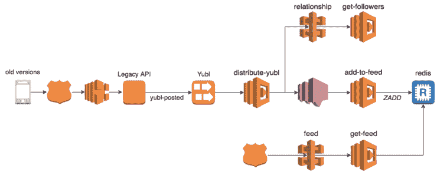**

**如果用户 A 的一个追随者没有在提要中收到他的新帖子，那么问题可能出在许多不同的地方。为了使这种调查更容易，我们需要能够按时间顺序查看**所有**相关日志，这就是关联 id(例如*初始请求 id* 、*用户 id* 、 *yubl-id* 等。)进来吧。**

**因为初始用户请求的处理流经 API 调用、 *Kinesis* 事件和 *SNS* 消息，这意味着关联 id 也需要通过 API 调用、 *Kinesis* 事件和 *SNS* 消息来捕获和传递。**

**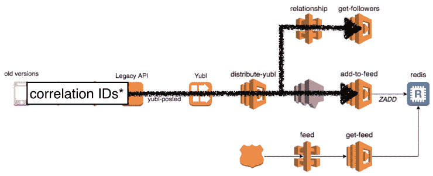**

**我们的方法是使用我们自己的客户端库，它将传递捕获的关联 id。**

# **捕获相关 id**

**我们所有的*λ*函数都是用包装器创建的，包装器用额外的优点包装您的处理程序代码，比如将相关标识捕获到*全局中。CONTEXT* 对象(因为 nodejs 是单线程的，所以它可以工作)。**

**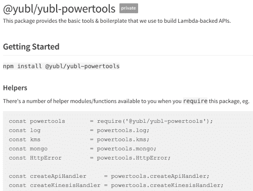****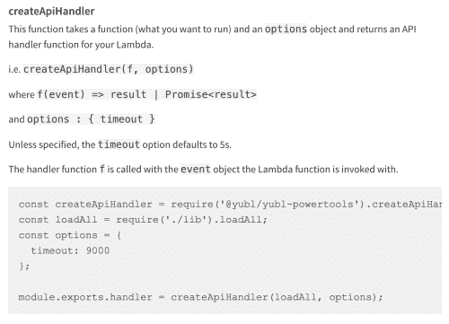**

# **转发相关标识**

**我们的 HTTP 客户端库是一个围绕[超级代理](https://www.npmjs.com/package/superagent) HTTP 客户端的薄包装，并将捕获的相关 id 注入到传出的 HTTP 头中。**

**我们还有一个发布*驱动*事件的客户端库，可以将相关 id 注入到[记录有效载荷](http://docs.aws.amazon.com/kinesis/latest/APIReference/API_PutRecord.html)中。**

**对于 *SNS，*您可以在[发布消息时将相关标识作为消息属性包含在内](http://docs.aws.amazon.com/sns/latest/api/API_Publish.html)。**

# **齐普金和亚马逊 x 光**

**从那时起，AWS 已经发布了 [x 光](https://aws.amazon.com/xray/)但是它还在预览中，所以我还没有机会看到它在实践中是如何工作的，并且在编写本报告的时候，它也不支持 *Lambda* 。**

**还有 [Zipkin](http://zipkin.io/) ，但是它需要您在 *EC2* 上运行额外的基础设施，并且虽然它有[广泛的支持](http://zipkin.io/pages/existing_instrumentations)用于在无服务器环境(您没有或者需要传统的 web 框架)中进行测试，但是我不太清楚。**

# **监视**

**您可以从 *CloudWatch* 中获得许多基本的度量标准，比如调用计数、持续时间、错误等。**

**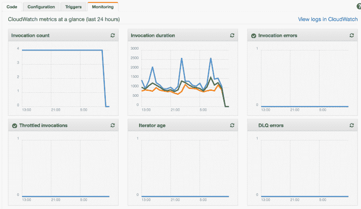**

**您也可以使用 AWS SDK[向 CloudWatch](http://docs.aws.amazon.com/AmazonCloudWatch/latest/APIReference/API_PutMetricData.html) 发布自定义指标(如用户创建、后查看)。然而，由于这些都是 HTTP 调用，您必须意识到它们会为面向用户的函数增加延迟(例如。提供原料药的那些)。您可以通过以“一劳永逸”的方式发布延迟，和/或为您在请求结束时发布度量标准所花费的时间(比如说，最多 50 毫秒)编制预算，来减少额外的延迟。**

**因为你必须在函数调用期间做所有的事情，这迫使你做出权衡。**

**另一种方法是从 [Datadog 的书](https://www.datadoghq.com/blog/monitoring-lambda-functions-datadog/)中吸取经验，使用特殊的日志消息并在事后处理它们。例如，如果您以如下所示的格式*监控|纪元时间戳|度量值|度量类型|度量名称*编写日志..**

> **console . log(" MONITORING | 1489795335 | 27.4 | latency | user-API-latency ")；**
> 
> **console . log(" MONITORING | 1489795335 | 8 | count | yubls-served ")；**

**然后您可以处理这些日志消息(参见上面的*日志*部分),并将它们作为度量发布。使用这种方法，您将会以牺牲指标的活性来换取更少的 API 延迟开销。**

**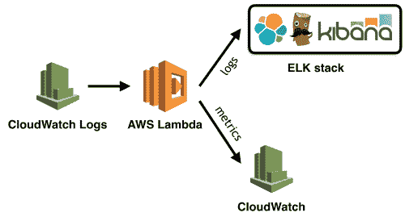**

**当然，您可以在您的架构中采用这两种方法，并针对每种情况使用合适的方法:**

*   **对于关键路径上的功能(这将直接影响用户体验的延迟)，选择将度量作为特殊日志消息发布的方法；**
*   **对于其他功能(cron 作业、kinesis 处理器等。)在调用持续时间不会显著影响用户体验的情况下，发布指标作为调用的一部分**

# **仪表板+警报**

**我们在 *CloudWatch* 和 *Graphite* 中设置了许多仪表板(使用 [hostedgraphite](https://www.hostedgraphite.com/) ，用于我们在 EC2 上运行的遗留堆栈)，它们显示在服务器团队区域附近的大型监视器上。我们还针对 API 延迟和错误计数等各种指标设置了警报，并设置了 [opsgenie](https://www.opsgenie.com/) 来提醒那个星期值班的人。**

# **考虑 CloudWatch 的替代品**

**虽然 *CloudWatch* 是一个很好的、具有成本效益的监控解决方案(在某些情况下，这是从 AWS 服务(如 *Kinesis* 和 *DynamoDB)中获取指标的唯一方式)*，但它也有缺点。**

**它的 UI 和定制与竞争对手如**[*Datadog*](https://www.datadoghq.com/)和 [*Sysdig*](https://www.sysdig.org/) 不可同日而语，而且它缺乏你在[*stack driver*](https://www.stackdriver.com/)和 [*波前*](https://www.wavefront.com/) 中找到的异常检测和寻找相关性等高级功能。****

****然而，最大的限制是 *CloudWatch* 指标只能精确到分钟。这意味着您发现问题的*时间以分钟为单位(您需要一些数据点来区分需要人工干预的实际问题和临时问题)，因此您恢复*的*时间可能以几十分钟为单位。随着规模的扩大和不可用性成本的上升，您需要努力减少这两种时间，这可能意味着您需要比 *CloudWatch* 能够提供的更精细的指标。*****

***不使用 *CloudWatch* 的另一个好理由是，**你真的不希望你的监控系统在它监控的系统**同时出现故障。多年来，我们经历了许多 AWS 中断，影响了我们在 *EC2* 上运行的核心系统以及 *CloudWatch* 本身。当我们的系统出现故障并恢复时，我们无法看到发生了什么，以及它对我们的用户有何影响。***

# ***配置管理***

***无论您使用何种方法进行配置管理，您都应该始终确保:***

*   ***敏感数据(如凭据、连接字符串)在传输中和静态时都是加密的***
*   ***对敏感数据的访问应该基于角色***
*   ***您可以轻松快速地传播配置更改***

***现在，你可以直接在你的 *Lambda* 函数中添加**环境变量**，并用 *KMS 对它们进行加密。****

***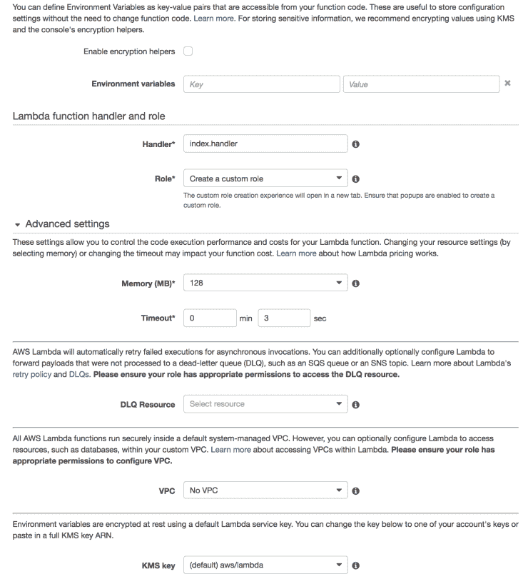***

***这是我们开始使用的方法，尽管在*无服务器*框架中使用了环境变量，因为那时它还不是 *Lambda* 服务的一个特性。在我们有了十几个共享配置值的函数(例如 MongoDB 连接字符串)后，这种方法变得很麻烦，手动传播配置更改(通过更新和重新部署需要更新配置值的每个函数)既费力又慢得令人痛苦。***

***在我们发展的这个阶段，我们转向了集中式配置服务。在考虑了 [consul](https://www.consul.io/) (我知道很多人都在用)之后，我们决定使用 *API 网关*、 *Lambda* 和 *DynamoDB* 来编写我们自己的程序，因为:***

*   ***我们不需要*执政官*的许多功能，只需要 kv 商店***
*   ***咨询是我们必须经营和管理的另一件事***
*   ***领事是我们必须学习的另一件事***
*   ***即使用 2 个节点运行 *consul* (你需要*一些*冗余用于生产)它仍然贵几个数量级***

***敏感数据(由开发人员)使用 *KMS* 进行加密，并以加密的形式存储在*配置 API* 中，当*λ*函数启动时，它会向*配置 API* 请求所需的配置值，并使用 *KMS* 对加密的 blob 进行解密。***

***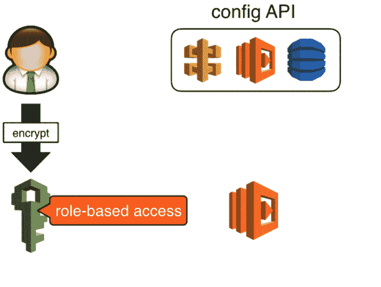***

***我们使用在 *api 网关*中创建的 API 密钥来保护对*配置 API* 的访问，如果这些密钥遭到破坏，攻击者将能够通过此 API 更新配置值。您可以通过用 *IAM* 角色保护 POST 端点来更进一步(我们最终没有实现),这将要求开发人员发出[签名请求](http://amzn.to/2mxTOyH)来更新配置值。***

***攻击者仍然可以检索加密形式的敏感数据，但他们将无法解密，因为 *KMS* 也需要基于角色的访问。***

# ***客户端库***

***由于我们的大多数*λ*函数需要与*配置 API* 对话，我们投入了大量精力来使我们的客户端库真正健壮，并在缓存支持和定期轮询中烘焙，以从源代码刷新配置值。***

***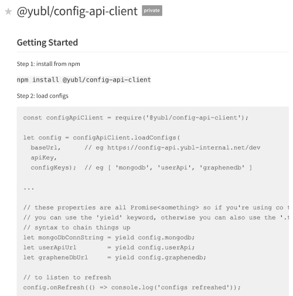***

***所以，这就是它的乡亲们，希望你喜欢这个职位，不要检查该系列的其余部分。***

***AWS Lambda 和其他无服务器技术的出现极大地简化了组织内部履行运营职责所需的技能和工具。然而，这种新范式也为现有工具链带来了新的限制和挑战，并要求我们提出新的答案。事情正在以令人难以置信的速度变化，我很高兴看到这个领域出现了什么新的实践和工具！***

***喜欢您正在阅读的内容，但需要更多帮助？我很乐意作为一名独立顾问提供服务，帮助您完成无服务器项目——架构审查、代码审查、构建概念验证，或者提供关于领先实践和工具的建议。***

***我在**伦敦，英国**工作，目前是英国唯一的 [**AWS 无服务器英雄**](https://aws.amazon.com/developer/community/heroes/yan-cui/) 。我有近 **10 年[的](https://www.linkedin.com/in/theburningmonk/)**经验在 AWS 中大规模运行生产工作负载。我主要在英国开展业务，但我愿意出差一周以上。要了解我们如何能够合作，请在这里告诉我更多关于您试图解决的问题的信息。***

***我还可以举办一个内部研讨会，帮助您的无服务器架构在 T2 投入生产。您可以在这里找到关于为期两天的研讨会[的更多信息，该研讨会将带您从 AWS Lambda 的基础一直到日志聚合、分发跟踪和安全最佳实践的通用操作模式。](https://theburningmonk.com/workshops/)***

***如果你更喜欢按照自己的节奏学习，那么你也可以找到所有与我为曼宁制作的 [**视频课程**](https://bit.ly/production-ready-serverless) 相同的研讨会内容。我们将讨论的主题包括:***

*   ***认证 *&* 授权与 API 网关 *&* 认知***
*   ***本地测试 *&* 运行功能***
*   ***CI/CD***
*   ***日志聚合***
*   ***监控最佳实践***
*   ***X 射线分布式跟踪***
*   ***跟踪相关 id***
*   ****性能&成本*优化***
*   ***错误处理***
*   ***配置管理***
*   ***金丝雀部署***
*   ***VPC***
*   ***安全***
*   ***Lambda、Kinesis 和 API 网关的最佳实践***

***代码 **ytcui** 也可以获得**票面价格的 6 折优惠**。不过，这个数字只有在我们参加曼宁的早期访问计划(MEAP)时才有效。***