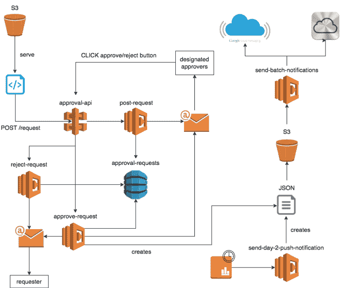
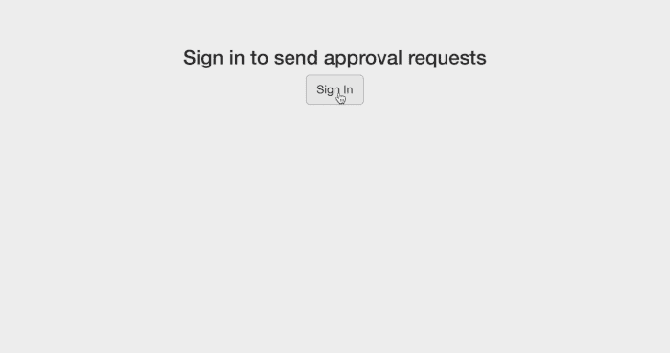
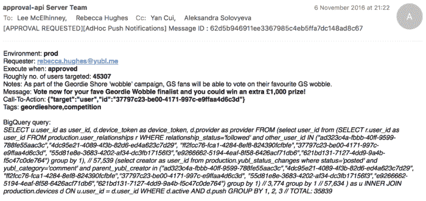
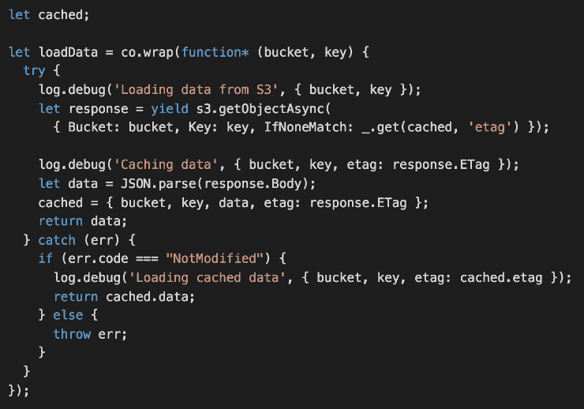

# Yubl 的无服务器之路——第 4 部分，构建可伸缩的推送通知系统

> 原文：<https://medium.com/hackernoon/yubls-road-to-serverless-part-4-building-a-scalable-push-notification-system-62b38924ed61>

## 我们使用 Lambda、S3、API Gateway、DynamoDB 和 SES 的组合，构建了一个与 BigQuery 结果集成的系统，能够批量发送数百万条推送通知。

# 这条路到此为止

第 1 部分:[概述](/@theburningmonk/yubls-road-to-serverless-part-1-overview-ca348370acde)

第 2 部分:[测试和持续交付策略](/@theburningmonk/yubls-road-to-serverless-part-2-testing-and-ci-cd-72b2e583fe64)

第三部: [ops](https://hackernoon.com/yubls-road-to-serverless-part-3-ops-6c82139bb7ee)

第 4 部分:[构建可伸缩的推送通知系统](https://hackernoon.com/yubls-road-to-serverless-part-4-building-a-scalable-push-notification-system-62b38924ed61)

第 5 部分:[建立一个更好的推荐系统](https://hackernoon.com/yubls-road-to-serverless-part-5-building-better-recommendations-with-lambda-bigquery-and-1d74407f3b3a)

就在 Yubl 的[不合时宜的消亡](http://theburningmonk.com/2016/11/yubl-a-sad-end-to-a-wonderful-journey/)之前，我们做了一件有趣的工作，重新设计了向用户发送定向推送通知的系统，以提高用户保留率。

旧系统依靠 [MixPanel](https://mixpanel.com/) 来选择用户和发送推送通知。虽然 *MixPanel* 对于我们快速获得基本分析非常有用，但我们很快发现我们的用例已经超出了 *MixPanel* 。最紧迫的限制是，我们无法根据用户的社交图谱查询用户以创建目标推送通知，例如，当某个影响者发布新帖子或开展新的社交媒体活动时，通知他/她的关注者。

由于我们所有的分析事件都被传输到 Google BigQuery(使用*kine sis*fire hose、 *S3* 和 *Lambda* 的组合)，我们拥有了支持产品团队复杂用例所需的所有数据。

我们需要的是一个推送通知系统，它可以与 BigQuery 结果集成，并且能够批量发送数百万条推送通知。

# 设计目标

从高层次来说，我们需要支持两种类型的通知。

**特别通知**由营销团队推动，与影响者和 BI 团队密切合作，将用户与他们可能感兴趣的影响者或内容匹配起来。通知示例包括:

*   关注*配饰*和其他时尚品牌的用户可能有兴趣知道另一个知名时尚品牌何时加入该平台
*   关注影响者的用户可能有兴趣知道该影响者何时发布新帖子或开展社交媒体活动(通常有赠送奖品等)。)
*   分享/喜欢音乐相关内容的用户可能有兴趣知道*蒂尼·坦帕*已经加入该平台

**预定通知**由产品团队驱动，这些通知旨在提醒用户完成注册过程或在过期后返回平台。通知示例包括:

*   第 1 天未完成的注册:通知未完成注册过程的用户回来完成该过程
*   第 2 天参与:通知用户在第 2 天回来关注更多人或邀请朋友
*   第 21 天不活动:通知 21 天没有登录应用程序的用户回来查看新内容

# A/B 测试

对于预定通知，我们希望测试不同的消息/布局，以优化它们随时间的有效性。为此，我们希望支持 A/B 测试作为新系统的一部分(MixPanel*已经支持了)。*

我们应该能够创建多个变量(每个变量都有一个百分比)，以及一个不会收到任何推送通知的控制组。

A/B test groups are configured in the Lambda function, which can be easily and quickly changed and redeployed, and the changes are source controlled and peer reviewed.

# 监督与无摩擦

对于即席通知，我们不想妨碍营销团队的工作，因此创建即席推送通知的过程应该尽可能无摩擦。然而，我们也不希望营销团队完全在没有监督的情况下运作，并冒着长期损害的风险，向用户发送不想要的推送通知(这可能会导致用户禁用通知，甚至愤怒地退出应用程序)。

我们达成的妥协是一个自动化的批准流程，通过该流程:

1.  营销团队将与 BI 合作进行查询，以识别用户(例如 *Tinie Tempah* 的追随者)
2.  填写申请表，通过电子邮件通知指定的批准人
3.  审批者可以给自己发送一个测试推送通知，看看它在 Android 和 iOS 上的格式如何
4.  批准者可以批准或拒绝请求
5.  一旦获得批准，该请求将被执行

A simple form to request push notifications to be sent to users identified by the query

Once your request has been submitted, the requester and the approvers will both receive an email detailing the no. of users selected by the query, the JSON payload, etc. In the email to the approvers, there are also buttons to approve/reject the request, as well as to send the proposed push notification to the approvers so they can see how the message would appear on both Android and iOS devices.

# 履行

我们决定使用 *S3* 作为`send-batch-notifications`函数的源，因为它允许我们传递大量用户(记住，目标是支持批量向数百万用户发送推送通知),而不必担心分页或有效负载大小的限制。

该函数可以处理任何格式正确的 JSON 文件，并且 JSON 文件可以通过多种方式生成:

*   由生成计划通知的 cron 作业执行
*   由批准系统在特别推送通知被批准后执行
*   由批准系统向批准者发送测试推送通知(以直观检查消息在 Android 和 iOS 设备上的显示方式)
*   当需要人工干预时，由工程团队成员执行

我们也考虑过将设备注册转移到 *SNS* ，但是我们决定不这么做，因为它没有提供*足够有用的*抽象来证明迁移工作(涉及客户端工作)和[发送推送通知的额外成本](https://aws.amazon.com/sns/pricing/)。相反，我们使用 [node-gcm](https://www.npmjs.com/package/node-gcm) 和 [apn](https://www.npmjs.com/package/apn) 直接与 gcm 和 apn 通信。

# 递归函数 FTW

*Lambda* 有一个 5 分钟执行时间的硬性限制(在不久的将来可能会放宽)，这可能不足以发送数百万条推送通知。

我们处理这种长时间运行任务的方法是将 *Lambda* 函数写成递归函数。

一个简单的递归函数将在固定大小的批中处理有效负载，并在每批结束时递归，同时传递一个令牌/位置值，以允许下一次调用从它停止的地方继续。

在这种特殊的情况下，我们有额外的考虑，因为工作项的总数可能非常大:

*   最小化所需递归的数量，这等同于对*λ*的[调用](http://docs.aws.amazon.com/lambda/latest/dg/API_Invoke.html)请求的数量，并带有[规模成本影响](https://aws.amazon.com/lambda/pricing/#lambda)
*   缓存 JSON 文件的内容以提高性能(通过避免多次加载和解析大型 JSON 文件)并降低 S3 成本

为了最小化递归的数量，我们的函数将:

1.  以 500 人为一个小批量处理用户列表
2.  在每个批处理结束时，调用`context.getRemainingTimeInMillis()`来检查这个调用还剩多少时间
3.  如果调用剩余时间超过 1 分钟，则处理另一个批处理；否则递归

当缓存来自 *S3* 的 JSON 文件的内容时，我们还需要比较 *ETAG* 以确保文件的内容没有改变。

通过这种设置，系统能够在我们的负载测试期间轻松处理超过 100 万用户的 JSON 文件(抱歉，苹果和谷歌发送了所有这些假的设备令牌:-P)。

喜欢您正在阅读的内容，但需要更多帮助？我很乐意作为一名**独立顾问**提供服务，帮助您完成无服务器项目——架构审查、代码审查、构建概念验证，或者提供关于领先实践和工具的建议。

我在**伦敦，英国**，目前唯一在英国的 [**AWS 无服务器英雄**](https://aws.amazon.com/developer/community/heroes/yan-cui/) 。我有近 **10 年**的[经验](https://www.linkedin.com/in/theburningmonk/)在 AWS 中大规模运行生产工作负载。我主要在英国开展业务，但我愿意出差一周以上。要了解我们如何合作，请在这里告诉我更多关于您试图解决的问题的信息。

我还可以举办一个内部研讨会，帮助您的无服务器架构进入生产准备阶段。您可以在这里找到关于为期两天的研讨会[的更多信息，该研讨会将带您从 AWS Lambda 的基础知识一直到日志聚合、分发跟踪和安全最佳实践的通用操作模式。](https://theburningmonk.com/workshops/)

如果你喜欢按照自己的进度学习，那么你也可以找到与我为曼宁制作的 [**视频课程**](https://bit.ly/production-ready-serverless) 相同的研讨会内容。我们将讨论的主题包括:

*   认证 *&* 授权与 API 网关 *&* 认知
*   本地测试 *&* 运行功能
*   CI/CD
*   日志聚合
*   监控最佳实践
*   X 射线分布式跟踪
*   跟踪相关 id
*   性能 *&* 成本优化
*   错误处理
*   配置管理
*   金丝雀部署
*   VPC
*   安全
*   Lambda、Kinesis 和 API 网关的最佳实践

代码 **ytcui** 也可以获得**票面价格 6 折优惠**。不过，这个数字只有在我们参加曼宁的早期访问计划(MEAP)时才有效。