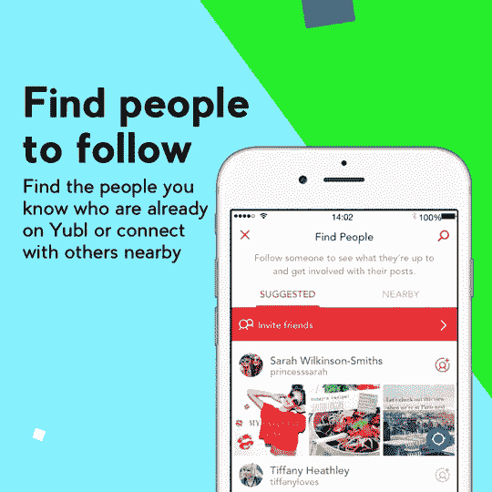
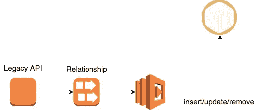
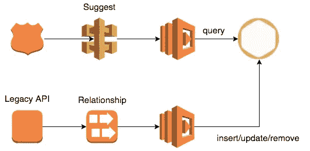
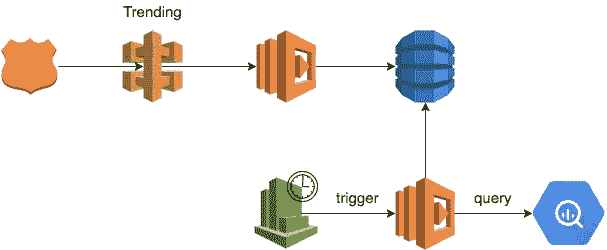
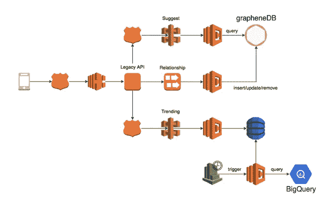

# Yubl 的无服务器之路——第 5 部分，用 Lambda、BigQuery 和 GrapheneDB 构建更好的推荐

> 原文：<https://medium.com/hackernoon/yubls-road-to-serverless-part-5-building-better-recommendations-with-lambda-bigquery-and-1d74407f3b3a>

## 我们使用 Lambda、BigQuery 和 GrapheneDB 的组合，在不到两周的时间内重建了 Yubl 中的推荐功能

# 这条路到此为止

第 1 部分:[概述](/@theburningmonk/yubls-road-to-serverless-part-1-overview-ca348370acde)

第 2 部分:[测试和持续交付策略](/@theburningmonk/yubls-road-to-serverless-part-2-testing-and-ci-cd-72b2e583fe64)

第三部: [ops](https://hackernoon.com/yubls-road-to-serverless-part-3-ops-6c82139bb7ee)

第 4 部分:[构建可伸缩的推送通知系统](https://hackernoon.com/yubls-road-to-serverless-part-4-building-a-scalable-push-notification-system-62b38924ed61)

第 5 部分:[建立一个更好的推荐系统](https://hackernoon.com/yubls-road-to-serverless-part-5-building-better-recommendations-with-lambda-bigquery-and-1d74407f3b3a)

当我在 2016 年 4 月加入 Yubl 时，它刚刚在 2 个月前推出，经过了长达两年多的漫长而混乱的开发周期——在产品问世之前，一直有一个全副武装的销售团队！

一些非常糟糕的决定发生在 Yubl..从硅谷来看，这种决策远比我们想象的要普遍。

也就是说，在 Yubl 也发生了许多好事，我很高兴能和我职业生涯中遇到的一些最优秀的人一起工作。这篇文章是关于一个有问题的特性，我们通过 AWS Lambda 的力量和使用正确的工具很快扭转了这个问题。

fans of *Silicon Valley* probably remember that scene from Season 3 when Richard and co walked into their shiny new Pipe Piper office to find “Action” Jack Barker had hired an army of sales people before they even had a product.

# 破损的特征

加入这家公司后，我发现这款应用已经有了**寻人**功能，尽管它没有达到我的预期。像 Twitter 和脸书这样的网站会使用复杂的算法来寻找和你有共同兴趣的人。另一方面，我们的特性将按照帐户创建时间的顺序返回 MongoDB 中您尚未关注的前 30 位用户。对于大多数用户来说，这份名单相当于前 30 名 Yubl 员工安装了该应用程序…说到操纵游戏！

其中一个开发者大胆地尝试改进这个特性，只返回与你共享连接的用户——要么你们都跟随 X，要么你们都被 X 跟随。

然而，实现是每个用户请求一系列昂贵(复杂)的 MongoDB 查询。最终，这种方法无法随着吞吐量和复杂性而扩展，因为它使用了错误的工具。

# Lambda + GrapheneDB =高效的图形查询

我之前在 Gamesys 和 Neo4j 一起工作，用它来分析和模拟 MMORPG 复杂的游戏经济。

像 Neo4j 这样的图表数据库是存储我们的社交图表的最佳位置，它允许我们有效地执行我们需要的图表查询，以便找到您应该关注的用户，例如第二/第三级关系。

[GrapheneDB](https://www.graphenedb.com/) 提供**托管的 Neo4j 数据库即服务**，内置监控、仪表盘、自动备份和纵向扩展。这是让我们前进并开始快速为我们的用户提供价值的完美选择。

在这个时间点上，我们已经将系统中所有的状态变化流入 Kinesis。为了将我们所有的社交图导出到 GrapheneDB 中，并与 MongoDB 保持同步，我们:

1.  运行一次性任务，将所有关系数据导出到 GrapheneDB 中
2.  为`Relationship` Kinesis 流订阅了一个 Lambda 函数，以处理任何后续关系变化并实时更新社交图(GrapheneDB 中)

a Lambda function would process relationship changes and update the social graph in real time

然后，我们通过 API Gateway 和 Lambda 公开数据，以便客户端应用程序和其他内部服务可以使用它来轻松找到建议的用户，以便用户跟踪。

## 未来计划

考虑到 Neo4j 要求你的所有图形都存储在一台机器上的限制(而且它对硬件的要求也非常苛刻)，这对我们来说不是一个长期的解决方案。

根据我的估计，GrapheneDB 上最大的实例就足够了，直到我们拥有超过 1000 万用户。它是根据我们平台上每个用户的平均连接数计算出来的，并使用 Twitter 的用户统计数据作为我们可能达到 1000 万用户的指南。

我们可以通过转移到批处理模型并对每个用户的推荐进行预处理来进一步提高上限，从而减少针对大型图的实时查询的数量。建议可以仅限于活动用户(例如，在过去 X 天内登录的用户),并且仅在以下情况下:

*   这些建议是陈旧的，即。超过 X 天没有被用户操作，因此它们可能不是用户想要的；或者
*   当用户的扩展社交图发生了变化，即。追随者/被追随者有新的联系

据我所知，出于可扩展性和成本原因，所有大型社交网络都使用批处理模式。

至于长期的解决方案，我们还没有决定任何事情。我简单地看了一下脸书的吉拉夫，但它比我们预想的要复杂得多。还有其他“幻想”的想法，比如这篇[论文](https://blog.acolyer.org/2017/05/30/mosaic-processing-a-trillion-edge-graph-on-a-single-machine/)中描述的马赛克系统。如果我们能走到那一步，那将是一个巨大的挑战。

# 查找趋势用户

因为我们仍然是一个小型社交网络——安装量刚刚超过 80 万，仅仅基于用户的社交图进行推荐是不够的，因为大多数用户的社交图都非常小。

为了弥补这一差距，我们决定在您的推荐中也包括平台上的趋势用户。

谢天谢地，我们所有的活动(比如 X 关注 Y，X 喜欢 Y 的帖子，等等。)被流式传输到 Google BigQuery。我们选择 BigQuery 是因为 AWS Athena 还没有发布，而 RedShift 并不适合用于需要快速响应的即席实时查询。此外，我在 Gamesys 有多年使用 BigQuery 的经验，所以这在当时是显而易见的。

*ps。如果你对 Athena 和 BigQuery 的区别很好奇，Lynn Langit 今年在无服务器的奥斯汀做了一个全面的比较。*

为了找到有趋势的用户，我们与产品团队一起创建了一个公式，根据过去 24 小时内新关注者的数量来计算用户的“趋势”。关注者计数根据用户最近被关注的程度进行指数加权。例如，一个在过去一个小时关注你的人给你 1 分，但是一个在 3 个小时前关注你的人只能给你 0.1 分。

我们用 CloudWatch Events 和 Lambda 创建了一个 cron 作业，每 3 小时对 BigQuery 执行一次上述查询。为了节省成本，我们的查询将只处理最近 24 小时内插入的事件。

然后将结果保存到 DynamoDB 表中，每次运行结束时都会覆盖该表。

我们再次通过 API Gateway 和 Lambda 公开了数据。

# 迁移到新的 API

现在，我们有了两个新的 API 来提供基于用户社交图的实时建议，并找到当前在我们平台上流行的用户。

然而，客户端应用程序需要更新以利用这些新的 API。我们没有等待客户团队跟上，而是更新了遗留 API 的建议端点，以使用两者的结果，这样我们就可以更早地为用户提供价值。

> "从订货到有人说谢谢的时间是唯一重要的声誉衡量标准."—丹·诺斯

这就是我们把所有东西放在一起的样子:

这项工作最令人满意的一个方面是，我们能够以多快的速度改变这个特性，并将新系统部署到生产中。一切都在不到两周的时间内完成，这主要是因为我们能够专注于我们的业务需求，并让 Lambda、BigQuery 和 GrapheneDB 等服务来处理无差别的工作。

喜欢您正在阅读的内容，但需要更多帮助？我很乐意作为一名**独立顾问**提供服务，帮助您完成无服务器项目——架构审查、代码审查、构建概念验证，或者提供关于领先实践和工具的建议。

我在**伦敦，英国**，目前唯一在英国的 [**AWS 无服务器英雄**](https://aws.amazon.com/developer/community/heroes/yan-cui/) 。我有近 **10 年**的[经验](https://www.linkedin.com/in/theburningmonk/)在 AWS 中大规模运行生产工作负载。我主要在英国开展业务，但我愿意出差一周以上。要了解我们如何合作，请在这里告诉我更多关于您试图解决的问题的信息。

我还可以举办一个内部研讨会，帮助您的无服务器架构进入生产准备阶段。您可以在这里找到关于为期两天的研讨会[的更多信息，该研讨会将带您从 AWS Lambda 的基础知识一直到日志聚合、分发跟踪和安全最佳实践的通用操作模式。](https://theburningmonk.com/workshops/)

如果你喜欢按照自己的进度学习，那么你也可以找到与我为曼宁制作的 [**视频课程**](https://bit.ly/production-ready-serverless) 相同的研讨会内容。我们将讨论的主题包括:

*   认证 *&* 授权与 API 网关 *&* 认知
*   本地测试 *&* 运行功能
*   CI/CD
*   日志聚合
*   监控最佳实践
*   X 射线分布式跟踪
*   跟踪相关 id
*   性能 *&* 成本优化
*   错误处理
*   配置管理
*   金丝雀部署
*   VPC
*   安全
*   Lambda、Kinesis 和 API 网关的最佳实践

代码 **ytcui** 也可以获得**票面价格 6 折优惠**。不过，这个数字只有在我们参加曼宁的早期访问计划(MEAP)时才有效。