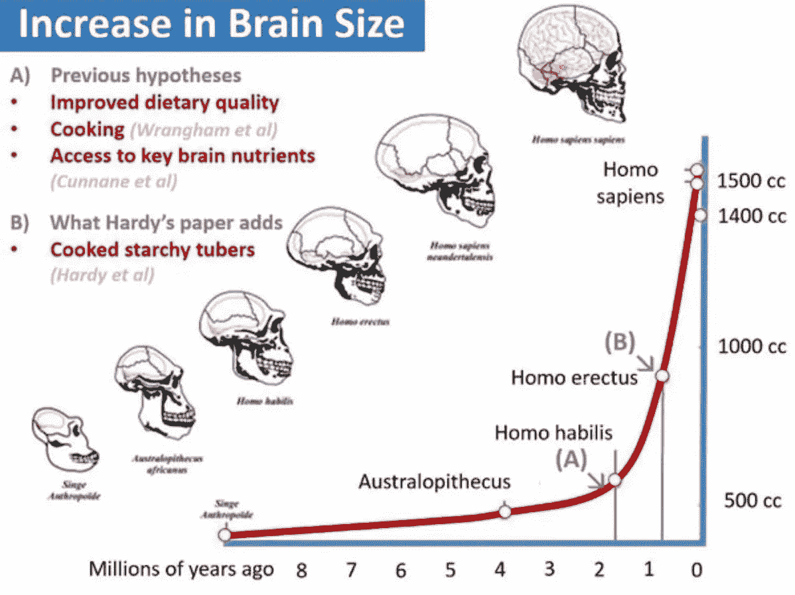

# 🌟人工智能在不久的将来& 13 小块食物让你在晚宴上显得聪明

> 原文：<https://medium.com/hackernoon/yuval-harari-dataism-future-skills-rebundling-business-models-living-designing-with-83a8958da16f>

## 🚀这是**指数**视图的第 101 期。** [在此报名订阅时事通讯。](http://azeem.io/s)**

****

**Photo Credit, [exponentialview on instagram.](https://www.instagram.com/exponentialview/)**

# **近期发展部**

**🔮💡[与尤瓦尔·赫拉利](https://soundcloud.com/exponentialview/homo-deus-a-conversation-between-yuval-harari-and-azeem-azhar?utm_source=soundcloud&utm_campaign=share&utm_medium=facebook)谈论基因工程和人工智能的进步将如何改变人类和人类社会。**一定要听。尤瓦尔的优秀新书《德乌斯人》已经在美国上市。(在这里买:[英国](https://www.amazon.co.uk/gp/product/1910701874/ref=as_li_tl?ie=UTF8&camp=1634&creative=6738&creativeASIN=1910701874&linkCode=as2&tag=exponentialview-21) | [美国](https://www.amazon.com/gp/product/0062464310/ref=as_li_tl?ie=UTF8&camp=1789&creative=9325&creativeASIN=0062464310&linkCode=as2&tag=exponentialvi-20&linkId=418e040333a6a0760deed81bf6da7f77) | [德国](https://www.amazon.de/gp/product/1910701882/ref=as_li_qf_sp_asin_il_tl?ie=UTF8&camp=1638&creative=6742&creativeASIN=1910701882&linkCode=as2&tag=exponview-21))****

**🎓你好，团队合作。智库[汉密尔顿计划](https://www.weforum.org/agenda/2017/02/employers-are-going-soft-the-skills-companies-are-looking-for/)表示:“数学和英语等科目的认知技能长期以来被用来衡量求职者的能力……非认知技能也是教育表现和工作成功的一个组成部分，而且正变得越来越重要。”。**好读书。**参见乔治·蒙比奥[探索教育的替代模式](https://www.theguardian.com/commentisfree/2017/feb/15/robots-schools-teaching-children-redundant-testing-learn-future)。此外，企业家马克·库班认为对文科的需求将会增加。**

**📦[伟大的重组者。](https://www.nytimes.com/2017/02/14/business/dealbook/bundling-online-services.html?_r=0)互联网商业模式曾经是关于分拆的。今天，情况似乎正好相反。**见解深刻。****

**🤖人工智能通过模仿生物学取得了最近的成功。现在它必须更进一步。**超级**文章作者@ kellybclancy。**

**🌟要点(作者[成功地将人工智能](https://medium.com/u/1b7b63b4e31a#.peqe5nz5i)武器化，以提供更好的洞察力、更有针对性的消息传递和快速的信息分发。对位:[也可能是没效果](https://www.buzzfeed.com/kendalltaggart/the-truth-about-the-trump-data-team-that-people-are-freaking?utm_term=.bt4kgAopjK#.frkkLyE3xa)。陪审团仍在审议川普和英国退出欧盟团队使用的数据与社交策略的真正影响。**

**莎拉·塔维尔(Sarah Tavel)的“[参与层级](https://news.greylock.com/the-hierarchy-of-engagement-expanded-648329d60804#.y1ngpsj7f)”是产品企业家的**经典读物**。**

**🔥转自卡尔·波兰尼 1940 年的演讲:[国际体系的崩溃](http://www.primeeconomics.org/articles/lecture-3-the-breakdown-of-the-international-system) **恰当的****

# **算法与人工智能系**

**在我与尤瓦尔·赫拉利的讨论中，探讨的一个主题是世界朝着算法管理的方向发展。算法如何在我们的日常生活以及商业和经济的深处越来越多地做出自动化决策。**

**📊皮尤研究中心最近就算法对社会的影响采访了 1302 名专家，这是一项相当出色的调查。结论是:算法将无处不在，这基本上是件好事。但我们需要警惕失去自己的决策能力，防范偏见，管理过滤器泡沫，并确保我们对这些算法进行监督。**

**我的观点是，正确设计的算法决策将继续给人类社会带来难以置信的好处。然而，这种算法需要整体设计，这意味着理解决策的更广泛背景，包括由此产生的任何外部性。如果“算法决策”狭隘地关注算法操作者的效率，意想不到的后果可能比比皆是。**

**《连线》杂志介绍了 Heliograf，[华盛顿邮报用来产生选举故事的机器人](https://www.wired.com/2017/02/robots-wrote-this-story/):**

> **2012 年 11 月，四名员工花了 25 个小时手动编辑并发布了选举结果的一小部分。2016 年 11 月，Heliograf 在几乎没有人工干预的情况下，创作了 500 多篇文章，点击量超过 50 万次。**

**这与 1995 年大不相同，当时我在《卫报》的老板把一堆脚本夹在一起自动生成天气预报。**

**DeepMind 的 Pathnet 让人工智能研究人员兴奋不已，因为它似乎是支持人工通用智能(或 AGI)的那种架构的先驱。Pathnet 在一个架构中结合了人工智能研究的几个热点领域:元学习、强化学习、对抗学习、合作学习和迁移学习。Carlos Perez 有一个[的合理可及的概述。](/intuitionmachine/pathnet-a-modular-deep-learning-architecture-for-agi-5302fcf53273#.yp1064dsb)**

**对立的例子是可以迫使机器学习系统犯错误的数据。这是网络安全的一个有趣领域，尤其是随着更多的决策转向算法。OpenAI [有一篇关于这个主题的很好的论文](https://openai.com/blog/adversarial-example-research/)。**

**其他地方:**

*   **比尔·盖茨[想向机器人征税](http://www.recode.net/2017/2/17/14652880/bill-gates-robots-steal-human-jobs-pay-taxes)**
*   **[人工智能生成式设计的精彩回顾](https://www.dezeen.com/2017/02/06/generative-design-software-will-give-designers-superpowers-autodesk-university/)**
*   **关于 [Autodesk 的增强智能系统如何共同设计 Elbo chair](http://nordic.businessinsider.com/this-scandinavian-chair-was-designed-using-ai-and-algorithms-2017-2/) 的精彩见解**
*   **Graphcore 的[神经网络学习的可视化](http://www.wired.co.uk/gallery/machine-learning-graphcore-pictures-inside-ai)**
*   **另一个令人印象深刻的无人驾驶汽车演示。这次是 drive.ai**

# **清洁技术与发展部**

**[上的](https://medium.com/u/bea61c20259e#.al9p3oe4p)**为什么可再生能源不再是‘替代’为什么化石燃料是遗产。

*   中国正在引领锂超级工厂的发展——有望在 2020 年控制全球 62%的产量。

# 在晚宴上显得聪明的 13 小块食物

1.  克莱尔·沃德尔对假新闻有一个超级分类。
2.  即使用户使用不同的浏览器,[网站如何描述用户。](https://arstechnica.com/security/2017/02/now-sites-can-fingerprint-you-online-even-when-you-use-multiple-browsers/)
3.  凯拉联网娃娃是一个完全的安全隐患。
4.  大学[被自己连接的自动售货机](http://www.networkworld.com/article/3168763/security/university-attacked-by-its-own-vending-machines-smart-light-bulbs-and-5-000-iot-devices.html)攻击。
5.  科学家[人工创造三角烯](https://www.scientificamerican.com/article/elusive-triangulene-created-for-the-first-time/)，一种新的碳同素异形体。
6.  电子寿命至少有 66000 年(大约比宇宙寿命长 10 ⁹。)
7.  观看印度火箭发射的 104 颗卫星。
8.  你 77 岁时的个性和 14 岁时的个性没有关联。
9.  [英国过多的死亡可能与削减医疗开支有关。](https://www.theguardian.com/society/2017/feb/17/health-cuts-most-likely-cause-major-rise-mortality-study-claims)
10.  ☭的俄罗斯人更加依赖他们曾处于共产主义统治下的国家。
11.  [重新思考公司。由于美国和其他发达国家的市场越来越集中在少数“超级明星”公司手中，这些公司影响市场规则的能力也增强了](https://promarket.org/theory-firm-interview-series-john-van-reenen/)
12.  💶乔尔·莫基尔:[欧洲是如何变得如此富有的？](https://aeon.co/essays/how-did-europe-become-the-richest-part-of-the-world)答:“经济进步的自我强化动力使知识驱动的增长成为可能并可持续”
13.  黄油对你有好处。大概吧。

# 结束注释

好的。我没有写马克·扎克伯格拯救世界的宣言。老实说，我没有时间去读它(或者对它的许多批评。)我想说的是，我很高兴他开始着手一些真正重要的关键问题。我会对宣言进行评估，直到我真正阅读它。

本周，我希望能在演示日为世界上第一个人工智能/人工智能加速器 [Zeroth.ai](http://zeroth.ai) 挤出几分钟时间。(我偶尔会帮[创始人 tak_lo](https://medium.com/u/502c13d18b4?source=post_page-----83a8958da16f--------------------------------) 。)他们的投资者/演示日将进行直播，只有几个座位。你可以在这里注册观看。

祝二月中旬愉快！

再见

阿兹姆

附注:我们的 Instagram 页面上有些很酷的东西。

> [黑客中午](http://bit.ly/Hackernoon)是黑客如何开始他们的下午。我们是阿妹家庭的一员。我们现在[接受投稿](http://bit.ly/hackernoonsubmission)并乐意[讨论广告&赞助](mailto:partners@amipublications.com)机会。
> 
> 如果你喜欢这个故事，我们推荐你阅读我们的[最新科技故事](http://bit.ly/hackernoonlatestt)和[趋势科技故事](https://hackernoon.com/trending)。直到下一次，不要把世界的现实想当然！

