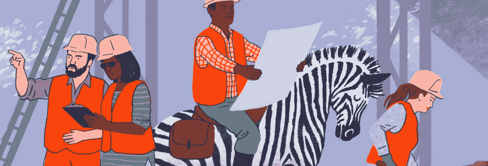

# 斑马在 DazzleCon 聚集

> 原文：<https://medium.com/hackernoon/zebras-uniting-at-dazzlecon-783dffac81e4>

昨天，我写了即将到来的[一氧化碳影响日](https://feld.com/archives/2017/11/co-impact-days-unicorns-zebras-ponies-donkeys.html)。在这篇文章中，我指向了一个名为[斑马修理独角兽弄坏的东西](/@sexandstartups/zebrasfix-c467e55f9d96)的中型帖子，结果是斑马宣言。

根据宣言，斑马(不同于独角兽)是真实的:

*   斑马[公司](https://hackernoon.com/tagged/companies)既有黑人也有白人:它们盈利并改善社会。他们不会为了一个牺牲另一个。
*   斑马也是互利共生的:通过群聚在一起，它们保护和保存彼此。他们的个人投入导致更强的集体产出。
*   斑马公司拥有无与伦比的耐力和资本效率，只要条件允许它们生存下去。

昨天下午，我收到斑马运动的创始人之一、《宣言》的作者马拉·泽佩达的短信，说我们应该谈谈。我们进行了一次很棒的讨论，在那里我了解了更多关于斑马、斑马运动以及本周即将在波特兰举行的 [DazzleCon 会议。来自世界各地的 200 多名 Zebra 创始人、投资者和朋友正聚集在一起，共同创建一个公司社区，为我们想要的社会提供我们需要的商品和服务。](https://www.zebrasunite.com/dazzlecon/)

玛拉还指着文章[“斑马”能修好“独角兽”弄坏的东西吗？](http://blog.longnow.org/02017/10/26/zebras-partner-long-now-dazzlecon/)在 Long Now 基金会的网站上， [DazzleCon](https://hackernoon.com/tagged/dazzlecon) 的赞助商之一，还有洛克菲勒基金会、麦克阿瑟基金会、骑士基金会和其他几家。

艾米和我报名支持斑马运动，并决定通过我们的锚点基金会赞助 DazzleCon。我对玛拉和她的同事们正在做的事情感到兴奋和着迷，因为他们将 21 世纪创业的视角和参与度远远超出了独角兽。

*最初发表于* [*费尔德思*](https://www.feld.com/archives/2017/11/zebras-uniting-dazzlecon.html) *。*