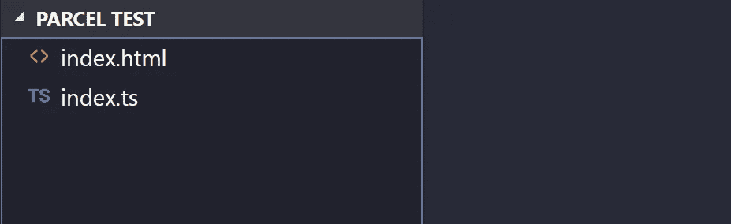
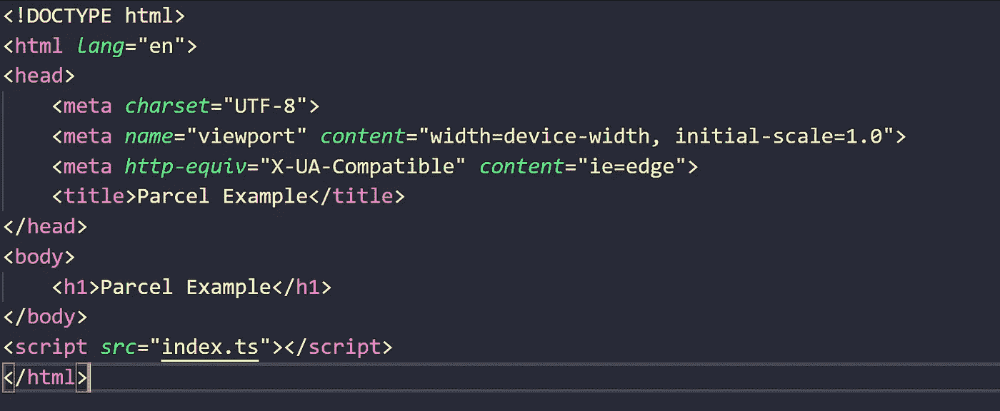
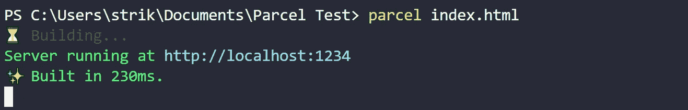

# 与包裹捆绑的零配置类型脚本

> 原文：<https://medium.com/hackernoon/zero-config-typescript-bundling-with-parcel-ef76fabcbfe3>

## 他们怎么能不小题大做呢？

Web 应用程序捆绑是一种开发实践，起初让我感到畏惧。就像很多的 [JavaScript](https://hackernoon.com/tagged/javascript) 一样，有很多方法可以做到这一点，每个人都有自己的看法，有时初始设置足以让你完全放弃[工具](https://hackernoon.com/tagged/tool)。

我得说，我的大部分捆绑体验都是用 Webpack 完成的。Webpack 是一个强大的工具，它的可配置性在很多方面都是它最好的特性，但是学习如何创建一个合适的配置以及更高级的东西，比如*“热模块加载”*，一开始真的有点难以接受。如果你像我一样是一个打字高手，你也需要添加一些东西，比如*“牛逼的打字加载器”，*虽然它确实很牛逼，但是在应用程序的设置阶段额外的努力也没什么牛逼的。

不过我不应该抱怨，这些步骤对于任何 web 开发人员来说都是相对基础和必要的，为了保护 Webpack，你最终会从你的老板那里得到你的`webpack.config.js`,或者从一个对技术非常精通的人准备的样板文件中撕掉它🙌🙌🙌).

## 输入包裹…

[package](https://parceljs.org/)通过提供一个*“极快、零配置的 web 应用捆绑器”解决了 web 捆绑步骤中的许多问题。这无疑激起了我的兴趣，看着他们网站上的文档，它做了你需要它做的一切。我对它的一个不满是，没有打字稿支持。或者至少这是他们的文档让我想到的，因为在阅读之后，我在资产部分没有看到任何关于 TypeScript 的内容，甚至在他们主页上漂亮的捆绑动画中也没有看到. ts 文件。*

Don't get me wrong I love the animation

我将告诉你我是如何在 GitHub 上找到样本和问题的；Parcel 确实支持 TypeScript，我很高兴地说，它的工作方式完全符合您的预期。

要开始使用 package，用`npm install -g parcel-bundler`全局安装它。就是这样，他们没有在零配置的事情上撒谎。制作索引页和打字稿文件，引用索引页中的打字稿文件(作为`.ts`而不是`.js`)。

要捆绑你的应用程序，只需运行`parcel index.html`，看着漂亮的表情符号大量输出在你眼前爬行。

有了这个简单的命令，您就有了一个强大的捆绑解决方案，它可以热重装、传输文件、拆分代码、解析模块等等，而不需要接触一个配置文件。

如果你正在尝试 web 应用捆绑，或者是一个经验丰富的 web 开发人员想要尝试一些新的东西，那就试试 package 吧。

如果你喜欢这篇小文章，请给我一个掌声👏因为它给自我提供了动力，驱使我创作更多这样的内容。