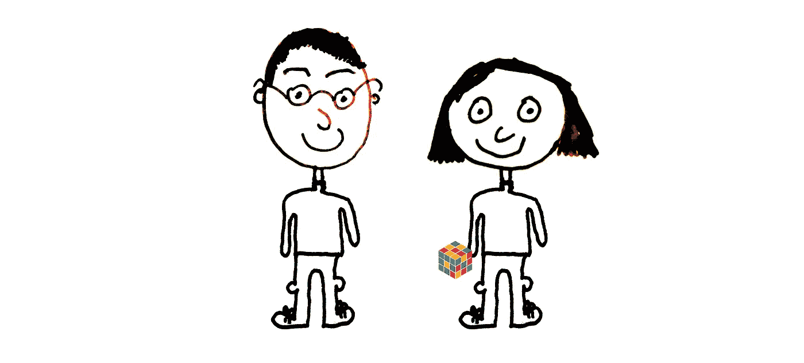
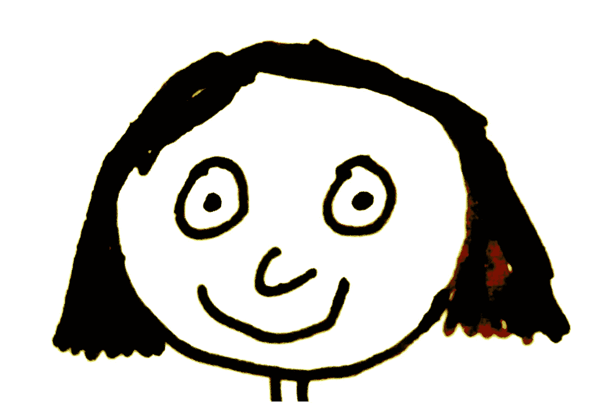
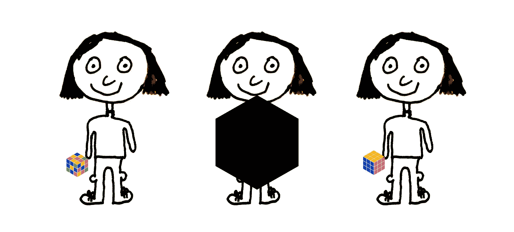
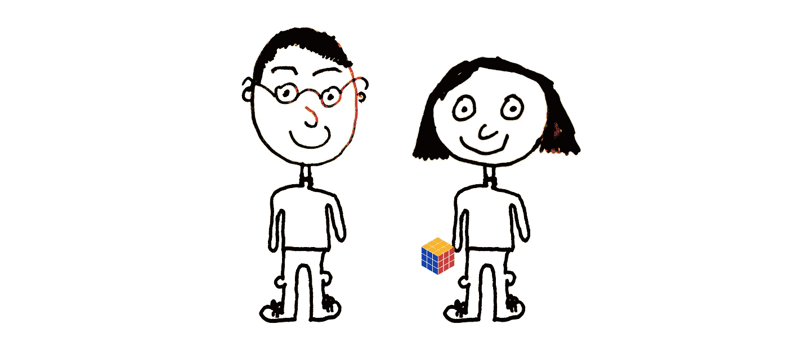

# 零知识证明:两个朋友的故事

> 原文：<https://medium.com/hackernoon/zero-knowledge-proofs-a-tale-of-two-friends-d7a0ffac3185>

Peggy the prover and Victor the verifier

在[区块链](https://hackernoon.com/tagged/blockchain)世界里，[零知识](https://hackernoon.com/tagged/zero-knowledge)证明经常会突然出现。想想 Zcash，Zerocoin。

但是零知识证明的问题是，如果不深入数学的本质，它们是很难理解的。

所以，我将描述一个零知识证明协议，作为两个朋友的故事，在一个我们都能理解的环境中。

# 零知识证明

像任何故事一样，在我们见到主角之前，我们必须设定场景。零知识证明故事的背景如下。

1.  一个难以解决的*问题*。
2.  问题的一个*陈述*。

在这个故事中，这些是…

1.  *问题*:魔方。
2.  *问题陈述*:魔方目前未解状态。

现在可以介绍主要人物了。首先，我们有谚语者佩吉。

Peggy the prover

谚语者佩吉总是在做断言。

自然地，她希望人们相信她的说法。她想向人们证明她的*主张*是有效的。然而，这给她带来了一个问题。她通常不想透露证实她*主张*的细节，因为那会泄露她的知识……而知识就是力量！

佩吉提出的一个这样的主张如下。

> 我知道如何从魔方当前的未解状态(语句)中解出魔方(问题)。

…但自然地，她不想泄露她如何做的知识。

我们的第二个角色是检验者维克多。

Victor the verifier

他喜欢听谚语人佩吉的说法。他们使他感兴趣。然而，他只是想永远确定她没有对她所知道的事情做出毫无根据的断言，因为他不想看起来像个傻瓜。

例如，他想知道证明者佩吉是否能解开魔方。如果她能的话，真的会让他印象深刻。

在这一点上，我们有一个来自 Peggy 的*声明*，它是魔方(*问题*的解决方案的证明者，处于当前状态(*语句*),她想向验证者 Victor 炫耀它。她真的想让他知道，她确实知道一个验证她*主张*的解决方案，因为她喜欢给验证者维克多留下深刻印象。

现在，在一个传统的证明(不是零知识证明)中，有一个非常明显的方法(或*协议*)证明者 Peggy 可以打动验证者 Victor 并证明她的*主张*。他们可以见面，她可以在他面前解开魔方…就这样。

在这种情况下，验证者 Victor 100%确信证明者 Peggy 在做出她的*声明*时没有说谎。他确信她是值得信赖的。这太棒了！证明者佩吉已经能够炫耀她的知识，验证者维克多确信证明者佩吉没有愚弄他。

然而，谚语人佩吉对这种方法并不满意…验证者维克多可能会知道一些关于她如何解开魔方的信息。

# 零知识

如果证明者 Peggy 不信任验证者 Victor，或者她不想泄露自己的秘密怎么办？如果验证者 Victor 也能做魔方，那么这就贬低了她对解决方案的了解，她当然不希望他在她完成之前就在他们所有共同的朋友面前去解决这个难题。

对于证明者 Peggy 来说，这个信息(解决方案)对她是有价值的。她不想透露…但她还是很想向验证者维克多证明她知道一个解决方案，因为这是证明者佩吉，她是一个炫耀者。

所以她想，有没有一种方法可以让我说服验证者维克多，让他相信我可以解开魔方(她的*声称*)，但不透露任何关于我是如何解开的信息？

那么，谚语所说的佩吉需要隐藏什么呢？显然，这是她要对立方体在当前状态(T4 语句 T5)和已解状态之间进行的一系列移动。她甚至不想透露她将要采取的任何行动。因为，即使验证者维克多看到了这两种状态之间的一个移动，那么她已经泄露了一些关于她如何解决魔方的信息。谚语者佩吉希望她的证明是零知识的，而不是少量知识的。

所以她想出了下面的方案(或*协议*)。

The zero knowledge proof protocol

# 协议

验证者维克多走过去，找到一个黑盒子，把它放在凳子上。他在顶部和两边各挖了一个洞。然后他把未解决的魔方放在里面。

然后，证明者 Peggy 将她的手臂穿过侧孔，并通过顶部的孔进行观察。她在验证者维克多的监督下解开盒子里的魔方。当她完成后，她揭示了立方体。

重要的是，验证者维克多看不到她在盒子里的移动。然而，他可以确定他没有被欺骗，因为证明者佩吉不可能骗过他。她不可能有，比如说，第二个魔方，刚从包装中拿出来，处于被解开的状态，准备偷偷摸摸地展示出来作为一个骗局。他确信他们达成一致的方案(或*协议*)是足够安全的，足以让他接受证明者 Peggy 的*声明*为真(协议的这种性质在文献中被称为*稳健性*

更重要的是，这个*协议*满足了证明者 Peggy 的愿望:她已经能够说服验证者 Victor 她知道解决方案(在文献中称为*完备性*，同时没有透露任何关于她的方法的信息(在文献中称为*零知识* - *ness* )。

她在零知识中验证了她的*主张*对魔方*问题*的*陈述*的解决方案，也就是零知识证明！

他们都对这个协议感到满意。证明者佩吉展示了她的知识，验证者维克多对她很敬畏。他们决定之后去喝一杯庆祝一下。

在现实中，佩吉想要隐藏的信息可能是她的身份、签名或她拥有的某些属性。

*如果你喜欢这个故事，请鼓掌，看看我在区块链上的* [*博客，用《沃利在哪里》和一个相机*](/swlh/explaining-blockchain-with-wheres-wally-and-a-camera-79e860a05815) *解释。*

*另外，完全分开，请在*[*www.pilcro.com*](https://www.pilcro.com/?utm_source=medium&utm_medium=blog3&utm_campaign=awareness)*查看我公司。你会喜欢我们所做的！*