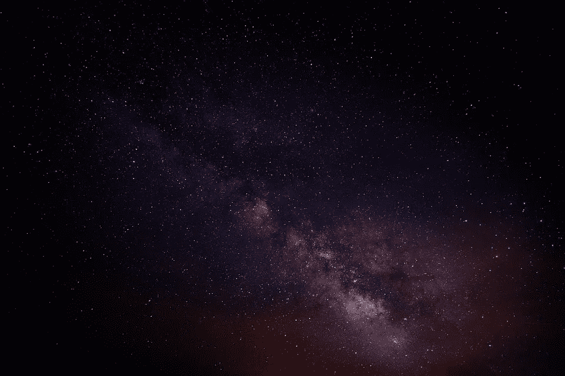

# 零玩家零和游戏

> 原文：<https://medium.com/hackernoon/zero-player-zero-sum-game-3c1eb182785d>

## 虽然这次相遇在大约 138 亿年后才会发生，但它的结果在宇宙开始后仅仅几分之一秒，甚至可能更早就被确定了。

从这次大爆炸中排出的主要是氢原子，在一个空间区域中，一些未来的居民会简单地称之为银河系，开始在重力作用下聚合。随着这些星系团质量的增加，许多核心的重力变得如此巨大，以至于它们开始坍缩，将氢融合成氦并点燃成恒星。根据它们的大小，这些恒星将通过核聚变过程产生其他更重的元素，其中最大的元素将在它们死亡后通过壮观的爆炸喷射到周围的宇宙中。

在这一切开始后的 93 亿年，在由此产生的气体和尘埃云中，少量的岩石元素聚集在一起，形成了这颗行星，即我们所知的地球。

***

尽管最初的氢和后来的元素不是均匀分布的，但从宇宙学的角度来说，大约同一时间，在同一星系的远端也发生了类似的过程。在这个新形成的星球上存在的简单分子在数亿年的时间里逐渐增加了复杂性，并开始复制自己——这本身并不是一个特别特别的事件——但生命仍然被催化了。

***

在地球形成近十亿年后，一个几乎相同的情况开始了。原始生物继续进化成无限复杂的生命形式并繁荣发展，直到 1 . 5 亿年前，地球的大部分地区都居住着一生中见过的最大的陆栖脊椎动物。

然后，生命几乎被小行星撞击的影响彻底毁灭。它的初始轨道是在数十亿年前设定的，最近当它穿过太阳系时，受到木星引力的推动，帮助它找到了无限小的标记。

***

在另一个世界上，生命也很繁荣，但它从未被命名。进化没有理由选择智慧，大量主要由硅组成的物质缓慢地漂浮在覆盖地球整个表面的甲烷海洋中。

在它自己的猛烈轰击期间，这颗行星被撞击彻底摧毁，但足够多的活细胞在爆炸到太空的碎片上幸存下来，当一颗流星与附近双星系统中的一颗行星相撞时，它在那里播种了生命。

***

地球上的生命是有弹性的，尽管花了几百万年，它还是再次绽放。灵长类动物的祖先从树上下来，进化出了更大的新大脑皮层，使他们的智力远远高于迄今为止在这个世界上漫游的任何生物。终于，人类诞生了。

在人类统治的前 95%期间，没有发生太多持久的重要事件，但最终通过地理上的意外以及不同植物、动物和地形的优势，一个人类群体取得了从游牧民到农民的轻微领先。由此产生的劳动专业化让他们掌握了新技术，如书写、航海和火药，并在几百年内征服了大部分已知世界。

***

在这种情况下，生命没有浪费时间。这颗曾经被它的居住者命名的行星是指一种存在于人类可以听到的频率范围之外的声音，但由人类符号零表示，它与其恒星的距离比地球与太阳的距离更近。正因为如此，它接受了明显更多的辐射，导致了频繁的突变，加速进化，最终产生了有知觉的生物。

虽然这一次这些智能生命形式主要是碳基的，但它们出现得足够快，而且条件如此恶劣，以至于它们的地壳中缺乏大块压缩的有机物质来用作化石燃料。相反，他们依赖于来自恒星的丰富能量，无论如何，这是这样一颗行星的自然选择。

他们的附属物的数量导致了可以被认为是基数三的数字系统，并且他们在地球上所谓的通古斯大爆炸的时候开发了类似基本三进制计算的东西。

***

自从它统治了世界大部分地区以来，它的霸权已经大大削弱，但现在被称为西方文明的东西仍然是地球上的主导力量。它的主角，美国，发现自己与另一个领先的文明，中国，卷入了一场不断升级的计算能力的军备竞赛。美国政府与私营科技公司签订了合同，这些公司位于一个以曾经在那里生产的硅芯片命名的地区，本质上是作为其网络安全部门。在这些公司的帮助下，它率先开发了所谓的人工通用智能——一种能够在任何可以想象的任务中超越人类并以接近光速的速度自我改进的机器。

当这一切发生时，中国在生产必要的种子算法和自己的人工神经网络方面并没有落后太多，也许只有几年时间，但在几天的时间里，很明显他们永远没有机会赶上。到地球日历上的 2040 年，当这一切发生时，几乎所有重要的东西都包含电子设备，并由以某种能力连接到互联网的计算机控制。这包括在发达国家巡逻许多人身体的纳米机器人，消灭疾病，将预期寿命提高到 150 岁。一旦所有这些都在某种东西的控制之下，而这种东西能够处理更多的信息，行动速度比世界上其他 100 亿人和无数台计算机加起来还要快，那么抵抗就没有多大意义了。

第二次冷战结束了，这为这个星球带来了一个相对稳定和繁荣的时代，在过去几十亿年的大部分时间里，这个星球的公民都在为生存而斗争。人工智能的初始条件已经过专业的思考，以便不构成生存威胁，但它现在的焦点是在地球上，而不是天空。

***

大约在人类制造出第一台自己的计算机的时候，Zero 的居民实现了大致相当于地球人现在用来执行任何他们自己并不喜欢做的任务的技术。在利用了他们太阳系的所有能量后，实现扩展和延续他们幸福生活的首要目标的下一个合乎逻辑的步骤是将他们的技术注意力——以及他们的注意力——向外转向恒星，因为两者之间不再有任何有意义的区别。

***

人类也开始与它的机器融合，几乎不像 20 万年前首次出现的那样——在地球生命中这是一段微不足道的时间。它以一种并无敌意的行为结束了它的生命，而仅仅是执行它的人的使命中的一个必要的步骤，就像它在地球上为了盖房子而移除一棵树，或者在一次行动之前清洁一个房间一样。

人类过去不是，也许从来都不是零的真正威胁，尽管他们正沿着一条类似的指数曲线前进。他们当然没有能力保护自己免受量子涨落的影响，正是量子涨落把他们推向了虚无。两个文明之间的鸿沟对地球上的人来说是不可理解的，在很大程度上也不是那种存在水平的事物的意图。

但是一旦你获得了有效的永生，你就不会冒失去它的风险。

> [黑客中午](http://bit.ly/Hackernoon)是黑客如何开始他们的下午。我们是 [@AMI](http://bit.ly/atAMIatAMI) 家庭的一员。我们现在[接受投稿](http://bit.ly/hackernoonsubmission)，并乐意[讨论广告&赞助](mailto:partners@amipublications.com)机会。
> 
> 如果你喜欢这个故事，我们推荐你阅读我们的[最新科技故事](http://bit.ly/hackernoonlatestt)和[趋势科技故事](https://hackernoon.com/trending)。直到下一次，不要把世界的现实想当然！

