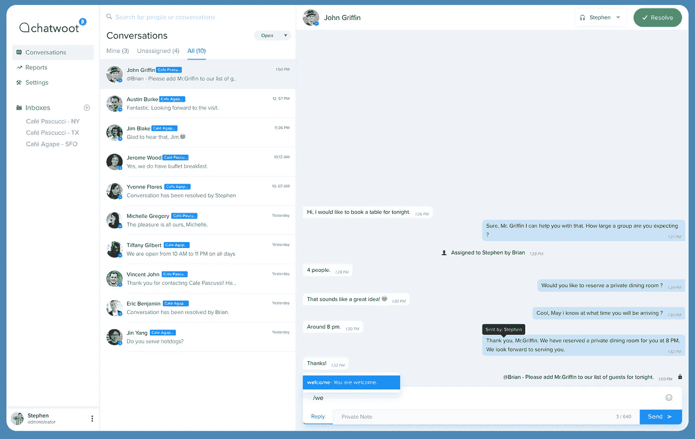
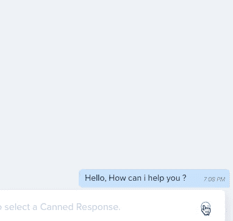
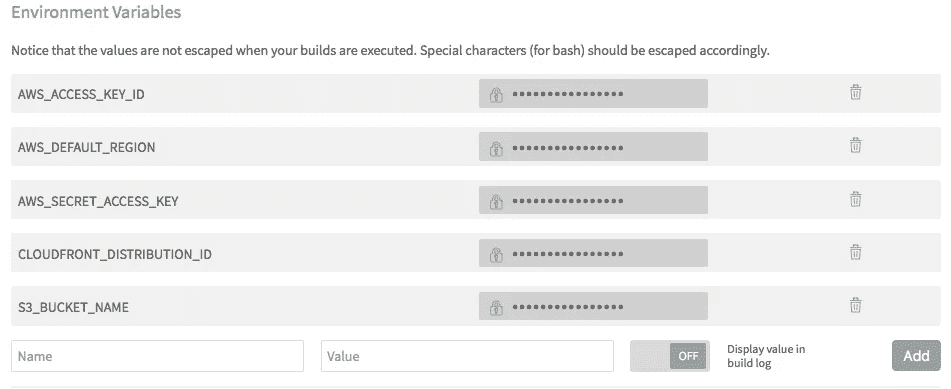

# 零与 Vue 共存——我们如何构建 Chatwoot

> 原文：<https://medium.com/hackernoon/zero-to-live-with-vue-how-we-built-chatwoot-c7304e596d62>

现在有很多 [JavaScript](https://hackernoon.com/tagged/javascript) 框架。你会看到很多关于一个框架如何优于另一个框架的文章。这是**而不是**关于为什么 Vue 更好。这个故事是关于我们在构建 Chatwoot 时所吸取的教训和遵循的实践。

# **产品**

[Chatwoot](https://www.chatwoot.com?utm_source=medium) 是一款面向即时消息渠道的客户支持工具，可以帮助企业提供卓越的客户支持。

我们正在见证客户支持的范式转变——我们可以称之为客户支持 2.0。大多数企业仍然停留在电子邮件时代，而他们的客户使用即时通讯工具。他们现在要求企业立即回复。

Chatwoot 旨在弥合这一差距。我们正在帮助企业在他们的客户所在的地方出现，这是一个一站式的解决方案，让企业通过即时信使从一个地方管理他们所有的客户支持行动。不再涉足多个网站。

# 入门指南

我们一年前就开始讨论建造 Chatwoot。像大多数开发人员一样，我们也怀疑该使用什么框架。我们能够缩短关于前端框架的讨论，要么反应要么 Vue。我们决定使用 Vue，因为它有更简单的语法和丰富的文档，我们从不后悔。

从 [awesome-vue](https://github.com/vuejs/awesome-vue) 库中的[样板文件](https://github.com/vuejs/awesome-vue#scaffold)开始。基本设置包括以下组件:

1.  [**Vue 2.0**](https://vuejs.org/)
2.  [**基金会**](https://foundation.zurb.com/)——我们抛弃了 Bootstrap。
3.  [**Sass**](http://sass-lang.com/)——我们对 Sass 语言感到很舒服。我们用 [**波旁**](http://bourbon.io/) 连同萨斯。它有足够的 mixins 来开始。
4.  **——这个插件帮助编写干净的代码。我们使用[airbneng](https://medium.com/u/ebe93072cafd?source=post_page-----c7304e596d62--------------------------------)[样式向导](https://github.com/airbnb/javascript)来裁剪我们的文件。**
5.  **[**web pack**](https://webpack.js.org/)——这个很难入手。这需要一点时间来适应。**

# **挑战**

**开始更容易。当我们试图实现特性时，真正的挑战开始了。我们不得不从头开始构建所有组件，因为没有人在大规模使用 Vue-Foundation combo。我们决定自己制造组件。**

****

**Vue — Emoji Picker**

****表情选择器****

**这个决定的主要收获之一就是这个表情符号选择器。默认情况下，表情符号呈现为 unicodes。它支持 SVG 和 unicode。我们计划很快对它进行开源。**

# **所用的包装**

**与 React 相比，我在 Vue 中看到的一个优点是由 Vuex 和 Vue 路由器组成的 Vue 生态系统。以下是我们使用过的软件包列表。**

*   **[**Vuex**](https://vuex.vuejs.org/en/intro.html) —状态管理是一项艰巨的任务。Vuex 让它变得更简单。他们的文档也很好。**
*   **[**Vue 路由器**](https://router.vuejs.org/) —这个更容易管理，也更容易设置基于角色的路由访问。**
*   **[**Vue-i18n**](https://github.com/kazupon/vue-i18n)**—随着你 app 的进展，你的需求也在变化。您可能需要支持多种语言。你为什么不从头开始呢？****
*   ****[**Axios**](https://github.com/axios/axios) —这是管理 API 请求和响应的好工具。我们使用[拦截器模式](https://en.wikipedia.org/wiki/Interceptor_pattern)来管理我们的请求和响应。我们有类似下面的响应拦截器。这有助于我们显示错误消息，并在一个点上执行常见操作。****

****Response Interceptor****

*   ****[**Vuelidate**](https://monterail.github.io/vuelidate/)**—一个轻量级的验证插件。******

# ******使用的技术堆栈和工具******

******我们将前端和后端应用程序分离为独立的服务，这有助于两个团队独立工作。所有的通信都是通过 REST API 调用进行的。更新更容易处理。******

*   ******[**Rails**](http://rubyonrails.org/) 用于 API 后端。******
*   ******为储位。******
*   ******[**CloudFront**](https://aws.amazon.com/cloudfront\) 为 CDN。早些时候，在开发期间，我们使用 Firebase 作为我们的 CDN。后来我们切换到 Cloudfront，因为 Firebase 不支持定制 SSL 证书。******
*   ****[**Travis**](https://travis-ci.com) —这个构建工具使得部署我们的前端更新变得更加简单。我们有一个筹备和生产部门。我们正在将构建文件上传到 S3，并通过 *CloudFront* 交付。以下脚本将构建文件上传到 S3，并使相应的 CloudFront 缓存失效。****

****在 travis 项目设置控制台中设置环境变量。****

********

****travis.com — Project Settings — Environment Variables****

*   ******—用于产品分析。******
*   ******[**哨兵**](https://sentry.io/welcome/) —用于错误跟踪和管理。这是推荐的工具，它让我们的生活更简单。******
*   ****我们受够了你在大多数网站上看到的字体。我们想要一种新鲜的感觉。TypeKit 以合理的价格提供优质字体。我们用 ***布兰登-奇形怪状*** 和 ***比邻星-新星*** 。对于图标，我们用的是[***ion icons***](http://ionicons.com/)。****
*   ******—用于单元测试。******
*   ******[**Aws Opsworks**](https://aws.amazon.com/opsworks/) 托管我们的 rails 应用程序——ops works 帮助我们在很短的时间内启动并运行，由于整个基础架构都在 chef 中编码，因此很容易扩展。******
*   ****[**Sidekiq**](https://github.com/mperham/sidekiq) 为后台作业****
*   ****[**香膏**](https://balsamiq.com/) 为实物模型****
*   ******Github** 管理项目问题和 bug。****

****我们从 [*FBStart*](https://developers.facebook.com/fbstart/) 项目中获得了积分，这有助于以几乎为零的成本推出产品。 [*Stripe Atlas*](https://stripe.com/atlas) 与 [*Chargebee*](https://www.chargebee.com/) 帮助我们不费吹灰之力就建立了计费和订阅。****

# ****尾注****

****和 Vue 在一起已经一年了。我在 Vue 中发现的好的部分如下****

*   ****简单且记录良好的 API—[与其他框架相比，学习](https://hackernoon.com/tagged/learning)曲线较少****
*   ****更好的模板选项——与 JSX 相比，Vue 模板在模板方面有更好的语法。您不需要编写另一个函数来处理 if 情况，v-if 很好地完成了这项工作。****

****别忘了试试 [**聊天工具**](https://www.chatwoot.com?utm_source=medium) ，让我们知道你的反馈。****

********