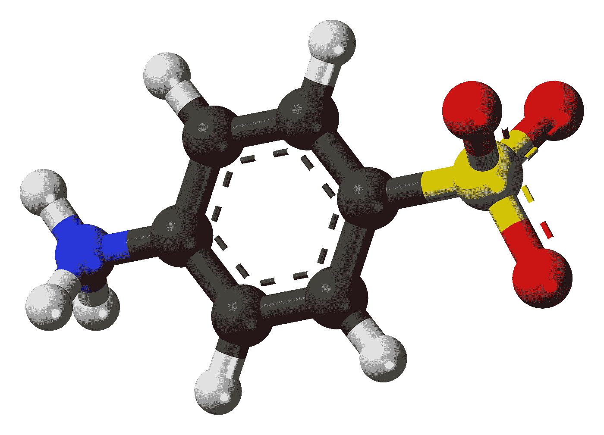

# 两性离子，忘记构建步骤

> 原文：<https://medium.com/hackernoon/zwitterion-transpilation-made-simple-a9baa407b006>

针对 JavaScript、JSX、TypeScript 和 TSX 的自动传输文件、实时重载和 SPA 服务器。



This has nothing to do with the Zwitterion server, except that it’s a zwitterion

你有没有想过使用 ES6/ES2015 及以后版本中所有的新语言功能？你有没有考虑过使用 [TypeScript](https://hackernoon.com/tagged/typescript) 、TSX、JSX、ES 模块、对象扩展、异步/等待、只读属性、块作用域或其他任何令人惊叹的 web 语言特性？

我有。我爱他们。我已经在 web 平台上开发应用程序 4 年了，我已经意识到我不想离开它们而生活。然而，成本很高。主流浏览器目前并不支持所有新的语言功能。这意味着在你的项目中增加一个额外的步骤。构建、捆绑、编译、传输……一塌糊涂。它给你的应用程序增加了很多不必要的复杂性。不再有了！

[两性离子](https://github.com/lastmjs/zwitterion)是一款 web 应用服务器，提供自动翻译、实时重载和开箱即用的单页面应用(SPA)支持。它允许你开发 [JavaScript](https://hackernoon.com/tagged/javascript) 、JSX、类型脚本和 TSX 应用程序，而不需要复杂的构建步骤。直接在`<script>`标签中包含文件即可。比如:`<script src="hello-world.ts"></script>`。TypeScript 编译器提供的所有功能都是自动可用的，包括 es 模块、异步/等待和对象扩展。

神奇的事情都发生在服务器端，隐藏了复杂性。请求的 JavaScript、JSX、TypeScript 和 TSX 文件自动转换，浏览器接收转换后的 JavaScript。它甚至处理简单的说明符。

我们来做一个例子。为了简单起见，我们将在全球范围内安装[两性离子](https://github.com/lastmjs/zwitterion):

```
npm install -g zwitterion
```

现在让我们创建一个简单的例子。我们将创建三个文件，一个`index.html`文件、一个名为`app.ts`的主脚本和一个名为`hello-world.ts`的模块:

```
//index.html<!DOCTYPE html><html>
  <head>
    <script type="module" src="app.ts"></script>
  </head>
</html>
```

我们将创建`app.ts`文件:

```
//app.tsimport { sayHello } from './hello-world';alert(sayHello());
```

和`hello-world.ts`模块:

```
export function sayHello() {
  return 'Hello world!';
}
```

现在我们将使用几个选项启动[两性离子](https://github.com/lastmjs/zwitterion):

```
zwitterion --port 8000 --watch-files
```

如果我们去`[http://localhost:800](http://localhost:8000)0`我们会看到我们的自动传输网络服务器。请注意 TypeScript 文件是如何工作的，没有任何构建步骤。模块会自动加载到浏览器中。当文件改变时，浏览器会自动重新加载。为了推向生产，我们进行静态构建。此版本将适用于在内容交付网络(CDN)上发布应用:

```
zwitterion --port 8000 --build-static
```

您可以像这样构建整个应用程序，并且可以混合和匹配不同的文件格式。这里有一个例子，被称为[两性离子例子](https://github.com/lastmjs/zwitterion-example)。这是在的一个 CDN [上直播的。](https://zwitterion-example.netlify.com/)

我们正在使用[两性离子](https://github.com/lastmjs/zwitterion)在 [Prendus](https://github.com/Prendus) 构建我们的整个生产应用程序。我也开始在其他项目中使用它。示例项目包括[可消耗组件](https://github.com/Prendus/prendus-question-elements)、[嵌入式设备](https://github.com/scramjs/scram-engine)和[基于浏览器的超级网格原型](https://github.com/lastmjs/browser-based-super-grid)。

所以，试试吧。两性离子公司可能会走上正确的道路，减少臭名昭著的构建步骤的复杂性。随着越来越多的语言为网络平台编译，它也可能帮助我们解决未来的翻译需求。前途是光明的。

两性离子:[https://github.com/lastmjs/zwitterion](https://github.com/lastmjs/zwitterion)

两性离子例子:[https://github.com/lastmjs/zwitterion-example](https://github.com/lastmjs/zwitterion-example)

两性离子例子现场演示:【https://zwitterion-example.netlify.com 